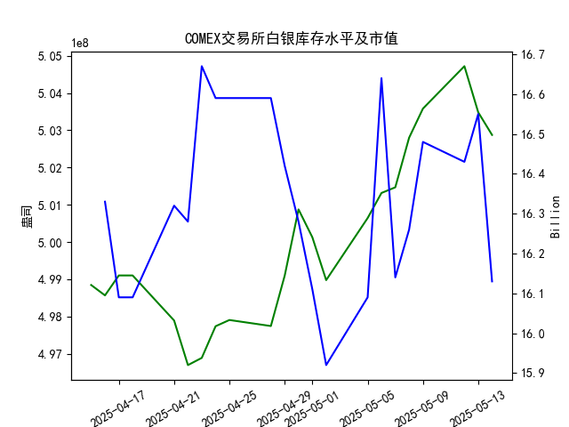

|            |   comex白银库存量 |   comex白银库存市值(billion) |   伦敦银现货价 |   上海金交所白银现货价 |   美元兑人民币汇率 |
|:-----------|------------------:|-----------------------------:|---------------:|-----------------------:|-------------------:|
| 2025-04-17 |       4.99104e+08 |                       32.23  |         32.31  |                   8143 |             7.2085 |
| 2025-04-18 |       4.99104e+08 |                       32.23  |         32.31  |                   8142 |             7.2069 |
| 2025-04-21 |       4.97895e+08 |                       32.785 |         32.31  |                   8227 |             7.2055 |
| 2025-04-22 |       4.96698e+08 |                       32.785 |         32.61  |                   8154 |             7.2074 |
| 2025-04-23 |       4.96891e+08 |                       33.55  |         32.96  |                   8191 |             7.2116 |
| 2025-04-24 |       4.97741e+08 |                       33.325 |         33.395 |                   8295 |             7.2098 |
| 2025-04-25 |       4.97908e+08 |                       33.325 |         33.335 |                   8270 |             7.2066 |
| 2025-04-28 |       4.97746e+08 |                       33.325 |         33.01  |                   8173 |             7.2043 |
| 2025-04-29 |       4.99098e+08 |                       32.89  |         33.225 |                   8197 |             7.2029 |
| 2025-04-30 |       5.00876e+08 |                       32.51  |         32.225 |                   8163 |             7.2014 |
| 2025-05-01 |       5.00128e+08 |                       32.205 |         32.125 |                   8163 |             7.2014 |
| 2025-05-02 |       4.98978e+08 |                       31.91  |         32.365 |                   8163 |             7.2014 |
| 2025-05-05 |       5.00644e+08 |                       32.14  |         32.365 |                   8163 |             7.2014 |
| 2025-05-06 |       5.01317e+08 |                       33.19  |         33.025 |                   8221 |             7.2008 |
| 2025-05-07 |       5.01469e+08 |                       32.195 |         32.875 |                   8229 |             7.2005 |
| 2025-05-08 |       5.028e+08   |                       32.335 |         32.43  |                   8100 |             7.2073 |
| 2025-05-09 |       5.03581e+08 |                       32.73  |         32.515 |                   8150 |             7.2095 |
| 2025-05-12 |       5.04719e+08 |                       32.56  |         32.02  |                   8124 |             7.2066 |
| 2025-05-13 |       5.03481e+08 |                       32.88  |         32.98  |                   8214 |             7.1991 |
| 2025-05-14 |       5.02874e+08 |                       32.085 |         32.885 |                   8172 |             7.1956 |

### 近期白银市场投资机会分析（2025年5月14日）

#### 1. **COMEX白银库存与价格背离**
- **库存变化**：5月14日COMEX白银库存降至5.0287亿盎司（较前日减少约0.6%），但伦敦现货价格同步下跌0.29%（32.98 → 32.885美元/盎司），形成“库存降、价格跌”的短期背离。
- **潜在机会**：若库存持续下降且价格企稳，可能触发技术性反弹，可关注低吸机会。

#### 2. **沪伦价差套利窗口**
- **价差分析**（5月14日）：
  - **伦敦银价**：32.885美元/盎司 × 汇率7.1956 ≈ **236.77元/盎司**（折合**7610元/千克**）。
  - **上海银价**：8172元/千克，价差达**562元/千克**（沪高伦低）。
- **驱动因素**：人民币连续升值（5月13-14日汇率从7.1991→7.1956）未完全传导至国内价格。
- **策略建议**：关注进口套利机会（买伦敦/抛上海），需结合税费与物流成本评估可行性。

#### 3. **短期波动中的技术面信号**
- **伦敦白银**：5月13日冲高32.98美元后回落，形成“流星线”形态，若次日跌破32.70支撑位，可能开启回调周期。
- **上海白银**：5月14日下跌0.5%（8214 → 8172），但仍在20日均线（约8150）上方，短期支撑明显。

#### 4. **库存市值异动**
- **COMEX市值**：5月14日骤降至161.3亿美元（前日164.3亿），降幅1.8%超过库存量降幅，反映市场对白银估值短期下修。
- **关注点**：若市值与库存量同步触底回升，可能成为趋势反转信号。

#### 5. **汇率敏感度增强**
- **人民币升值影响**：过去一周人民币对美元升值0.16%（7.2073→7.1956），降低国内白银进口成本，压制上海价格弹性。
- **对冲策略**：持有白银多头可搭配人民币汇率衍生品对冲汇兑风险。

---

### 今日（5月14日）关键指标对比
| 指标               | 5月13日       | 5月14日       | 变动幅度  |
|--------------------|--------------|--------------|----------|
| COMEX库存（亿盎司） | 5.0348       | 5.0287       | -0.12%   |
| 伦敦银价（美元/盎司）| 32.98        | 32.885       | -0.29%   |
| 上海银价（元/千克） | 8214         | 8172         | -0.51%   |
| 美元兑人民币汇率    | 7.1991       | 7.1956       | +0.05%   |

---

### 结论与建议
1. **短线谨慎看空**：价格与库存背离、沪伦价差收窄压力下，可轻仓试空伦敦白银（止损33.2美元）。
2. **中长线布局窗口**：若COMEX库存连续3日回升失败，可逐步建立多单（目标34美元）。
3. **跨市场套利**：价差高于500元/千克时，启动买伦敦/卖上海策略（需锁定汇率风险）。
4. **密切跟踪**：5月15日COMEX库存数据、人民币中间价及美联储政策预期。