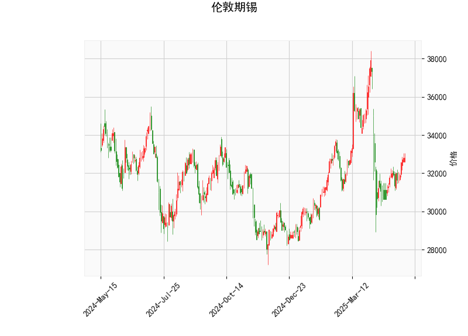

# 伦敦期锡技术分析及投资策略

## 一、技术分析解读

### 1. 价格与布林轨道
- **当前价（32814.0）**略低于**布林中轨（33004.69）**，表明价格处于中性区间，短期可能延续震荡格局。
- **布林带宽度（上轨36985.08，下轨29024.30）**显示波动率较高，若价格突破中轨并站稳，可能向上测试上轨压力位（潜在+12.7%空间）；若跌破下轨支撑，则可能加速下行（潜在-11.5%空间）。

### 2. RSI指标
- **RSI（55.08）**接近中性区间中轴（50），既未超买也未超卖，反映市场多空力量暂时平衡，但需警惕突破性行情对RSI的后续影响。

### 3. MACD指标
- **MACD线（-59.32）**与**信号线（-295.12）**均为负值且存在显著背离，但**柱状图（235.80）**大幅收窄，暗示空头动能减弱，MACD可能即将形成低位金叉，短期存在反弹可能性。

### 4. K线形态
- 无明确反转或持续形态（如吞没、十字星等），短期缺乏方向性信号，需结合其他指标判断趋势。

---

## 二、投资机会与策略建议

### 1. 趋势跟踪策略
- **多头机会**：若价格站稳布林中轨（33000附近）且MACD确认金叉，可轻仓试多，目标看向上轨（36985），止损设于中轨下方1-2%。
- **空头机会**：若价格跌破布林下轨（29024），可能打开下行空间，但需配合RSI超卖（<30）或MACD死叉确认，止损设于下轨上方。

### 2. 均值回归策略
- **区间交易**：在布林带内（29024-36985）高抛低吸。当前价格接近中轨，若回踩下轨附近（29000-30000）可逢低买入，反弹至中上轨（34000-35000）分批止盈。

### 3. 事件驱动策略
- 关注库存数据、新能源产业链需求变化及东南亚锡矿供应扰动。若出现利多消息（如减产、库存骤降），可配合技术面突破中轨时加仓。

---

## 三、风险提示
1. **MACD假信号风险**：当前MACD金叉位于零轴下方，反弹力度可能较弱，需结合成交量验证。
2. **波动率陷阱**：布林带较宽，价格快速波动易触发止损，建议降低仓位至常规水平的50-70%。
3. **宏观风险**：美联储政策、美元指数波动及全球经济复苏预期变化可能放大价格波动。