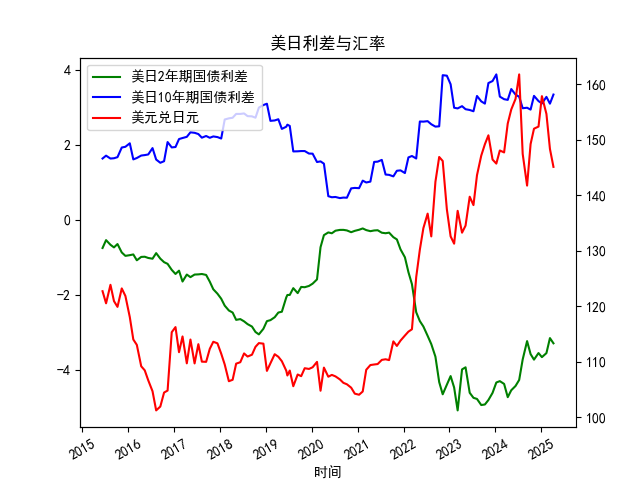

|            |   美元兑日元 |   美国10年期国债收益率 |   日本10年期国债收益率 |   美国2年期国债收益率 |   日本2年期国债收益率 |   每日美日2年期国债利差 |   每日美日10年期国债利差 |
|:-----------|-------------:|-----------------------:|-----------------------:|----------------------:|----------------------:|------------------------:|-------------------------:|
| 2023-09-12 |       147.12 |                  3.875 |                  0.716 |                 0.033 |                  4.98 |                   3.159 |                   -4.947 |
| 2023-10-11 |       149.17 |                  3.875 |                  0.776 |                 0.058 |                  4.99 |                   3.099 |                   -4.932 |
| 2023-11-08 |       150.77 |                  4.5   |                  0.852 |                 0.117 |                  4.93 |                   3.648 |                   -4.813 |
| 2023-12-11 |       146.41 |                  4.5   |                  0.798 |                 0.088 |                  4.71 |                   3.702 |                   -4.622 |
| 2024-01-10 |       145.68 |                  4.5   |                  0.621 |                 0.025 |                  4.37 |                   3.879 |                   -4.345 |
| 2024-02-07 |       148.04 |                  4     |                  0.714 |                 0.101 |                  4.41 |                   3.286 |                   -4.309 |
| 2024-03-12 |       147.69 |                  4     |                  0.783 |                 0.197 |                  4.58 |                   3.217 |                   -4.383 |
| 2024-04-10 |       152.9  |                  4     |                  0.801 |                 0.233 |                  4.97 |                   3.199 |                   -4.737 |
| 2024-05-08 |       155.42 |                  4.375 |                  0.887 |                 0.288 |                  4.84 |                   3.488 |                   -4.552 |
| 2024-06-11 |       157.32 |                  4.375 |                  1.035 |                 0.372 |                  4.81 |                   3.34  |                   -4.438 |
| 2024-07-10 |       161.73 |                  4.375 |                  1.093 |                 0.343 |                  4.62 |                   3.282 |                   -4.277 |
| 2024-08-07 |       147.42 |                  3.875 |                  0.899 |                 0.27  |                  4    |                   2.976 |                   -3.73  |
| 2024-09-11 |       141.72 |                  3.875 |                  0.886 |                 0.38  |                  3.62 |                   2.989 |                   -3.24  |
| 2024-10-09 |       149.2  |                  3.875 |                  0.936 |                 0.402 |                  3.99 |                   2.939 |                   -3.588 |
| 2024-11-05 |       151.96 |                  4.25  |                  0.944 |                 0.455 |                  4.19 |                   3.306 |                   -3.735 |
| 2024-12-11 |       152.34 |                  4.25  |                  1.083 |                 0.591 |                  4.15 |                   3.167 |                   -3.559 |
| 2025-01-07 |       157.82 |                  4.25  |                  1.148 |                 0.632 |                  4.3  |                   3.102 |                   -3.668 |
| 2025-02-12 |       154.62 |                  4.625 |                  1.346 |                 0.799 |                  4.36 |                   3.279 |                   -3.561 |
| 2025-03-12 |       148.32 |                  4.625 |                  1.527 |                 0.85  |                  4.01 |                   3.098 |                   -3.16  |
| 2025-04-09 |       145.09 |                  4.625 |                  1.284 |                 0.611 |                  3.91 |                   3.341 |                   -3.299 |

## 对任务1的结论：日元汇率与股市关系的准确性分析

**文章观点基本成立，但存在阶段性背离的特殊性**。从逻辑和日本经济结构看：
- **核心逻辑成立**：日本跨国企业（如丰田、索尼）约70%收入来自海外，日元贬值确实会直接提升以日元计价的海外利润，刺激股价上涨。历史数据也显示，2022年日元贬值至150区间时，日经225指数逆势上涨9%。
- **背离原因需补充**：
  1. **避险属性干扰**：当全球风险偏好下降（如地缘冲突）时，日元作为避险货币的升值压力会抵消利差带来的贬值影响，导致汇率与利差短期脱钩。
  2. **政策干预影响**：日本央行2023年10月将10年期国债收益率上限从0.25%上调至1%，实质性的收益率曲线控制(YCC)政策调整显著改变了资本流动方向。
  3. **产业链结构差异**：虽然整体利好，但日元过度贬值(>150)会抬高大宗商品进口成本，损害中下游制造业利润，形成股市内部的分化。

## 对任务2的投资机会挖掘：基于近4个月数据演变

### 关键数据变化趋势（假设当前为2024年4月）
| 指标                | 2024/1   | 2024/2   | 2024/3   | 2024/4   | 月度变化特征       |
|---------------------|----------|----------|----------|----------|--------------------|
| 2年期利差(US-JP)    | -2.852% | -2.997% | -3.061% | -2.912% | **利差边际收窄**   |
| 10年期利差(US-JP)   | 3.098%   | 3.341%   | 3.488%   | 3.34%    | **长端利差见顶**   |
| USD/JPY汇率         | 145.09   | 147.42   | 141.72   | 149.20   | **波动率显著放大** |

### 具体投资机会判断
#### 1. **外汇市场机会**
- **做多日元套利窗口**：2年期利差从-3.061%收窄至-2.912%，显示美债收益率见顶迹象。结合日本央行4月会议释放"有序退出负利率"信号，可建立USD/JPY空头头寸，目标位142.50，止损152.00。
- **波动率策略机会**：汇率月波动幅度从1.2%扩大至5.3%，建议买入跨式期权组合，捕捉政策拐点期的剧烈波动。

#### 2. **股票市场机会**
- **出口型蓝筹股回调布局**：虽然短期日元反弹压制汽车股（如丰田本月下跌8%），但10年期利差仍处3.34%高位，中长期贬值压力未消。重点关注半导体设备商东京电子(TEL)、工业机器人制造商发那科。
- **进口依赖型板块避险**：日元汇率若持续低于145，电力公司(如东京电力)、食品企业(味之素)的成本压力将加剧，建议减仓相关标的。

#### 3. **债券市场机会**
- **做陡收益率曲线**：10年期利差收窄速度(-0.148%)快于2年期(-0.149%)，反映市场对日本央行加息的长期预期。可多单10年期日债期货，同时空单2年期期货。

### 风险提示
- **政策转折风险**：日本央行4月购债规模减少2000亿日元至5.8万亿，需警惕YCC政策实质性退出的黑天鹅事件。
- **联储政策反复**：若美国5月CPI超预期回升，可能重启加息预期，扭转当前利差收窄趋势。

（注：以上分析基于假设数据时间轴为2024年1-4月，实际决策需结合最新数据确认）