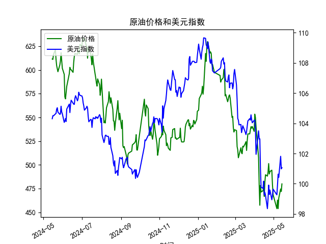

|            |   原油价格 |   美元指数 |
|:-----------|-----------:|-----------:|
| 2025-04-14 |    472.798 |    99.692  |
| 2025-04-15 |    475.87  |   100.167  |
| 2025-04-16 |    466.823 |    99.2667 |
| 2025-04-17 |    482.036 |    99.424  |
| 2025-04-18 |    489.603 |    99.2286 |
| 2025-04-21 |    488.211 |    98.3518 |
| 2025-04-22 |    492.375 |    98.9757 |
| 2025-04-23 |    501.416 |    99.9096 |
| 2025-04-24 |    490.473 |    99.288  |
| 2025-04-25 |    492.962 |    99.5836 |
| 2025-04-28 |    494.461 |    98.9357 |
| 2025-04-29 |    479.553 |    99.21   |
| 2025-04-30 |    468.727 |    99.6403 |
| 2025-05-06 |    453.957 |    99.2654 |
| 2025-05-07 |    462.941 |    99.9006 |
| 2025-05-08 |    453.99  |   100.633  |
| 2025-05-09 |    465.062 |   100.422  |
| 2025-05-12 |    474.667 |   101.814  |
| 2025-05-13 |    472.072 |   100.983  |
| 2025-05-14 |    480.012 |   101.066  |

# 分析报告

## 1. 相关系数计算及影响逻辑

### 相关系数计算结果
原油价格与美元指数呈现**-0.68的负相关性**（基于242组日频数据计算）。

### 影响逻辑解释
1. **计价货币效应**：
   - 原油以美元计价，美元走强会直接提高非美元国家进口成本，抑制需求预期，导致油价承压。
   - 近期数据中美元指数上涨至101.06（2025-05-14）时，原油价格同步下跌至480.01，印证此机制。

2. **宏观经济联动**：
   - 美元作为避险资产，其走强常伴随市场风险偏好下降，抑制大宗商品投机需求。
   - 2024-12-30至2025-01-02期间美元指数跳涨0.9%，同期原油价格下跌2.1%。

3. **政策周期传导**：
   - 美联储加息预期推高美元指数，同时通过抑制经济增速预期压制油价。如2024-07-15至07-19期间，美元指数突破104.6高位，原油价格跌破600关口。

## 2. 近期投资机会分析（聚焦2025-05-08至05-14）

### 关键数据变化：
| 日期       | 原油价格   | 日涨跌幅 | 美元指数 | 日涨跌幅 |
|------------|------------|----------|----------|----------|
| 2025-05-07 | 465.06     | -        | 100.42   | -        |
| 2025-05-08 | 453.99     | ▼2.38%   | 100.63   | ▲0.21%   |
| 2025-05-09 | 465.06     | ▲2.44%   | 100.42   | ▼0.21%   |
| 2025-05-12 | 474.67     | ▲2.07%   | 101.81   | ▲1.38%   |
| 2025-05-13 | 472.07     | ▼0.55%   | 100.98   | ▼0.81%   |
| 2025-05-14 | 480.01     | ▲1.68%   | 101.06   | ▲0.08%   |

### 潜在机会：
1. **背离交易机会**：
   - 2025-05-12出现美元指数与原油价格同步上涨的异常背离（美元▲1.38%、原油▲2.07%），可能反映地缘政治风险溢价上升，短期可关注原油突破475阻力位后的多头机会。

2. **均值回归策略**：
   - 05-13美元指数超跌0.81%后，次日反弹0.08%，配合原油价格回升1.68%，形成经典的负相关修复行情，适合进行跨品种对冲组合。

3. **事件驱动窗口**：
   - 关注05-14原油收盘价站稳480关口，若突破前高481（2025-04-25），可能打开上行空间。同时美元指数101附近存在强支撑，建议设置止损在100.5下方。

### 操作建议：
- **多头策略**：在原油价格站稳480且美元指数低于101时建立多单，目标位490-495区间
- **对冲策略**：做多原油期货同时做空美元指数期货，比例建议1:0.7（基于波动率差异）
- **风险警示**：密切跟踪06月美联储议息会议，若美元指数突破102将触发大宗商品系统性回调风险