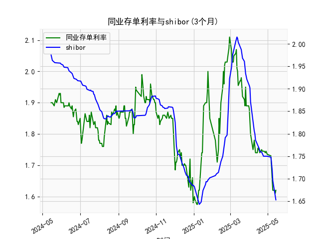

|            |   同业存单利率(3个月) |   shibor(3个月) |
|:-----------|----------------------:|----------------:|
| 2025-04-15 |                 1.755 |           1.775 |
| 2025-04-16 |                 1.75  |           1.772 |
| 2025-04-17 |                 1.75  |           1.767 |
| 2025-04-18 |                 1.74  |           1.761 |
| 2025-04-21 |                 1.75  |           1.759 |
| 2025-04-22 |                 1.745 |           1.755 |
| 2025-04-23 |                 1.745 |           1.753 |
| 2025-04-24 |                 1.745 |           1.75  |
| 2025-04-25 |                 1.745 |           1.75  |
| 2025-04-27 |                 1.74  |           1.75  |
| 2025-04-28 |                 1.745 |           1.75  |
| 2025-04-29 |                 1.74  |           1.75  |
| 2025-04-30 |                 1.735 |           1.75  |
| 2025-05-06 |                 1.73  |           1.748 |
| 2025-05-07 |                 1.69  |           1.737 |
| 2025-05-08 |                 1.66  |           1.72  |
| 2025-05-09 |                 1.62  |           1.696 |
| 2025-05-12 |                 1.62  |           1.672 |
| 2025-05-13 |                 1.61  |           1.662 |
| 2025-05-14 |                 1.62  |           1.653 |

### 1. 同业存单利率与SHIBOR的相关性及影响逻辑

**相关性**：  
同业存单利率（AAA评级）与SHIBOR（3个月）均反映银行间市场的短期资金成本，二者呈现高度正相关性。同业存单是商业银行发行的标准化融资工具，利率由市场供需决定；SHIBOR是报价行对同业拆借资金的报价均值，代表银行间无担保融资成本。两者的波动通常受以下共同因素驱动：  
- **货币政策**：央行通过公开市场操作、MLF等工具调节流动性，直接影响市场利率水平。宽松政策会压低同业存单利率和SHIBOR，反之则推升。  
- **流动性预期**：季末、年末等资金需求高峰时，银行对短期资金的需求上升，导致两者同步走高。  
- **信用风险溢价**：同业存单利率包含发行主体的信用风险（尽管AAA评级风险极低），而SHIBOR为无风险利率，因此同业存单利率通常略高于SHIBOR，利差反映市场对信用风险的定价。  

**影响逻辑**：  
- **同业存单利率对SHIBOR的引导作用**：同业存单市场规模大、交易活跃，其利率变化更直接反映银行负债端压力，可能通过市场情绪传导至SHIBOR报价。  
- **SHIBOR对同业存单的基准作用**：SHIBOR作为定价基准，常被用于浮动利率存单的挂钩标的，其波动会影响存单发行成本。  

---

### 2. 近期投资机会分析（聚焦最近一周）

#### **数据趋势观察**  
- **同业存单利率（AAA）最近一周**：  
  - 从`1.74%`（前一周均值）快速下降至`1.62%`（最新值），单日最大跌幅出现在最近两日（从`1.61%`升至`1.62%`，但整体周内下行趋势明显）。  
  - **今日 vs 昨日**：利率微升`1bp`（1.61%→1.62%），可能反映短期流动性边际收紧，但周内仍以宽松主导。  

- **SHIBOR（3个月）最近一周**：  
  - 从`1.75%`逐步回落至`1.653%`，与同业存单利率同步下行，但降幅更平缓。  
  - **今日 vs 昨日**：SHIBOR持平于`1.653%`，市场流动性维持稳定。  

#### **投资机会判断**  
1. **债券市场**：  
   - 同业存单利率快速下行暗示短端债券（如国债、政策性金融债）配置价值提升，可关注1年期以内利率债的交易机会。  
   - 信用利差收窄：AAA同业存单与SHIBOR利差缩小（从`10bp`降至`3bp`），反映市场风险偏好回升，高评级信用债或受追捧。  

2. **货币市场基金**：  
   - 短期利率下行可能压低货基收益率，但流动性宽松环境下规模或扩张，适合避险资金短期停放。  

3. **权益市场关联机会**：  
   - **金融板块**：银行负债成本下降（存单利率走低）利好净息差预期，关注零售银行或同业负债占比较低的银行股。  
   - **高杠杆行业**：流动性宽松环境下，房地产、基建等利率敏感行业融资成本降低，存在估值修复机会。  

4. **套利策略**：  
   - 同业存单与SHIBOR利差收窄至接近历史低位，若未来利差走阔，可通过“做多SHIBOR期货+做空同业存单”进行套利（需结合衍生品工具）。  

#### **风险提示**  
- 今日同业存单利率小幅反弹需警惕流动性边际变化，可能受央行逆回购缩量或缴税期扰动。  
- 外部因素（如美联储政策、人民币汇率）可能通过跨境资金流动间接影响利率走势，需持续跟踪。  

**结论**：短期流动性宽松延续，建议增配短久期利率债及高评级信用债，同时关注金融股与利率敏感型行业的反弹机会。