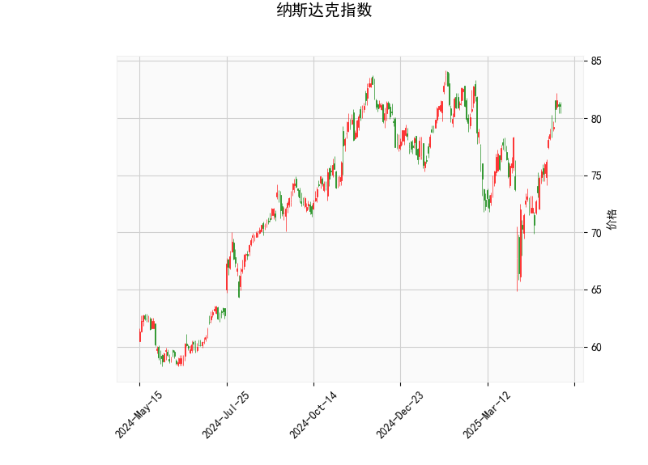

# 纳斯达克指数技术分析与投资机会研判

## 一、技术指标分析
### 1. 价格与布林带
- **当前价81.06**位于布林带中轨（75.77）和上轨（83.00）之间，接近上轨但未突破。短期显示偏强趋势，但需警惕上轨压力。
- **布林带宽度收窄**（上轨83.00 vs 中轨75.77）暗示市场波动率降低，可能进入方向选择阶段。

### 2. RSI指标
- **RSI 66.71**接近超买阈值（70），反映市场短期买盘力量较强。但未突破70说明未形成极端超买，仍有继续上行动能。

### 3. MACD指标
- **MACD线（1.84）>信号线（1.09）**，柱状图持续扩大（+0.75），显示多头动能增强，中期趋势维持看涨。

### 4. K线形态
- **CDLMATCHINGLOW**：底部反转形态，通常出现在下跌末端，但当前处于中高位需谨慎解读。
- **CDLSPINNINGTOP**：纺锤线形态，反映多空博弈激烈，短期可能进入震荡或趋势反转。

---

## 二、投资机会与策略建议
### 1. 突破策略（激进型）
- **做多条件**：价格突破布林上轨83.00且RSI未超70，配合MACD持续扩张，可短线追涨。
- **目标位**：参考前高或布林带开口后的新通道上沿。
- **止损设置**：跌破突破K线最低点或中轨75.77。

### 2. 回调买入策略（稳健型）
- **入场时机**：若价格回踩中轨75.77附近（当前偏离率+7%），结合RSI回落至50-60区间。
- **验证信号**：需MACD柱状图缩量后重新放大，避免下跌中继风险。

### 3. 反转博弈策略（高风险）
- **潜在做空机会**：若价格触及83.00后出现看跌吞没/乌云盖顶形态，且RSI突破70后快速回落。
- **关键触发点**：MACD柱状图开始收缩，MACD线下穿信号线形成死叉。

---

## 三、风险警示
1. **RSI背离风险**：若价格创新高但RSI未同步突破前高，可能形成顶背离。
2. **布林带假突破**：关注突破时成交量变化，缺乏量能支撑的突破可能失败。
3. **宏观事件冲击**：需同步关注美联储政策、CPI数据等基本面驱动因素。

> （注：以上分析基于静态技术指标，实际交易需结合动态市场环境及个人风险承受能力综合决策。）