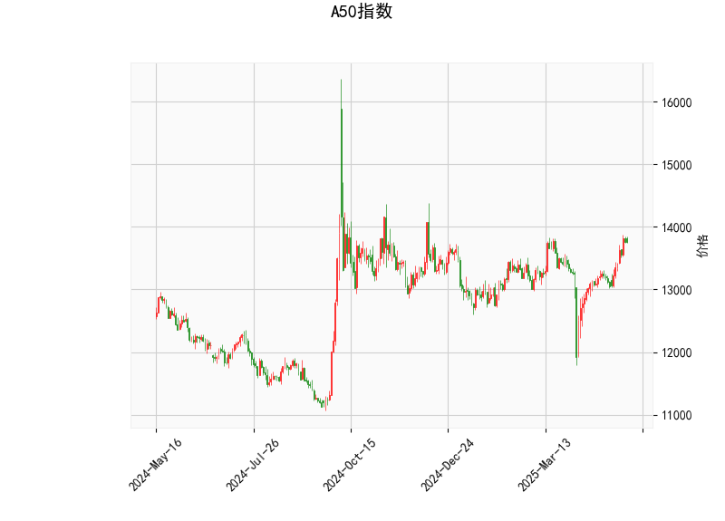

### A50指数技术分析结果解读

#### 1. 技术指标分析
- **当前价（13760.0）**：  
  当前价格位于布林带中轨（13256.64）和上轨（13901.03）之间，接近上轨，表明市场处于**短期强势区间**，但需警惕上轨附近的阻力作用。

- **RSI（65.47）**：  
  RSI值接近70（超买阈值），显示市场存在**短期超买风险**，但尚未进入明确超买区域，需结合其他指标判断趋势持续性。

- **MACD（154.28）与信号线（81.17）**：  
  MACD线远高于信号线，且MACD柱（73.11）为正值且持续扩大，表明**上涨动能强劲**，短期趋势偏多。

- **布林带**：  
  - 上轨（13901.03）：当前价接近上轨，若突破可能加速上涨，但需警惕回调压力。  
  - 中轨（13256.64）：若价格回落，中轨可能成为短期支撑。  
  - 下轨（12612.24）：当前距离较远，短期跌破概率较低。

- **K线形态**：  
  - **CDLMATCHINGLOW**（匹配低形态）：通常出现在下跌趋势中，暗示空方力量减弱，可能预示**短期底部反转**。  
  - **CDLSHORTLINE**（短实体线）：表明市场犹豫，需结合后续K线确认方向。

---

#### 2. 近期投资机会与策略

##### **机会判断**：
- **短期趋势**：MACD与RSI显示市场处于多头主导阶段，但RSI接近超买区域，需警惕回调风险。
- **关键位置**：  
  - **上方阻力**：布林带上轨（13901）是短期关键阻力位，突破后可能打开上行空间。  
  - **下方支撑**：中轨（13256）是重要支撑，若跌破可能引发短期调整。

##### **策略建议**：
1. **趋势跟踪策略**：  
   - **做多条件**：若价格突破13901且RSI未超70，可顺势做多，目标位14200-14500，止损设于中轨下方（13250）。  
   - **止盈信号**：MACD柱缩窄或RSI超70时需减仓。

2. **反转策略**：  
   - **做空条件**：若价格在13901附近受阻且RSI超70，可轻仓试空，目标中轨（13256），止损设于13901上方。  
   - **反转确认**：需结合后续K线形态（如看跌吞没）增强信号可信度。

3. **区间套利**：  
   - **高抛低吸**：在布林带上轨（13901）附近卖出，中轨（13256）附近买入，适用于震荡行情。  
   - **风险控制**：需严格止损（如突破上轨或跌破中轨时离场）。

##### **风险提示**：
- **RSI超买风险**：若RSI突破70，可能引发短期回调。  
- **MACD背离风险**：若价格上涨但MACD柱缩窄，需警惕动能衰竭。  
- **K线形态可靠性**：CDLMATCHINGLOW需配合成交量确认反转有效性。

---

### 总结
当前A50指数短期偏多，但需关注13901附近的阻力与RSI超买风险。策略上可优先考虑趋势跟踪（突破做多），若出现回调则关注中轨支撑的买入机会。套利交易需结合区间震荡特征，严格止损以控制风险。