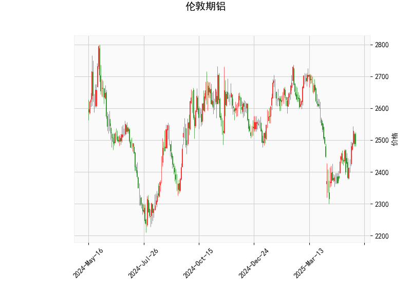

### 伦敦期铝技术分析结果解读

#### 1. 技术指标分析
- **当前价（2489.0）**：  
  价格位于布林带中轨（2520.72）下方，但接近中轨，表明市场处于中性区域，短期可能面临方向选择。若价格站稳中轨上方，可能转为偏多；若承压回落，则可能向下轨（2276.56）靠近。

- **RSI（54.55）**：  
  处于中性区间（50附近），未显示明显超买或超卖信号，但略高于50表明买方力量稍占优。需结合其他指标观察趋势持续性。

- **MACD（3.01）与信号线（-13.64）**：  
  MACD线（3.01）已上穿信号线（-13.64），且柱状图（16.65）持续放大，形成“金叉”，显示短期反弹动能增强。但信号线仍处于负值区域，需警惕反弹是否具有持续性。

- **布林带**：  
  上轨（2764.88）与下轨（2276.56）间距较大，反映当前波动率较高。若价格突破中轨并站稳，可能向上轨方向运行；若跌破近期低点，可能向下轨测试支撑。

- **K线形态**：  
  - **CDLMATCHINGLOW**：匹配低点形态，通常出现在下跌趋势中，暗示短期抛压减弱，存在潜在反转可能。  
  - **CDLSHORTLINE**：短实体线，表明市场犹豫不决，需结合后续K线确认方向。

#### 2. 投资机会与策略建议

##### **潜在机会**：
1. **短期反弹策略**：  
   - **入场条件**：价格站稳布林带中轨（2520）且MACD柱状图持续放大，或RSI突破60。  
   - **目标**：上轨附近（2764），潜在盈利空间约10%。  
   - **止损**：若价格跌破2450（近期支撑位），需止损。

2. **区间震荡策略**：  
   - 若价格持续围绕中轨波动，可在布林带下轨（2276）附近轻仓做多，上轨（2764）附近分批止盈，中轨附近作为动态止损参考。

3. **套利机会**：  
   - **跨期套利**：关注近月与远月合约价差变化。若库存数据或供应端出现扰动，可能产生正向套利机会（买入近月、卖出远月）。  
   - **跨市场套利**：若伦敦铝价与上海期货交易所（SHFE）铝价出现显著价差，可结合汇率和运费进行跨市套利。

##### **风险提示**：
- **假突破风险**：MACD金叉信号需配合成交量确认，警惕价格回踩中轨后再度下行。  
- **宏观扰动**：美联储政策、能源价格波动（电解铝成本）可能加剧价格波动。  
- **库存变化**：LME铝库存若大幅增加，可能压制反弹空间。

##### **总结**：  
当前技术面显示短期反弹信号，但需关注中轨压力位突破情况。建议轻仓参与反弹，严格设置止损；若价格持续承压中轨，则观望为主。套利策略需结合基本面数据动态调整。