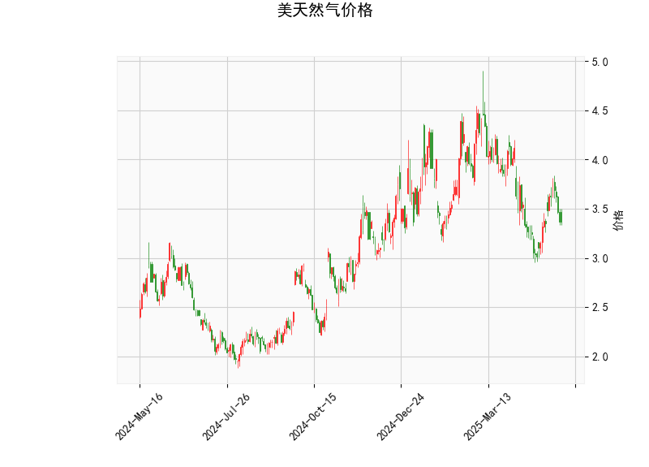

# 美天然气价格技术分析及投资策略

## 一、技术指标分析

### 1. 关键指标解读
- **当前价（3.366）**：位于布林通道中轨（3.751）下方，短期处于弱势区间，但距离下轨（2.956）尚有12%空间，存在潜在支撑。
- **RSI（44.27）**：中性偏弱但未超卖（<30），短期卖压占优但未极端化。
- **MACD指标**：MACD线（-0.032）上穿信号线（-0.057），柱状图转正（+0.024），显示短期动能转向多头。
- **布林通道**：价格处于中下轨之间，通道宽度（上轨4.545-下轨2.956）反映高波动性，需关注中轨突破或下轨支撑。
- **K线形态**：
  - **CDLLONGLINE**（长实体线）：出现在连续下跌后可能暗示反转。
  - **CDLMATCHINGLOW**（匹配低形态）：下跌动能衰竭信号。

### 2. 多空力量对比
- **多头信号**：MACD底背离初现、K线反转形态组合、价格偏离中轨可能均值回归。
- **空头压力**：价格仍处中轨下方、RSI未达超卖区、绝对价格靠近年度低位。

---

## 二、投资机会与策略

### 1. 短期交易机会
- **多头策略**（风险偏好型）：
  - **入场条件**：价格站稳3.30且MACD柱持续放大
  - **目标位**：布林中轨3.75（+11.4%）
  - **止损位**：跌破前低或布林下轨2.95（-12.3%）
  - **仓位控制**：不超过总资金5%，配合突破中轨后加仓
- **空头策略**（保守型）：
  - **入场条件**：RSI反弹至50受阻+价格未破中轨
  - **目标位**：回踩3.0心理关口（-10.9%）
  - **止损位**：有效突破中轨3.75

### 2. 套利机会
- **跨期套利**：关注近月合约超跌后的正套机会（买近月/卖远月），需结合库存数据验证供需变化。
- **波动率策略**：布林通道宽度达1.589（上轨-下轨），可考虑卖出宽跨式期权组合，收割波动率收缩收益。

---

## 三、风险提示
1. **基本面扰动**：需同步关注EIA库存报告、极端天气预期（飓风/寒潮）、LNG出口设施运行状况。
2. **技术面失效风险**：MACD金叉可能为"假信号"，需配合成交量放大验证。
3. **仓位管理**：建议使用追踪止损保护盈利，避免隔夜跳空风险。

> **关键观察窗口**：未来3个交易日能否收于3.50上方确认趋势反转，或下破3.30加速探底。建议结合明日EIA库存数据公布时点调整策略。