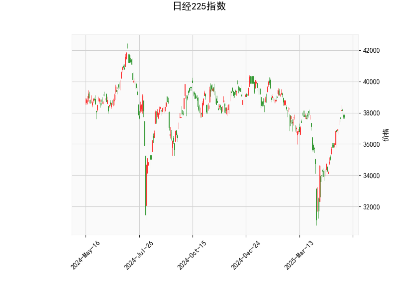

# 日经225指数技术分析及投资策略

---

## 一、技术指标分析

### 1. 价格与布林带
- **当前价37,755.51**介于布林通道中轨（36,300.9）与上轨（39,731.6）之间，距离上轨约5.2%空间，短期处于**多头强势区域**，但需警惕上轨压力。
- **中轨向上倾斜**（布林带中轨为动态均线），显示中期趋势仍偏多，若回踩中轨可视为支撑位。

### 2. RSI指标
- **RSI 62.5**接近超买阈值（70），但未进入绝对高位，暗示市场存在**短期过热风险**但未完全透支上涨动能。若突破70需警惕回调，若维持60-70震荡则可能延续趋势。

### 3. MACD指标
- **MACD线（658.2）> 信号线（374.4）**，形成金叉且柱状图持续扩张（283.8），表明**上涨动能强劲**，短期多头占优。需关注MACD柱是否出现顶背离。

### 4. K线形态
- **CDLMATCHINGLOW**（匹配低点形态）为看涨信号，通常出现在下跌后，显示空方力量衰竭，多方开始反攻。结合当前处于上升趋势，该形态可能强化短期反弹预期。

---

## 二、投资机会与策略

### 1. 趋势跟踪策略
- **多头策略**：若价格站稳布林带中轨（36,300附近）且MACD维持金叉，可分批建仓，目标看向上轨39,700区域，止损设于中轨下方1-2%。
- **突破交易**：若放量突破布林带上轨，可能打开加速上涨空间，可轻仓追涨，止损设于突破位下方。

### 2. 回调交易策略
- **支撑位博弈**：若价格回踩中轨（36,300）或RSI回落至50附近，可结合MACD柱缩量企稳信号布局多单，目标上轨。

### 3. 风险对冲机会
- **期权保护**：持有现货者可买入虚值看跌期权对冲回调风险，或通过卖出虚值看涨期权（Covered Call）增厚收益。
- **跨期套利**：关注期货合约升贴水结构，若近月合约溢价过高（Contango），可尝试卖近买远的日历价差策略。

### 4. 风险提示
- **超买修正风险**：RSI若突破70需警惕短期回调，配合MACD柱缩量或死叉可考虑止盈。
- **事件驱动风险**：日本央行货币政策调整、日元汇率波动可能加剧指数波动率。

---

## 三、结论
**短期看涨但需谨慎追高**。建议以中轨为支撑布局多单，关注上轨突破有效性，同时密切跟踪MACD与RSI的背离信号。套利机会需结合衍生品市场流动性及价差结构动态调整。