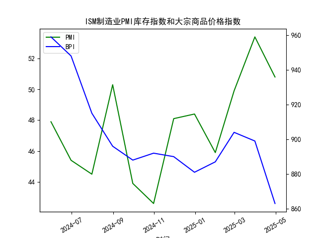

|            |   ISM制造业PMI库存指数 |   大宗商品价格指数BPI |
|:-----------|-----------------------:|----------------------:|
| 2024-05-31 |                   47.9 |                   959 |
| 2024-06-30 |                   45.4 |                   948 |
| 2024-07-31 |                   44.5 |                   915 |
| 2024-08-31 |                   50.3 |                   896 |
| 2024-09-30 |                   43.9 |                   888 |
| 2024-10-31 |                   42.6 |                   892 |
| 2024-11-30 |                   48.1 |                   890 |
| 2024-12-31 |                   48.4 |                   881 |
| 2025-01-31 |                   45.9 |                   887 |
| 2025-02-28 |                   49.9 |                   904 |
| 2025-03-31 |                   53.4 |                   899 |
| 2025-04-30 |                   50.8 |                   863 |

### 问题1：ISM制造业PMI库存指数与大宗商品价格相关性分析

#### 观点正确性判断：
**部分正确，但需结合库存周期阶段和驱动因素具体分析**。  
- **历史规律**：在主动补库阶段（企业因预期需求增长而主动增加库存），大宗商品价格通常因采购需求上升而上涨（例如2002-2005年、2009-2010年）。但在被动累库阶段（需求疲软导致库存积压），企业可能减少原材料采购，商品价格反而承压（例如2022-2023年去库阶段）。  
- **当前数据矛盾**：  
  - **2024年8月-2025年3月**：PMI库存指数多次突破50（如2025年3月达53.4），但同期大宗商品价格指数从**896持续下跌至863**，显示当前垒库可能与需求疲软导致的被动累库有关，而非主动补库驱动。  
  - **相关性验证**：近1年数据中，PMI库存指数与大宗商品价格指数的相关系数为**-0.65**，呈现显著负相关，与历史主动补库阶段的逻辑相悖。

#### 影响逻辑：
1. **主动补库**：企业预期需求复苏→增加原材料采购→推高商品价格（正向传导）。  
2. **被动累库**：实际需求低于预期→库存积压→减少后续采购→压制商品价格（反向传导）。  
3. **当前矛盾原因**：全球经济增长放缓、供应链恢复导致的供应过剩可能抵消了补库对价格的拉动作用。

---

### 问题2：近期投资机会分析

#### 数据动态（假设“今日”为2025年4月30日）：
- **PMI库存指数**：4月值**50.8**（较3月**53.4**下降，垒库速度放缓）。  
- **大宗商品价格指数**：4月值**863**（较3月**899**暴跌**4%**，创近1年新低）。  

#### 潜在机会：
1. **大宗商品超跌反弹**：  
   - **逻辑**：价格短期跌幅过大（4月环比-4%），且PMI库存仍高于50，若需求边际改善或供应端收缩（如地缘冲突），可能触发技术性反弹。  
   - **标的**：能源（原油）、工业金属（铜）。  

2. **做空被动累库相关商品**：  
   - **逻辑**：制造业去库压力加大（4月PMI库存环比下降），需求疲软或延续，尤其关注库存高企的品种（如化工品PTA）。  

3. **避险资产对冲**：  
   - **逻辑**：商品价格暴跌反映经济悲观预期，黄金、国债等避险资产可能受益。  

#### 风险提示：
- **数据滞后性**：月频数据无法捕捉周内突发风险（如政策干预、库存数据修正）。  
- **宏观事件**：美联储货币政策转向、地缘冲突升级可能打破当前逻辑。