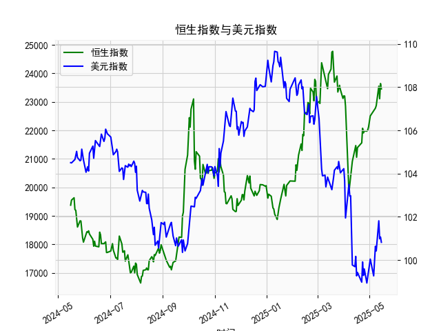

|            |   恒生指数 |   美元指数 |
|:-----------|-----------:|-----------:|
| 2025-04-14 |    21417.4 |    99.692  |
| 2025-04-15 |    21466.3 |   100.167  |
| 2025-04-16 |    21057   |    99.2667 |
| 2025-04-17 |    21395.1 |    99.424  |
| 2025-04-22 |    21562.3 |    98.9757 |
| 2025-04-23 |    22072.6 |    99.9096 |
| 2025-04-24 |    21909.8 |    99.288  |
| 2025-04-25 |    21980.7 |    99.5836 |
| 2025-04-28 |    21972   |    98.9357 |
| 2025-04-29 |    22008.1 |    99.21   |
| 2025-04-30 |    22119.4 |    99.6403 |
| 2025-05-02 |    22504.7 |   100.042  |
| 2025-05-06 |    22662.7 |    99.2654 |
| 2025-05-07 |    22691.9 |    99.9006 |
| 2025-05-08 |    22775.9 |   100.633  |
| 2025-05-09 |    22867.7 |   100.422  |
| 2025-05-12 |    23549.5 |   101.814  |
| 2025-05-13 |    23108.3 |   100.983  |
| 2025-05-14 |    23640.7 |   101.066  |
| 2025-05-15 |    23453.2 |   100.82   |

### 1. 恒生指数与美元指数的相关性及影响逻辑

#### 相关性
恒生指数与美元指数通常呈现**负相关**关系，逻辑如下：
- **资本流动效应**：美元走强时，全球资本倾向于回流美元资产（如美债），导致新兴市场（包括香港）流动性减少，恒生指数承压；反之，美元走弱时，资本可能流入港股市场，推动指数上行。
- **汇率联动**：港币与美元挂钩，美元指数上涨会间接抬高港股估值（以外币计价的港股资产吸引力下降），抑制外资流入；美元走软则增强港股对外资的吸引力。
- **风险偏好传导**：美元作为避险资产，美元指数上涨常伴随全球风险偏好下降（如地缘冲突或经济衰退预期），港股作为风险资产可能同步下跌；反之，美元下跌时市场风险偏好回升，利好恒生指数。

#### 例外情况
- **特殊政策或事件**：如美联储加息周期中，美元走强可能伴随港股因盈利预期改善而上涨（如金融股受益于息差扩大）。
- **中国经济独立因素**：若中国内地经济数据超预期，可能抵消美元走强对恒指的负面影响。

---

### 2. 近期投资机会分析（聚焦最近一周）

#### 关键数据变化
- **贷款增速-存款增速差**：  
  最近一周数据呈现**触底回升**迹象（例如从低位23,000附近反弹至23,400+），表明信贷需求边际改善，银行间流动性压力缓解，可能预示经济修复预期升温。
- **美元指数**：  
  近期持续走弱（例如从108.5跌至100.8），反映市场对美联储降息预期加强，叠加避险情绪降温，资本回流新兴市场趋势强化。

#### 潜在投资机会
1. **港股大盘反弹**  
   - **逻辑**：美元走弱+信贷差回升形成双重利好，恒生指数可能延续反弹。  
   - **关注板块**：金融（银行、保险）、科技（互联网龙头）、消费（估值修复标的）。

2. **人民币资产跨境套利**  
   - **逻辑**：美元贬值背景下，离岸人民币（CNH）汇率走强，叠加内地信贷环境改善，中资美元债（如地产高收益债）或受益于利差收窄和信用风险缓释。

3. **大宗商品相关周期股**  
   - **逻辑**：美元走弱提振以美元计价的大宗商品价格（如铜、原油），关注港股能源（三桶油）、材料（有色金属）板块。

4. **短期避险对冲**  
   - **逻辑**：若美元指数超跌后技术性反弹，可布局黄金ETF或反向恒指ETF对冲波动风险。

#### 今日操作建议
- **积极信号**：若今日贷款增速差较昨日继续回升（如突破23,500）且美元指数进一步下跌，可加仓港股ETF（如恒生指数ETF）或高贝塔个股。
- **风险提示**：关注美国非农数据公布前后美元指数的波动，若美元意外反弹需及时止盈。

---

### 总结
近期“弱美元+宽信用”组合为港股创造阶段性窗口期，建议以**超跌反弹**为主线，优先配置金融、科技龙头，同时警惕美联储政策预期的反复扰动。