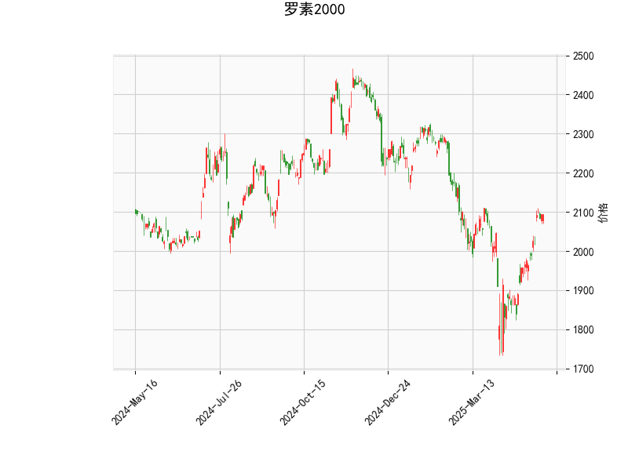

### 罗素2000指数技术分析解读

#### 1. 技术指标分析
- **当前价（2094.69）与布林轨道**  
  当前价格位于布林带中轨（2006.86）和上轨（2202.65）之间，且明显高于中轨，表明短期处于**上升趋势**中。距离上轨仍有约5%的空间，若量能配合可能进一步向上突破。但需警惕上轨附近的阻力压制。

- **RSI（64.27）**  
  相对强弱指标接近**超买阈值（70）**，反映市场短期存在一定的买盘过热风险，但尚未进入明确超买区域。若RSI突破70且价格同步创出新高，可能加速上涨；反之，若价格与RSI背离（如价格新高但RSI走弱），则需警惕回调。

- **MACD（33.86）与信号线（13.48）**  
  MACD柱状图（20.38）持续扩张，且MACD线远高于信号线，显示**多头动能强劲**。当前属于典型的“金叉延续”状态，但需关注MACD柱状图是否出现缩量或拐头向下，这可能预示短期回调。

- **K线形态**  
  - **CDLCLOSINGMARUBOZU**（光头光脚阳线）：表明买方完全主导，收盘价接近当日最高点，短期看涨信号强烈。  
  - **CDLLONGLINE**（长实体K线）：显示市场波动性增加，但需结合位置判断。当前处于中轨上方，长实体阳线更可能延续趋势而非反转。

#### 2. 投资机会与策略建议

##### **机会判断**  
- **趋势延续机会**：若价格站稳中轨（2006附近）且MACD柱状图维持扩张，可关注逢低做多策略，目标看向上轨（2200区域）。  
- **回调风险**：若RSI突破70后快速回落或价格跌破中轨，可能触发短期回调，目标支撑看向下轨（1810附近）。  
- **套利窗口**：布林带上下轨间距较大（约390点），若价格触及上轨且RSI超买，可尝试波段做空；反之，若价格回落至中轨附近且MACD未死叉，可布局多单。

##### **策略建议**  
1. **多头策略**  
   - **入场**：价格回踩中轨（2006）或突破前高（2100）时介入。  
   - **止损**：中轨下方1%-2%（1980-1990区域）。  
   - **目标**：上轨2200附近，若突破则持有至RSI超买信号出现。  

2. **空头对冲策略**  
   - **触发条件**：RSI突破70 + 价格触及上轨 + MACD柱状图缩量。  
   - **入场**：2200附近轻仓试空，止损设于上轨上方1%。  
   - **目标**：中轨2000附近，若跌破则看向下轨。  

3. **风险提示**  
   - 布林带宽度扩张反映波动率上升，需严格控制仓位。  
   - 关注宏观事件（如美联储政策）对中小盘股的冲击，罗素2000指数对利率敏感度较高。  
   - 若K线形态出现“CDLDOJI”（十字星）或“CDLENGULFING”（吞没形态），需警惕趋势反转。  

##### **关键验证信号**  
- **看涨确认**：成交量放大突破上轨，MACD柱状图持续走高。  
- **看跌确认**：价格跌破中轨且RSI回落至50以下，MACD死叉形成。  

（注：以上分析基于历史数据，需结合实时市场动态调整。）