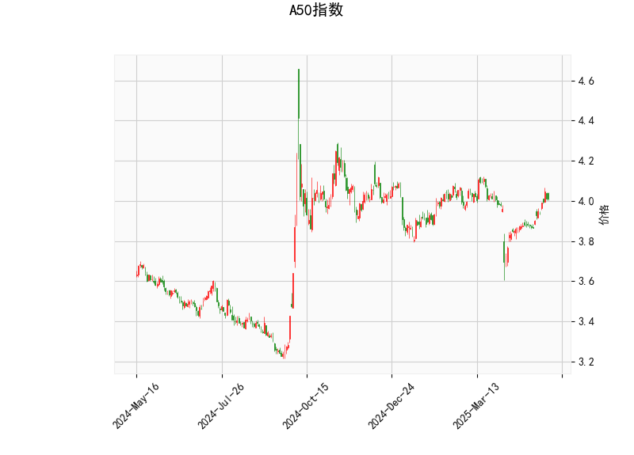

### 一、技术分析结果解读

#### 1. **RSI指标（63.46）**  
当前RSI值为63.46，处于中性偏强区间（50-70），表明市场存在一定买盘动能，但尚未进入超买区域（>70）。需警惕短期回调风险，但若持续站稳60以上，可能延续上行趋势。

#### 2. **MACD指标**  
- **MACD线（0.025）** 高于 **信号线（0.0064）**，形成“金叉”，且柱状图（0.0187）为正值并扩大，显示短期动能偏强，可能进一步上行。  
- 但MACD绝对值较小，需结合价格突破确认趋势强度。

#### 3. **布林轨道**  
- 当前价（4.011）位于中轨（3.958）与上轨（4.148）之间，接近中轨。  
- **中轨支撑**（3.958）可作为短期多空分界线，若价格站稳中轨，可能向上轨（4.148）发起冲击；若跌破中轨，则可能回踩下轨（3.769）。  
- 布林带宽度收窄，显示近期波动率较低，需关注突破方向。

#### 4. **K线形态**  
- **CDLBELTHOLD（蛰伏形态）**：通常出现在趋势末期，暗示多空力量平衡，可能预示反转。需结合其他指标验证。  
- **CDLLONGLINE（长脚十字线）**：表明市场存在分歧，但收盘价接近开盘价，显示短期犹豫。  
- **CDLMATCHINGLOW（相同低价）**：看涨信号，若出现在下跌趋势中，可能预示短期底部形成。

---

### 二、潜在机会与策略建议

#### 1. **趋势跟随策略**  
- **多头机会**：若价格站稳中轨（3.958）并突破前高（接近上轨4.148），可尝试追多，目标看向4.15-4.20区间，止损设于中轨下方（3.95）。  
- **空头机会**：若价格跌破中轨且MACD柱状图转负，可能回踩下轨（3.769），可轻仓试空，止损设于中轨上方（3.96）。

#### 2. **套利机会**  
- **波动率套利**：布林带收窄后若出现突破，可布局跨式期权组合（同时买入看涨和看跌期权），捕捉波动率扩张机会。  
- **均值回归策略**：若价格触及上轨（4.148）且RSI接近70，可逢高做空，目标中轨附近。

#### 3. **风险提示**  
- **假突破风险**：当前布林带收窄，需警惕价格突破后快速反转（如假突破上轨后回调）。  
- **RSI背离**：若价格创新高但RSI未同步突破前高，可能形成顶背离信号。  
- **事件驱动风险**：关注宏观经济数据（如中国PMI、美联储政策）对A50指数的短期冲击。

---

### 三、总结  
**短期看震荡偏多**，MACD金叉和布林中轨支撑提供做多逻辑，但需警惕RSI超买修正及布林上轨压力。建议结合分时图确认入场点，严格设置止损，并关注基本面与市场情绪变化。