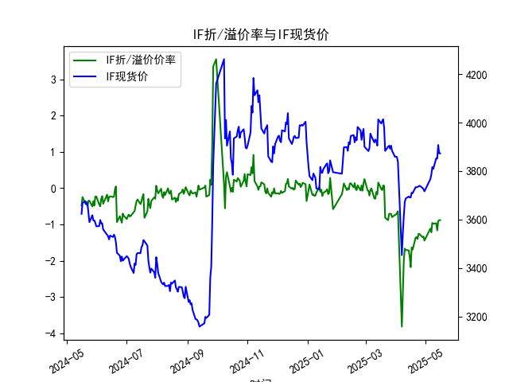
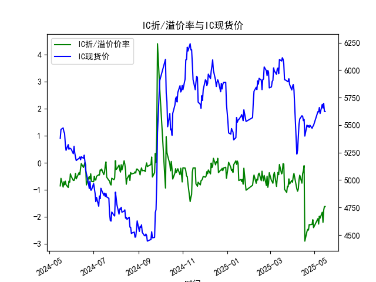
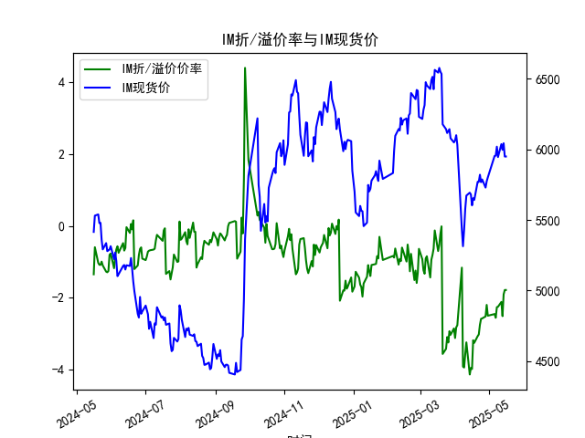

|            |   IF折/溢价率 |   IF现货价 |   IH折/溢价率 |   IH现货价 |   IC折/溢价率 |   IC现货价 |   IH折/溢价率 |   IH现货价 |
|:-----------|--------------:|-----------:|--------------:|-----------:|--------------:|-----------:|--------------:|-----------:|
| 2025-04-16 |     -2.17398  |     3690.8 |     -0.296286 |     5540.4 |     -0.296286 |     5540.4 |      -3.98173 |     5603   |
| 2025-04-17 |     -1.63358  |     3710.6 |     -0.104562 |     5551.2 |     -0.104562 |     5551.2 |      -3.18113 |     5653.8 |
| 2025-04-18 |     -1.68913  |     3708.8 |     -2.89029  |     5400   |     -2.89029  |     5400   |      -3.25269 |     5642   |
| 2025-04-21 |     -1.36545  |     3733.2 |     -2.52696  |     5499.8 |     -2.52696  |     5499.8 |      -3.06818 |     5770   |
| 2025-04-22 |     -1.34653  |     3733   |     -2.45739  |     5486   |     -2.45739  |     5486   |      -3.02072 |     5769.6 |
| 2025-04-23 |     -1.39646  |     3734   |     -2.48358  |     5495   |     -2.48358  |     5495   |      -2.75012 |     5820   |
| 2025-04-24 |     -1.25668  |     3736.8 |     -2.28117  |     5478   |     -2.28117  |     5478   |      -2.58556 |     5767.4 |
| 2025-04-25 |     -1.26205  |     3739.2 |     -2.28499  |     5498.6 |     -2.28499  |     5498.6 |      -2.57433 |     5786.6 |
| 2025-04-28 |     -1.34913  |     3730.6 |     -2.27382  |     5471   |     -2.27382  |     5471   |      -2.51923 |     5729   |
| 2025-04-29 |     -1.33181  |     3724.8 |     -2.10005  |     5487.2 |     -2.10005  |     5487.2 |      -2.19842 |     5773.6 |
| 2025-04-30 |     -1.44197  |     3716.2 |     -2.39398  |     5497   |     -2.39398  |     5497   |      -2.49939 |     5801.4 |
| 2025-05-06 |     -1.11177  |     3766.2 |     -2.06144  |     5622   |     -2.06144  |     5622   |      -2.45329 |     5953.2 |
| 2025-05-07 |     -1.2169   |     3785   |     -2.26234  |     5620.2 |     -2.26234  |     5620.2 |      -2.55739 |     5955.2 |
| 2025-05-08 |     -0.957625 |     3816   |     -1.97107  |     5660   |     -1.97107  |     5660   |      -2.2617  |     6018.8 |
| 2025-05-09 |     -0.976471 |     3808.6 |     -2.04348  |     5604.8 |     -2.04348  |     5604.8 |      -2.25057 |     5945.2 |
| 2025-05-12 |     -0.966676 |     3853   |     -1.82396  |     5688   |     -1.82396  |     5688   |      -2.1153  |     6037   |
| 2025-05-13 |     -1.16158  |     3851   |     -2.19778  |     5654.6 |     -2.19778  |     5654.6 |      -2.51032 |     5996.6 |
| 2025-05-14 |     -0.908163 |     3907.4 |     -1.74715  |     5697.8 |     -1.74715  |     5697.8 |      -1.90524 |     6043   |
| 2025-05-15 |     -0.880406 |     3872.8 |     -1.6149   |     5623   |     -1.6149   |     5623   |      -1.78364 |     5949   |
| 2025-05-16 |     -0.880406 |     3872.8 |     -1.6149   |     5623   |     -1.6149   |     5623   |      -1.78364 |     5949   |







# 股指期货折/溢价率与现货价的相关性及影响逻辑

## 1. 折/溢价率与现货价的关联机制
**折溢价率**反映期货价格相对现货指数的偏离程度，计算公式为：  
`（期货价格 - 现货指数）/ 现货指数 × 100%`  

### 核心逻辑：
- **正向溢价（升水）**通常暗示市场对未来上涨的预期，可能源于：
  - 资金成本（利率）低于股息率时的正向套利空间
  - 乐观情绪推动期货买盘需求
- **负向折价（贴水）**多体现避险需求或套保压力，常见于：
  - 市场波动加剧时对冲需求激增
  - 股息集中发放期对定价的向下修正
- **均值回归特性**：极端折溢价会引发套利交易（如反向期现套利），推动价格收敛

### 动态传导路径：
```
市场情绪波动 → 期货买卖力量变化 → 折溢价率波动 → 套利资金介入 → 现货市场流动性变化 → 现货价格修正
```

---

# 近期投资机会分析（聚焦最近一周）

## 2. 数据特征与机会判断
### 关键观测点（2025年5月12日-16日）：
| 品种 | 折溢价率变化 | 现货价波动 | 异常信号 |
|------|--------------|------------|----------|
| **IF** | 贴水收窄0.08% → 稳定 | 从3907→3872下跌0.9% | 期现反向运动，套利窗口隐现 |
| **IH** | 贴水扩大0.4% → 收窄0.13% | 5697→5623下跌1.3% | 期价抗跌性强于现货 |
| **IC** | 贴水波动率最高达0.45% | 5697→5623同IH走势 | 跨品种对冲机会 |
| **IM** | 贴水收窄0.12% → 稳定 | 6043→5949下跌1.6% | 期货市场提前消化下跌预期 |

### 机会维度：
1. **期现套利窗口**  
   IF品种出现期货价格相对抗跌（贴水收窄+现货下跌），可关注：
   - 反向套利：做空期货+买入现货组合
   - 执行窗口：贴水率突破-0.9%时触发

2. **跨品种对冲**  
   IH/IC溢价差扩大至0.4%（历史75分位水平），建议：
   - 多IH空IC组合，捕捉大盘/中小盘风格回归

3. **波动率交易**  
   IM贴水波动率显著高于其他品种（周内振幅0.6%），适合：
   - 卖出宽跨式期权组合，收割波动率溢价

4. **事件驱动策略**  
   5月16日四大品种同步出现贴水稳定，结合：
   - 季度合约换月完成后的流动性回升
   - 现货市场超跌反弹概率增大
   可布局期货多头敞口

---

# 风险提示
1. 关注隔夜欧美市场波动对开盘价冲击
2. 警惕交割周前期的基差快速收敛风险
3. 流动性分层现象（IM合约成交量需重点监测）

