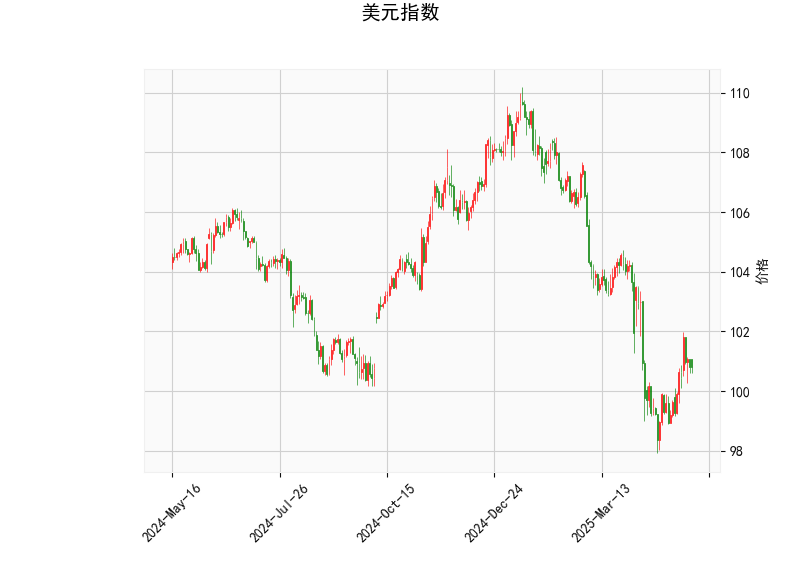

# 美元指数技术分析解读

## 一、美元指数技术分析解读
### 1. 核心指标解析
- **价格位置**：当前价100.82低于布林带中轨（102.39），但高于下轨（97.52），处于弱势震荡区间。布林带开口扩大（上下轨间距约9.75）显示波动率上升，但未突破下轨表明未进入超卖。
- **动能指标**：
  - RSI（49.73）接近中性，无明确方向信号；
  - MACD（-0.26）与信号线（-0.59）在负值区收敛，柱状线（0.34）翻红，暗示下跌动能减弱但未形成金叉；
  - K线形态显示低位匹配（CDLMATCHINGLOW），需后续阳线确认反转有效性。
- **关键阈值**：若突破中轨102.39可能转强，跌破下轨97.5将打开下行空间。

### 2. 趋势判断
短期维持弱势震荡格局，技术面存在超跌反弹可能但缺乏明确多头信号。需关注美联储政策预期变化对实际走势的引导作用。

---

## 二、A股/港股投资机会与策略
### 1. 美元走弱逻辑下的机会
- **跨境资金流动**：美元弱势可能刺激资金回流新兴市场，关注港股通资金动向及恒生科技指数（HSTECH）弹性。
- **板块配置**：
  - **受益人民币升值**：航空（航油成本下降）、造纸（进口木浆成本降低）；
  - **外资偏好资产**：港股互联网龙头（腾讯、美团）、A股消费白马（食品饮料）；
  - **大宗商品传导**：黄金股（山东黄金、招金矿业）对冲美元信用风险。

### 2. 套利策略建议
- **AH溢价收敛**：筛选AH溢价率>30%的金融股（如中信证券、中国平安），做多H股/做空A股；
- **波动率套利**：利用恒指期权与A50期权的波动率差值构建跨市场组合；
- **事件驱动**：关注港股二次上市中概股与美股的价差修复机会。

### 3. 风险警示
- 美联储"higher for longer"政策超预期可能逆转美元弱势；
- 需同步监测中国10年期国债收益率与美债利差变化；
- 警惕港股流动性风险（日均成交低于800亿港元时慎用杠杆）。

---

**操作建议**：短期可逢低布局恒生科技ETF（3033.HK）及消费ETF，中期关注美元指数100关键位争夺，若有效跌破则加大港股配置比例至60%以上。