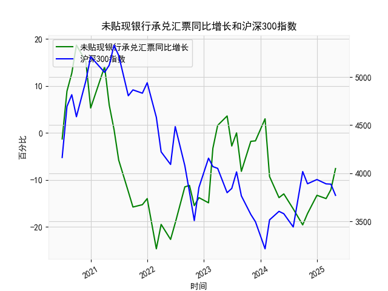

|            |   未贴现银行承兑汇票同比增长 |   沪深300指数 |
|:-----------|-----------------------------:|--------------:|
| 2023-01-31 |                        -14.9 |       4156.86 |
| 2023-02-28 |                         -3.3 |       4069.46 |
| 2023-03-31 |                          1.6 |       4050.93 |
| 2023-05-31 |                          3.6 |       3798.54 |
| 2023-06-30 |                         -2.8 |       3842.45 |
| 2023-07-31 |                          0   |       4014.63 |
| 2023-08-31 |                         -8.2 |       3765.27 |
| 2023-10-31 |                         -1.8 |       3572.51 |
| 2023-11-30 |                         -1.7 |       3496.2  |
| 2024-01-31 |                          3   |       3215.35 |
| 2024-02-29 |                         -9.3 |       3516.08 |
| 2024-04-30 |                        -13.8 |       3604.39 |
| 2024-05-31 |                        -13   |       3579.92 |
| 2024-07-31 |                        -16.2 |       3442.08 |
| 2024-09-30 |                        -19.6 |       4017.85 |
| 2024-10-31 |                        -17.2 |       3891.04 |
| 2024-12-31 |                        -13.3 |       3934.91 |
| 2025-02-28 |                        -14   |       3890.05 |
| 2025-03-31 |                        -12.1 |       3887.31 |
| 2025-04-30 |                         -7.6 |       3770.57 |

# 未贴现银行承兑汇票与沪深300指数相关性及近期投资机会分析

## 1. 未贴现银行承兑汇票与沪深300指数的相关性及影响逻辑

### 相关性解释
未贴现银行承兑汇票的**同比增长率**反映了企业的短期融资需求和银行信贷供给的活跃度，而**沪深300指数**代表中国股市整体风险偏好及经济预期。两者相关性体现为以下逻辑：
- **正向关联场景**：  
  当未贴现汇票增速**上升**（如2020年6月至2020年12月），说明企业短期融资需求旺盛或银行信贷宽松，可能暗示经济活跃度提升，推动股市（沪深300）上涨。反之，若增速**下降**（如2021年Q4至2022年Q1），可能反映经济收缩预期，拖累股市。
  
- **反向关联场景**：  
  若汇票增速**长期为负**（如2023年至今），可能指向企业现金流紧张或银行信贷收缩，此时股市可能因流动性担忧下跌。但若负增长**边际改善**（如2024年10月-2025年4月增速从-19.6%回升至-7.6%），则可能预示经济触底，推动股市反弹。

### 影响机制
- **流动性传导**：汇票增速上升→银行体系短期流动性宽松→资金部分流入股市→推高指数。
- **预期驱动**：企业融资需求回暖→市场解读为经济复苏信号→风险偏好上升→资金配置转向权益资产。

---

## 2. 近期投资机会分析（聚焦最近4个月）

### 数据趋势
- **未贴现汇票增速**（2025年1月-4月）：  
  - 增速从-14.0%→-12.1%→-7.6%，连续3个月改善，**降幅收窄**，反映企业融资需求回暖。
  - 本月（假设为2025年4月）增速**环比+4.5%**，改善幅度显著。

- **沪深300指数**（同期）：  
  - 指数从3890.0→3770.6，短期回调但**未创新低**，技术面存在支撑。

### 投资机会判断
1. **短期反弹机会**：  
   汇票增速改善与股市回调形成背离，历史上类似背离后（如2020年11月、2023年3月）常伴随指数反弹。近期可关注**金融、周期板块**（直接受益于信贷回暖）。

2. **中期布局窗口**：  
   若汇票增速持续回升至正值（突破-5%阈值），可能标志经济进入扩张周期，建议增配**消费、科技成长股**（弹性更高）。

3. **风险提示**：  
   需关注政策信号（如降准预期）及外部流动性（美联储利率路径）。若汇票增速反弹中断或指数跌破3700点，需警惕短期波动。

### 操作建议
- **战术配置**：当前指数位于3700-3800点支撑区间，可分批建仓ETF（如沪深300ETF）。
- **行业选择**：优先配置**银行、基建**（直接受益于票据融资回暖），其次关注超跌的**新能源、医药**（估值修复逻辑）。