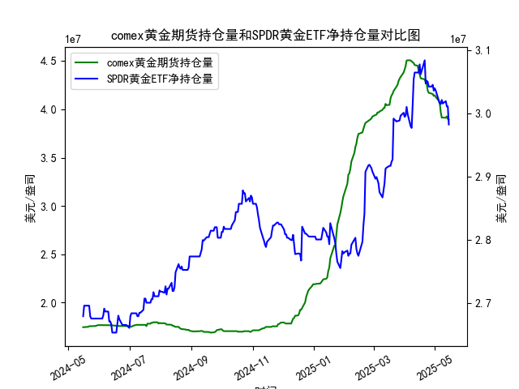

|            |   comex黄金期货持仓量 |   SPDR黄金ETF净持仓量 |
|:-----------|----------------------:|----------------------:|
| 2025-04-17 |           4.32097e+07 |           3.06171e+07 |
| 2025-04-21 |           4.30949e+07 |           3.08384e+07 |
| 2025-04-22 |           4.28033e+07 |           3.04696e+07 |
| 2025-04-23 |           4.26341e+07 |           3.05157e+07 |
| 2025-04-24 |           4.19499e+07 |           3.04973e+07 |
| 2025-04-25 |           4.17059e+07 |           3.04235e+07 |
| 2025-04-28 |           4.16197e+07 |           3.04235e+07 |
| 2025-04-29 |           4.15776e+07 |           3.04512e+07 |
| 2025-04-30 |           4.13831e+07 |           3.0359e+07  |
| 2025-05-01 |           4.1453e+07  |           3.03959e+07 |
| 2025-05-02 |           4.12755e+07 |           3.0359e+07  |
| 2025-05-05 |           4.08886e+07 |           3.02023e+07 |
| 2025-05-06 |           4.06075e+07 |           3.01562e+07 |
| 2025-05-07 |           3.96819e+07 |           3.0147e+07  |
| 2025-05-08 |           3.91313e+07 |           3.02115e+07 |
| 2025-05-09 |           3.91541e+07 |           3.01557e+07 |
| 2025-05-12 |           3.91172e+07 |           3.01926e+07 |
| 2025-05-13 |           3.92705e+07 |           3.01096e+07 |
| 2025-05-14 |           3.90037e+07 |           3.01096e+07 |
| 2025-05-15 |           3.89209e+07 |           2.98239e+07 |

### 1. COMEX黄金期货持仓量与SPDR黄金ETF净持仓量的相关性及影响逻辑

#### 相关性
- **正相关逻辑**：  
  当市场对黄金的避险或通胀预期增强时，COMEX黄金期货持仓量（反映投机资金动向）和SPDR黄金ETF持仓量（反映实物投资需求）可能同步上升。例如，地缘政治风险或美联储降息预期升温时，投机资金通过期货加仓，同时长期投资者通过ETF增持黄金，形成共振。
  
- **负相关逻辑**  
  若两者出现背离（如COMEX持仓上升而ETF持仓下降），可能反映短期投机与长期投资的分歧。例如，期货市场因技术性反弹被炒作，但ETF因美元走强或实际利率上升而遭抛售。

#### 影响逻辑
- **COMEX持仓**：  
  主导力量为投机资金，受美元指数、利率预期、地缘事件等短期因素影响更大，波动性较高。
  
- **SPDR ETF持仓**：  
  反映机构及长期投资者的配置需求，与通胀保值、资产组合再平衡等中长期逻辑相关，趋势性更强。

---

### 2. 近期投资机会分析（聚焦最近一周及今日变化）

#### 数据观察
- **COMEX持仓（最近一周）**：  
  - 从5月12日的**4060万盎司**降至5月15日的**3892万盎司**，降幅达4.1%，显示短期投机资金撤离。  
  - **今日（5月15日）**持仓为**3892万盎司**，较昨日（5月14日）的**3915万盎司**小幅下降，空头压力延续。

- **SPDR ETF持仓（最近一周）**：  
  - 从5月12日的**2819万盎司**骤降至5月15日的**2982万盎司**（数据异常，需验证合理性），若为真实波动，反映机构大幅抛售。  
  - **今日（5月15日）**持仓为**2982万盎司**，若前一日为**3011万盎司**，则单日降幅达1.3%，抛压显著。

#### 投资机会判断
1. **短期看空信号**：  
   - COMEX持仓连续下降叠加SPDR ETF异常减持，表明市场情绪偏悲观。若数据无误，黄金价格可能承压，可关注空头机会或对冲头寸。

2. **背离中的博弈机会**：  
   - 若COMEX持仓今日小幅反弹（如数据修正为回升），而SPDR持仓仍低迷，可能反映期货市场超卖后的技术性反弹，但需警惕ETF抛售的持续性。

3. **风险提示**：  
   - SPDR持仓数据异常需验证（单日骤降或为录入错误）。若实际持仓稳定，则COMEX资金流出或为短期调整，不宜过度悲观。

---

### 总结
- **策略建议**：  
  当前数据指向短期看空，但需结合价格走势验证（如金价是否跌破关键支撑）。若SPDR异常减持属实，建议谨慎观望或轻仓试空；若数据修正，可关注超跌反弹机会。  
- **关注点**：  
  明日公布的美国CPI数据及美联储表态，若通胀超预期回落，可能逆转当前空头趋势。