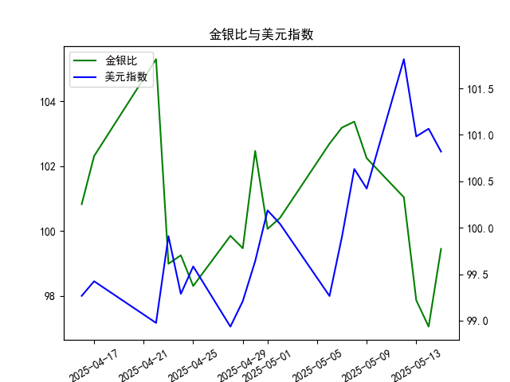

|            |    金价 |   银价 |   美元指数 |   金银比 |
|:-----------|--------:|-------:|-----------:|---------:|
| 2025-04-16 | 3322.9  | 32.955 |    99.2667 | 100.831  |
| 2025-04-17 | 3305.65 | 32.31  |    99.424  | 102.31   |
| 2025-04-22 | 3433.55 | 32.61  |    98.9757 | 105.291  |
| 2025-04-23 | 3262.95 | 32.96  |    99.9096 |  98.9973 |
| 2025-04-24 | 3314.75 | 33.395 |    99.288  |  99.2589 |
| 2025-04-25 | 3277.3  | 33.335 |    99.5836 |  98.3141 |
| 2025-04-28 | 3296.3  | 33.01  |    98.9357 |  99.8576 |
| 2025-04-29 | 3305.05 | 33.225 |    99.21   |  99.4748 |
| 2025-04-30 | 3302.05 | 32.225 |    99.6403 | 102.469  |
| 2025-05-01 | 3214.75 | 32.125 |   100.187  | 100.07   |
| 2025-05-02 | 3249.7  | 32.365 |   100.042  | 100.408  |
| 2025-05-06 | 3391.45 | 33.025 |    99.2654 | 102.693  |
| 2025-05-07 | 3392.25 | 32.875 |    99.9006 | 103.186  |
| 2025-05-08 | 3352.3  | 32.43  |   100.633  | 103.37   |
| 2025-05-09 | 3324.55 | 32.515 |   100.422  | 102.247  |
| 2025-05-12 | 3235.4  | 32.02  |   101.814  | 101.043  |
| 2025-05-13 | 3227.95 | 32.98  |   100.983  |  97.876  |
| 2025-05-14 | 3191.95 | 32.885 |   101.066  |  97.064  |
| 2025-05-15 | 3191.05 | 32.085 |   100.82   |  99.4561 |

# 金银比与美元指数的相关性及影响逻辑分析

## 一、金银比与美元指数的相关性及影响逻辑

### 1. 金银比的本质
金银比（黄金价格/白银价格）反映了两种贵金属的相对价值关系。黄金具有更强的避险和货币属性，白银则兼具工业属性。当市场风险偏好下降（如经济衰退预期增强）时，黄金表现通常优于白银，导致金银比上升；反之当工业需求或通胀预期主导时，白银可能跑赢黄金。

### 2. 美元指数的影响机制
美元指数与金银价格存在显著负相关：
- **计价效应**：金银以美元计价，美元走强会直接压制以美元标价的金银价格
- **替代效应**：美元资产实际收益率上升会削弱无息资产金银的吸引力
- **避险竞争**：美元和黄金同为避险资产，在风险事件中可能出现此消彼长

### 3. 联动关系的特殊性
美元指数对金银比的影响具有非对称性：
- 当美元走强主要由经济基本面驱动时（如美联储加息），金银比可能扩大（黄金抗跌性强于白银）
- 当美元走弱伴随通胀预期升温时，白银的工业属性可能使其涨幅超过黄金，导致金银比收窄
- 在极端风险事件中，黄金的避险属性可能完全主导，出现美元与黄金同步上涨的特殊情形

---

# 近期投资机会分析（聚焦最近一周及单日变化）

## 二、数据特征解析（2025年5月9日-5月15日）

### 1. 关键指标变动
| 日期       | 金银比   | 美元指数 | 单日金银比变化 |
|------------|----------|----------|----------------|
| 5月14日    | 97.06    | 101.0655 | +2.4（显著跳升）|
| 5月15日    | 99.46    | 100.8196 |                |

### 2. 近期趋势特征
- **金银比**：近一周从101.04（5月12日）快速下跌至97.06（5月14日）后暴力反弹
- **美元指数**：从101.814（5月12日）持续回落至100.82，形成短期下行通道
- **单日异动**：5月15日出现"美元下跌+金银比跳升"的背离现象

---

## 三、潜在投资机会研判

### 1. 短期套利机会
**金银比均值回归策略**：
- 当前金银比单日暴涨2.4点（+2.47%），创近一个月最大单日波幅
- 历史数据显示该比值在98-103区间震荡，当前99.46接近区间中枢
- 可构建"做多白银+做空黄金"组合，博弈比值向均值（约100）回归

### 2. 贵金属趋势机会
**白银补涨潜力**：
- 美元指数连续4日下跌（累计-1.0%），但白银相对滞涨
- 5月15日美元续跌时，金银比异常上升暗示白银超跌
- 若美元延续弱势，白银可能迎来补涨行情

### 3. 结构性对冲机会
**通胀预期交易**：
- 美元持续回落可能反映市场对美联储放缓加息的预期
- 结合近期能源价格波动，可建立"多头白银+空头美债"组合
- 白银受益于工业属性，美债空头对冲利率下行风险

### 4. 风险警示
- 单日金银比异动需警惕流动性风险（可能存在程序化交易引发的超调）
- 关注5月16日美国CPI数据公布，可能引发美元指数技术性反弹
- 建议采用期权组合策略控制尾部风险

---

**操作建议**：优先关注白银的短期反弹机会，建立金银比套利头寸（仓位不超过5%），同时配置黄金看跌期权对冲黑天鹅风险。密切跟踪美元指数100.50关键支撑位的争夺情况。