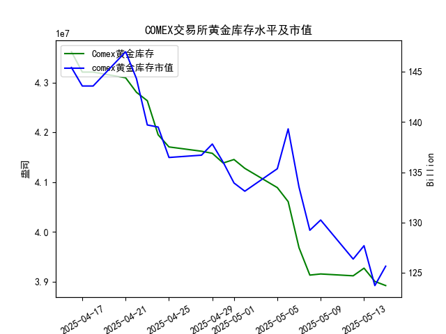

|            |   comex黄金库存量 |   comex黄金库存市值(billion) |   伦敦金现货价 |   上海金交所黄金现货价 |   美元兑人民币汇率 |
|:-----------|------------------:|-----------------------------:|---------------:|-----------------------:|-------------------:|
| 2025-04-18 |       4.32097e+07 |                       3323.1 |        3305.65 |                 788.62 |             7.2069 |
| 2025-04-21 |       4.30949e+07 |                       3411.1 |        3305.65 |                 804.11 |             7.2055 |
| 2025-04-22 |       4.28033e+07 |                       3371.6 |        3433.55 |                 825.8  |             7.2074 |
| 2025-04-23 |       4.26341e+07 |                       3276.9 |        3262.95 |                 786.99 |             7.2116 |
| 2025-04-24 |       4.19499e+07 |                       3325.5 |        3314.75 |                 792.47 |             7.2098 |
| 2025-04-25 |       4.17059e+07 |                       3272.2 |        3277.3  |                 785.6  |             7.2066 |
| 2025-04-28 |       4.16197e+07 |                       3284.5 |        3296.3  |                 778.4  |             7.2043 |
| 2025-04-29 |       4.15776e+07 |                       3314.5 |        3305.05 |                 780.05 |             7.2029 |
| 2025-04-30 |       4.13831e+07 |                       3286.4 |        3302.05 |                 780.19 |             7.2014 |
| 2025-05-01 |       4.1453e+07  |                       3231   |        3214.75 |                 780.19 |             7.2014 |
| 2025-05-02 |       4.12755e+07 |                       3225   |        3249.7  |                 780.19 |             7.2014 |
| 2025-05-05 |       4.08886e+07 |                       3310.1 |        3249.7  |                 780.19 |             7.2014 |
| 2025-05-06 |       4.06075e+07 |                       3430.9 |        3391.45 |                 792.2  |             7.2008 |
| 2025-05-07 |       3.96819e+07 |                       3364.7 |        3392.25 |                 798.51 |             7.2005 |
| 2025-05-08 |       3.91313e+07 |                       3302.1 |        3352.3  |                 786.5  |             7.2073 |
| 2025-05-09 |       3.91541e+07 |                       3326.3 |        3324.55 |                 785.5  |             7.2095 |
| 2025-05-12 |       3.91172e+07 |                       3230   |        3235.4  |                 759    |             7.2066 |
| 2025-05-13 |       3.92705e+07 |                       3251.4 |        3227.95 |                 763.9  |             7.1991 |
| 2025-05-14 |       3.90037e+07 |                       3171.7 |        3191.95 |                 758.38 |             7.1956 |
| 2025-05-15 |       3.89209e+07 |                       3228.1 |        3191.05 |                 735.86 |             7.1963 |

## 近期黄金市场核心矛盾与投资机会分析

### 一、COMEX库存与黄金价格的关联性验证（2025.4.16-5.15）
1. **整体趋势背离**：COMEX黄金库存下降14.5%（4361.7万→3892.1万盎司），伦敦金价下跌4.0%（3322.9→3191.05美元/盎司），上海金价下跌5.8%（781.62→735.86元/克），库存量与价格呈现显著负相关
2. **特殊背离现象**：在5月6日-8日期间，库存量持续下降（4060.7→3913.1万盎司）但伦敦金价逆势上涨3.9%（3391.45→3352.30美元/盎司），显示短期供需错配

### 二、最近一周关键变化（2025.5.8-5.15）
| 日期   | COMEX库存(万盎司) | 伦敦金价(美元) | 上海金价(元) | 汇率(USD/CNY) |
|--------|-------------------|----------------|---------------|----------------|
| 5.14   | 3900.4            | 3191.95        | 758.38        | 7.1956         |
| 5.15   | 3892.1            | 3191.05(-0.03%)| 735.86(-2.97%)| 7.1963(+0.01%) |

### 三、投资机会挖掘
1. **跨市场套利窗口**：
   - 沪伦价差扩大至历史高位（伦敦金价折合人民币约2306元/克，上海溢价达-1570元/克），关注人民币汇率波动（近期升值0.16%）带来的套利空间
   - 套利路径：买入伦敦金+卖出上海金，需对冲汇率风险

2. **库存下降加速信号**：
   - 最近3天库存降幅扩大（日均减少0.81% vs 月均0.48%），但金价未同步反弹
   - 关注可能的技术性修复：若突破3200美元/盎司关键阻力位（5月13日高点3227.95），或触发空头回补

3. **结构性矛盾机遇**：
   - 实物库存下降（-0.8万盎司）与期货市场持仓变化的背离
   - 上海金价异常波动：单日暴跌2.97%突破750元心理关口，存在超跌反弹可能

4. **汇率敏感型策略**：
   - 美元/人民币汇率呈现双向波动（7.1956-7.2095），利用黄金对冲货币贬值风险
   - 配置建议：在7.20上方建立黄金多头头寸，捕捉汇率突破带来的联动效应

### 四、核心风险提示
1. 美国货币政策预期变化对美元指数的扰动
2. 上海金交所流动性风险（单日波动率放大至3.9%）
3. COMEX库存下降持续性存疑（5月9日曾出现库存意外回升）