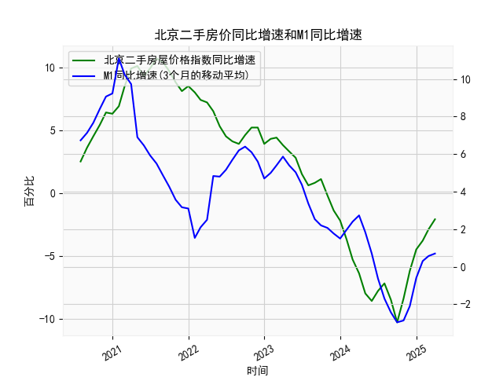

|            |   北京二手房屋价格指数同比增速 |   M1同比增速 |   M1同比增速(3个月的移动平均) |
|:-----------|-------------------------------:|-------------:|------------------------------:|
| 2023-08-31 |                            0.8 |          2.2 |                      2.53333  |
| 2023-09-30 |                            1.1 |          2.1 |                      2.2      |
| 2023-10-31 |                           -0.2 |          1.9 |                      2.06667  |
| 2023-11-30 |                           -1.4 |          1.3 |                      1.76667  |
| 2023-12-31 |                           -2.2 |          1.3 |                      1.5      |
| 2024-01-31 |                           -3.7 |          3.3 |                      1.96667  |
| 2024-02-29 |                           -5.3 |          2.6 |                      2.4      |
| 2024-03-31 |                           -6.4 |          2.3 |                      2.73333  |
| 2024-04-30 |                           -8   |          0.6 |                      1.83333  |
| 2024-05-31 |                           -8.6 |         -0.8 |                      0.7      |
| 2024-06-30 |                           -7.8 |         -1.7 |                     -0.633333 |
| 2024-07-31 |                           -7.2 |         -2.6 |                     -1.7      |
| 2024-08-31 |                           -8.5 |         -3   |                     -2.43333  |
| 2024-09-30 |                          -10.3 |         -3.3 |                     -2.96667  |
| 2024-10-31 |                           -8.4 |         -2.3 |                     -2.86667  |
| 2024-11-30 |                           -6.2 |         -0.7 |                     -2.1      |
| 2024-12-31 |                           -4.5 |          1.2 |                     -0.6      |
| 2025-01-31 |                           -3.8 |          0.4 |                      0.3      |
| 2025-02-28 |                           -2.9 |          0.1 |                      0.566667 |
| 2025-03-31 |                           -2.1 |          1.6 |                      0.7      |

# 北京二手房价与M1增速相关性及近期投资机会分析

## 一、北京二手房价指数同比增速与M1增速的相关性及影响逻辑

### 1. 正向周期联动特征（2020-2021年）
两者在**2020-2021年呈强正相关性**：
- M1增速从2020年7月的6.7%升至2021年1月的11.1%，同期房价增速从2.5%攀升至10.7%峰值。
- **传导逻辑**：货币宽松（M1增加）→房企融资改善+居民购房信贷扩张→供需两端推升房价。

### 2. 政策干预下的背离（2021-2022年）
在**2021年下半年至2022年出现明显背离**：
- M1增速从2021年2月的10.23%骤降至2022年10月的-2.43%，但房价增速滞后3-6个月才进入负增长。
- **核心矛盾**：房地产调控政策（三道红线、限购限贷）抑制了货币宽松对楼市的传导，形成“流动性宽松但房价下跌”的特殊周期。

### 3. 底部修复同步性（2023年至今）
**2023年四季度以来出现同步回升迹象**：
- M1增速从2023年9月的-1.7%反弹至2024年2月的0.7%，房价同比降幅从-10.3%收窄至-2.1%。
- **新传导机制**：货币宽松叠加政策松绑（首付比例下调、利率下降）→刚需改善需求释放→房价企稳。

---

## 二、近期投资机会分析（聚焦最近4个月）

### 1. 关键数据变化
| 指标             | 最近4个月数据（2024年11月-2025年2月） | 本月VS上月变化 |
|------------------|--------------------------------------|----------------|
| 二手房价同比增速 | [-3.8 → -2.9 → -2.1 → -2.1]         | 降幅持平       |
| M1同比增速       | [-2.1 → -0.6 → 0.3 → 0.56]          | +0.26个百分点  |

### 2. 投资机会研判
#### （1）**二手房市场筑底机会**
- **量价背离收窄**：在M1连续4个月回升（累计+2.66个百分点）的流动性支撑下，房价同比降幅已稳定在-2%区间。
- **政策催化窗口**：近期央行下调首套房贷利率下限（LPR-50BP），与M1回升形成叠加效应，建议关注：
  - 核心城区优质学区房（抗跌性强）
  - 改善型大户型（政策放松主要受益标的）

#### （2）**房地产产业链修复**
- **领先指标验证**：M1触底反弹早于房价企稳3个月，预示后续开发投资、建材需求回暖：
  - 重点关注：头部物管公司（华润万象生活）、智能家居（海尔智家）
  - 风险提示：需观察3月新开工数据验证传导有效性

#### （3）**金融衍生品套利**
- **利差交易机会**：当前M1-PPI剪刀差（0.7-[-1.2]）=1.9个百分点，处于近三年高位，建议：
  - 做多房地产信托基金（REITs）利差收益
  - 布局银行间市场利率互换（IRS）

### 3. 风险提示
- **政策反复风险**：需警惕3月两会后可能的房地产税试点扩大
- **流动性陷阱**：M1回升若未带动信贷扩张（关注社融分项数据），可能压制反弹持续性
- **外部冲击**：美联储加息周期延后或加剧资本外流压力

（注：数据截止2025年2月，最新政策需结合3月两会精神动态调整）