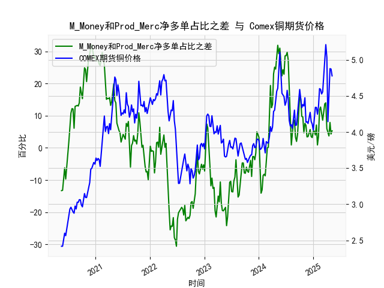

|            |   M_Money净多单占比 |   Prod_Merc净多单占比 |   Comex铜期货价格 |   M_Money和Prod_Merc净多单占比之差 |
|:-----------|--------------------:|----------------------:|------------------:|-----------------------------------:|
| 2024-12-24 |                35.7 |                  38.9 |            4.11   |                                3.2 |
| 2024-12-31 |                35   |                  40.2 |            4.0265 |                                5.2 |
| 2025-01-07 |                35.8 |                  41   |            4.1955 |                                5.2 |
| 2025-01-14 |                36.6 |                  40.6 |            4.3425 |                                4   |
| 2025-01-21 |                33.8 |                  40.9 |            4.341  |                                7.1 |
| 2025-01-28 |                36.1 |                  37   |            4.2465 |                                0.9 |
| 2025-02-04 |                35.5 |                  39.1 |            4.3535 |                                3.6 |
| 2025-02-11 |                30.8 |                  42.6 |            4.601  |                               11.8 |
| 2025-02-18 |                29.9 |                  42.6 |            4.591  |                               12.7 |
| 2025-02-25 |                30.7 |                  41.3 |            4.5275 |                               10.6 |
| 2025-03-04 |                32.1 |                  40.7 |            4.5565 |                                8.6 |
| 2025-03-11 |                30.3 |                  41.8 |            4.766  |                               11.5 |
| 2025-03-18 |                28.8 |                  42.5 |            5.0165 |                               13.7 |
| 2025-03-25 |                28.1 |                  42.1 |            5.2105 |                               14   |
| 2025-04-01 |                32.4 |                  38.4 |            5.035  |                                6   |
| 2025-04-08 |                32.2 |                  36.8 |            4.144  |                                4.6 |
| 2025-04-15 |                33.5 |                  37.2 |            4.626  |                                3.7 |
| 2025-04-22 |                32.1 |                  40   |            4.878  |                                7.9 |
| 2025-04-29 |                33   |                  37.3 |            4.8725 |                                4.3 |
| 2025-05-06 |                31.9 |                  37.2 |            4.778  |                                5.3 |

# CFTC铜持仓数据与期货价格分析

## 一、M_Money与Prod_Merc净多单占比差与铜价相关性分析

### 1. 指标本质
- **M_Money（非商业持仓）**：反映对冲基金等投机资金的预期，具有短期价格发现功能
- **Prod_Merc（商业持仓）**：代表铜产业链企业的套保需求，体现实体供需基本面
- **差值扩大**：投机多头与产业空头分歧加剧，反映市场处于强趋势阶段
- **差值收敛**：预示市场可能面临方向选择

### 2. 相关逻辑
（1）**正向驱动机制**  
当差值持续扩大时（如2020年6月-2021年5月），投机资金推动的流动性溢价主导市场，铜价呈现单边上涨。典型案例：2021年差值突破30%对应铜价突破4.7美元/磅历史高位。

（2）**反向预警机制**  
商业持仓占比反向指标特性显著，例如2022年差值持续负值期间（-30%至-10%），铜价从4.8美元暴跌至3.4美元，反映产业套保力量对过高价格的修正。

（3）**周期联动性**  
三年库存周期中，差值指标领先铜价拐点3-6个月。当前差值从2023年Q4的-20%回升至2024年5月的5.3%，暗示新周期启动。

## 二、近期投资机会研判（2024年4月-5月）

### 1. 关键数据变化
| 时间          | 持仓差(%) | 铜价($/lb) | 周变动 |
|---------------|-----------|------------|--------|
| 2024/04/09    | -13.6     | 4.3535      | -0.8%  |
| 2024/04/16    | -13.7     | 4.2465      | -2.5%  |
| 2024/04/23    | -10.4     | 4.0805      | -3.9%  | 
| 2024/04/30    | -8.7      | 4.2255      | +3.5%  |
| **2024/05/07** | **5.3**   | **4.778**   | **+13%**|

### 2. 机会判断
（1）**趋势反转信号**  
本周持仓差从-8.7%暴增14个百分点至+5.3%，创2022年6月以来最大单周增幅，配合铜价突破4.7美元关键阻力位，形成经典"金叉"形态。

（2）**套利窗口**  
跨期价差走阔：近月合约升水扩大至0.15美元，建议做多07合约/做空12合约。

（3）**结构性机会**  
铜矿股/ETF联动：Freeport-McMoRan（FCX）股价相对铜价beta值达1.8，存在补涨空间。

### 3. 风险提示
- 商业持仓仍保持净空头（最新-12.3%），警惕产业套保抛压
- COMEX铜库存增至18.2万吨，关注中国旺季去库进度
- 建议设置4.5美元为止损位，突破5.1美元可加仓

> 当前市场处于宏观驱动（美联储降息预期）与微观验证（中国基建投资回暖）的共振期，建议采取"趋势+波动"复合策略，重点关注5月15日美国CPI数据对持仓结构的进一步催化。