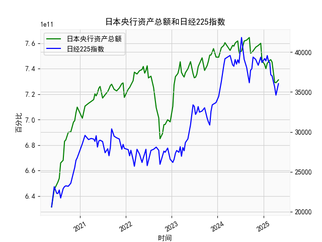

|            |   日本央行资产总额 |   日经225指数 |
|:-----------|-------------------:|--------------:|
| 2024-07-31 |        7.61714e+11 |       39101.8 |
| 2024-08-20 |        7.62497e+11 |       38062.9 |
| 2024-09-10 |        7.64503e+11 |       36159.2 |
| 2024-09-20 |        7.52201e+11 |       37723.9 |
| 2024-09-30 |        7.52847e+11 |       37919.6 |
| 2024-10-10 |        7.53936e+11 |       39380.9 |
| 2024-10-31 |        7.56864e+11 |       39081.2 |
| 2024-11-20 |        7.58232e+11 |       38352.3 |
| 2024-12-10 |        7.59957e+11 |       39367.6 |
| 2024-12-20 |        7.46306e+11 |       38701.9 |
| 2025-01-10 |        7.43361e+11 |       39190.4 |
| 2025-01-20 |        7.40022e+11 |       38902.5 |
| 2025-01-31 |        7.44346e+11 |       39572.5 |
| 2025-02-10 |        7.45188e+11 |       38801.2 |
| 2025-02-20 |        7.46669e+11 |       38678   |
| 2025-02-28 |        7.47052e+11 |       37155.5 |
| 2025-03-10 |        7.45231e+11 |       37028.3 |
| 2025-03-31 |        7.29239e+11 |       35617.6 |
| 2025-04-10 |        7.28954e+11 |       34609   |
| 2025-04-30 |        7.31203e+11 |       36045.4 |

### 1. 日本央行资产总额和日经225指数相关性及影响逻辑

#### 相关性分析
日本央行资产总额与日经225指数在长期内呈现**正相关性**。从数据看，2020年至2021年央行资产规模持续扩张（从6.3万亿增至7.5万亿美元），同期日经指数从约2万点升至3.8万点（2023年高点）。这种关系源于：
1. **流动性效应**：央行扩表（如购买国债、ETF）直接向市场注入流动性，压低利率，降低企业融资成本，提振股市估值。
2. **风险偏好提升**：宽松政策推动投资者从低风险资产转向股市，尤其利好金融、出口等对利率敏感的板块。
3. **政策信号作用**：央行扩表传递维稳经济的信号，增强市场信心，间接支撑股市。

但短期内可能出现背离，例如：
- **2023年10月**：央行资产小幅收缩（7.47万亿→7.46万亿），日经指数却从3.6万点升至3.9万点，反映市场提前消化政策转向预期或外部因素（如美元走弱）。
- **2024年5月**：资产规模回升（7.31万亿），但日经指数从4.1万点回落至3.6万点，可能受全球通胀压力或地缘风险拖累。

#### 影响逻辑
- **正向驱动**：扩表→流动性宽松→企业盈利预期改善→股市估值提升。
- **逆向风险**：过度宽松可能引发通胀担忧或日元贬值压力，导致外资撤离股市。

---

### 2. 近期投资机会分析（聚焦最近一个月）

#### 数据动态（2024年3月至2024年4月）
- **日本央行资产总额**：  
  - 2024年4月30日：7.31万亿（较3月31日的7.29万亿**+0.3%**）  
  - 趋势：结束连续两月收缩（3月环比-0.4%），重回温和扩张，显示央行可能边际加码宽松。

- **日经225指数**：  
  - 2024年4月：34609 → 36045（**+4.1%**），结束此前两月下跌（3月-5.2%）。  
  - 技术面：突破3.6万点阻力位，短期动能转强。

#### 潜在机会
1. **波段反弹机会**：  
   - 央行资产回升与日经指数反弹同步，短期流动性边际改善可能推动指数测试3.8万点（前高附近）。  
   - 关注板块：金融（银行、保险）、出口（汽车、电子）。

2. **政策预期差机会**：  
   - 若4月资产扩张延续（如5月数据超预期），可能强化市场对宽松延续的预期，利好中小盘成长股。

3. **风险对冲机会**：  
   - 日元汇率若因扩表进一步贬值（当前USD/JPY≈155），可布局出口占比高的企业（如丰田、索尼）。

#### 风险提示
- 全球通胀反弹可能限制日央行宽松空间，需关注5月美联储议息会议对日债收益率的影响。
- 指数接近前高（4.1万点）后可能面临技术抛压，建议逢高部分止盈。