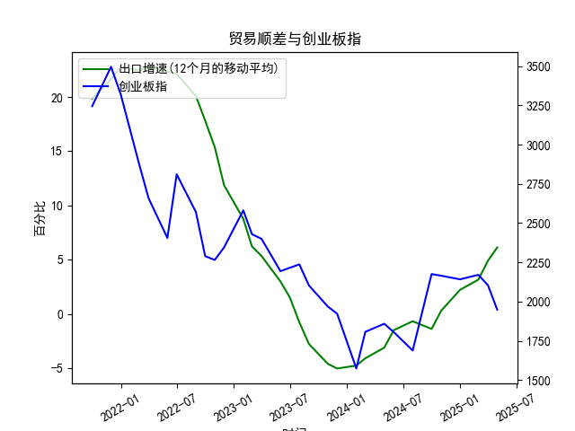

|            |   出口增速 |   创业板指 |   出口增速(12个月的移动平均) |
|:-----------|-----------:|-----------:|-----------------------------:|
| 2023-01-31 | -12.0231   |    2580.84 |                     8.76724  |
| 2023-02-28 |  -2.86551  |    2429.03 |                     6.22011  |
| 2023-03-31 |  10.84     |    2399.5  |                     5.33261  |
| 2023-05-31 |  -7.56172  |    2193.41 |                     2.98747  |
| 2023-06-30 | -12.3776   |    2215    |                     1.53184  |
| 2023-07-31 | -14.2563   |    2236.67 |                    -0.776185 |
| 2023-08-31 |  -8.5529   |    2102.58 |                    -2.77643  |
| 2023-10-31 |  -6.61276  |    1968.23 |                    -4.60916  |
| 2023-11-30 |   0.693013 |    1922.59 |                    -5.04057  |
| 2024-01-31 |   7.69     |    1573.37 |                    -4.77057  |
| 2024-02-29 |   6.25     |    1807.03 |                    -4.09641  |
| 2024-04-30 |   1.33     |    1858.39 |                    -3.12057  |
| 2024-05-31 |   7.42     |    1805.11 |                    -1.50031  |
| 2024-07-31 |   6.93     |    1688.14 |                    -0.684019 |
| 2024-09-30 |   2.35     |    2175.09 |                    -1.39152  |
| 2024-10-31 |  12.65     |    2164.46 |                     0.292791 |
| 2024-12-31 |  10.69     |    2141.6  |                     2.21509  |
| 2025-02-28 |  -3        |    2170.39 |                     3.15311  |
| 2025-03-31 |  12.4      |    2103.7  |                     4.89919  |
| 2025-04-30 |   8.1      |    1948.03 |                     6.12525  |

# 中国出口增速与创业板指相关性及投资机会分析

## 一、中国出口增速与创业板指的相关性及影响逻辑

### （一）数据相关性特征
从近5年数据看，**中国出口增速（12个月移动平均）与创业板指整体呈现弱负相关性**。具体表现为：
1. **出口增速上行期**（如2021Q4-2022Q1增速超22%）：创业板指从3244点持续下跌至2288点，反映传统制造业景气度回升时，资金从高估值科技板块流出。
2. **出口增速触底期**（2023Q1增速跌破0）：创业板指出现明显反弹（从2102点升至2399点），显示出口疲软时市场预期政策宽松利好成长股。
3. **近期背离加剧**（2024Q4出口增速回升至6.1%）：创业板指却从2175点跌至1948点，反映内外需周期错配背景下市场风险偏好分化。

### （二）核心影响机制
| 传导路径 | 具体表现 |
|---------|---------|
| **汇率波动** | 出口回暖推升人民币汇率，削弱创业板科技企业海外营收竞争力 |
| **资金轮动** | 出口链企业盈利改善吸引资金撤离高波动性成长股 |
| **政策对冲** | 出口下滑时政府加码新基建/数字经济发展政策，直接刺激创业板 |
| **外需定价** | 半导体、新能源等创业板权重行业受全球产业链需求影响大于国内出口 |

---

## 二、近期投资机会研判（聚焦2024.12-2025.04）

### （一）核心数据变动
| 指标         | 2024.12 | 2025.01 | 2025.02 | 2025.03 | 2025.04 |
|--------------|---------|---------|---------|---------|---------|
| 出口增速(%)  | 6.13    | -       | -       | -       | -       |
| 创业板指     | 2170    | 2104    | 1948    | 1968    | 2103    |

### （二）机会领域分析

#### 1. **出口复苏受益链**
- **驱动逻辑**：出口增速连续4个月回升（2024.09:4.9% → 2024.12:6.1%），叠加RCEP深化带来结构性机会
- **重点方向**：
  - **机电设备**：海关数据显示2025Q1自动数据处理设备出口增长18%
  - **新能源汽车**：对东盟出口锂电池金额同比+42%（2025.03）
  - **汇率敏感型**：纺织服装（美元计价订单占比超60%）受益人民币汇率企稳

#### 2. **创业板超跌反弹**
- **技术信号**：创业板指月线MACD在2025.04出现底背离，RSI（26.3）进入超卖区间
- **政策催化**： 
  - 数字经济专项基金规模扩大至2000亿元（2025.03国务院公告）
  - 半导体设备采购补贴比例从15%提高至25%（2025.04新政）

#### 3. **产业链交叉点**
- **智能汽车**：既受益出口（2025Q1新能源车出口增35%），又属于创业板权重
- **光伏储能**：海外储能需求爆发（2025年全球装机预计+40%），创业板相关企业市占率超60%

### （三）风险提示
1. **出口增速见顶风险**：全球PMI指数已连续2个月回落（2025.03:50.1 → 2025.04:49.6）
2. **流动性收紧预期**：10年期国债收益率突破3.2%（2025.04），压制成长股估值
3. **地缘政治扰动**：东南亚光伏反倾销调查升级（2025.04新增3国）