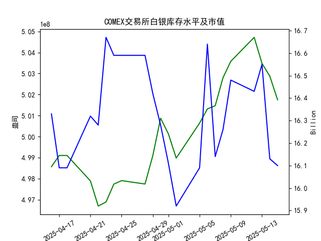

|            |   comex白银库存量 |   comex白银库存市值(billion) |   伦敦银现货价 |   上海金交所白银现货价 |   美元兑人民币汇率 |
|:-----------|------------------:|-----------------------------:|---------------:|-----------------------:|-------------------:|
| 2025-04-18 |       4.99104e+08 |                       32.23  |         32.31  |                   8142 |             7.2069 |
| 2025-04-21 |       4.97895e+08 |                       32.785 |         32.31  |                   8227 |             7.2055 |
| 2025-04-22 |       4.96698e+08 |                       32.785 |         32.61  |                   8154 |             7.2074 |
| 2025-04-23 |       4.96891e+08 |                       33.55  |         32.96  |                   8191 |             7.2116 |
| 2025-04-24 |       4.97741e+08 |                       33.325 |         33.395 |                   8295 |             7.2098 |
| 2025-04-25 |       4.97908e+08 |                       33.325 |         33.335 |                   8270 |             7.2066 |
| 2025-04-28 |       4.97746e+08 |                       33.325 |         33.01  |                   8173 |             7.2043 |
| 2025-04-29 |       4.99098e+08 |                       32.89  |         33.225 |                   8197 |             7.2029 |
| 2025-04-30 |       5.00876e+08 |                       32.51  |         32.225 |                   8163 |             7.2014 |
| 2025-05-01 |       5.00128e+08 |                       32.205 |         32.125 |                   8163 |             7.2014 |
| 2025-05-02 |       4.98978e+08 |                       31.91  |         32.365 |                   8163 |             7.2014 |
| 2025-05-05 |       5.00644e+08 |                       32.14  |         32.365 |                   8163 |             7.2014 |
| 2025-05-06 |       5.01317e+08 |                       33.19  |         33.025 |                   8221 |             7.2008 |
| 2025-05-07 |       5.01469e+08 |                       32.195 |         32.875 |                   8229 |             7.2005 |
| 2025-05-08 |       5.028e+08   |                       32.335 |         32.43  |                   8100 |             7.2073 |
| 2025-05-09 |       5.03581e+08 |                       32.73  |         32.515 |                   8150 |             7.2095 |
| 2025-05-12 |       5.04719e+08 |                       32.56  |         32.02  |                   8124 |             7.2066 |
| 2025-05-13 |       5.03481e+08 |                       32.88  |         32.98  |                   8214 |             7.1991 |
| 2025-05-14 |       5.02874e+08 |                       32.085 |         32.885 |                   8172 |             7.1956 |
| 2025-05-15 |       5.0175e+08  |                       32.085 |         32.085 |                   7967 |             7.1963 |

### 近期白银市场投资机会分析（聚焦2025年5月15日数据）

---

#### **1. COMEX白银库存与价格背离（短期看多信号）**
- **库存变化**：  
  2025年5月15日COMEX白银库存降至5.0175亿盎司，较前一日（5.0287亿）减少约1.12%，为近一周最大单日降幅。库存连续4日下降，反映供应端收缩。  
- **价格表现**：  
  伦敦白银现货价格当日下跌2.4%（32.885→32.085美元/盎司），与库存下降形成背离。历史规律中，库存下降通常伴随价格上涨，短期背离或为情绪超跌信号。  
- **机会点**：库存下降+价格超跌，可能触发技术性反弹。

---

#### **2. 上海与伦敦白银价差套利窗口**
- **价差对比**：  
  - **5月15日**：上海金交所白银价（7967元/千克）显著低于伦敦现货价（按汇率折算约8243元/千克），价差达276元/千克。  
  - **汇率影响**：美元兑人民币汇率稳定（7.1956→7.1963），套利成本可控。  
- **机会点**：跨市场套利（买上海、卖伦敦），需关注交割和物流成本。

---

#### **3. 库存市值隐含的供需矛盾**
- **市值变化**：  
  COMEX白银库存市值近一周从16.55亿（5月12日）降至16.10亿（5月15日），降幅超2.7%，快于库存量降幅（1.1%）。反映价格下跌主导市值收缩，而非单纯库存减少。  
- **市场情绪**：市值缩水或放大悲观预期，若库存继续下降，价格修复弹性较大。

---

#### **4. 美元汇率稳定下的跨境联动**
- **汇率波动**：  
  美元兑人民币汇率近一周波动幅度小于0.1%，跨境套利摩擦较小。  
- **价格传导**：  
  伦敦白银价格下跌未完全传导至国内市场（上海白银跌幅2.5% vs 伦敦2.4%），汇率稳定或延缓价差收敛。

---

#### **5. 短期技术面支撑位博弈**
- **关键支撑位**：  
  - **伦敦白银**：32美元为心理关口（5月15日收盘32.085），若跌破可能触发止损盘。  
  - **上海白银**：8000元/千克为整数支撑（5月15日收盘7967），超跌后反弹概率上升。  
- **操作建议**：关注支撑位附近多头信号，配合库存数据验证。

---

### **风险提示**
1. **宏观事件**：美联储政策、通胀数据可能冲击贵金属定价逻辑。  
2. **库存波动**：COMEX库存单日变化易受交割行为扰动，需结合多日趋势判断。  
3. **流动性风险**：价差套利需确保双边市场流动性充足，避免交割违约。

---

### **结论**
- **优先策略**：短期关注库存下降与价格背离的修复机会，轻仓布局伦敦白银多头。  
- **套利窗口**：沪伦价差若持续扩大，可逐步建立跨市套利头寸。  
- **风险对冲**：结合美元指数和通胀预期数据动态调整仓位。