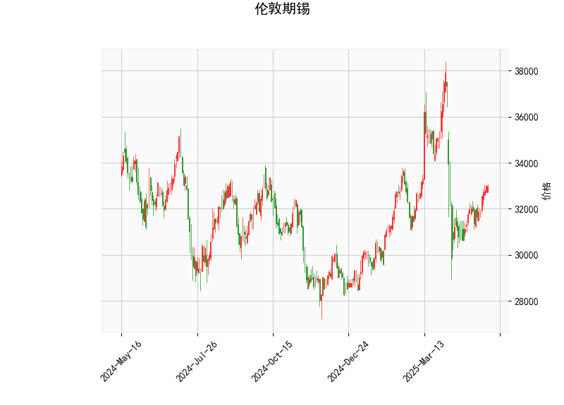

# 伦敦期锡技术分析及策略建议

## 一、技术指标解读

### 1. 价格与布林轨道
- **当前价32974**位于**布林中轨33005.85**附近（误差仅0.1%），显示价格处于多空平衡状态
- **布林带宽达7960点**（上轨36985.89/下轨29025.82），暗示市场隐含波动率处于高位
- **价格未触及上下轨**，暂时缺乏明确方向性信号

### 2. RSI指标
- **56.41**处于50-70中性区间，既未超买也未显示明显动能衰竭
- 配合布林带中轨位置，说明当前市场处于**技术性整理阶段**

### 3. MACD指标
- **MACD(12.88)上穿信号线(-231.48)**形成金叉，柱状图244.36创近期新高
- 但信号线绝对值异常大，可能反映前期长期下跌后的**指标修复需求**
- 需要警惕MACD在零轴下方金叉的**虚假信号风险**

### 4. K线形态
- **CDLSHORTLINE（短蜡烛）**属于反转预警形态，说明：
  - 短期多空博弈激烈
  - 前趋势动能衰减（当前市场符合该特征）
  - 需要配合其他指标验证

---

## 二、交易机会与策略

### 1. 趋势跟踪策略
- **突破交易**：
  - **多单触发条件**：收盘价站稳上轨36985（+12.2%空间）且MACD站上零轴
  - **空单触发条件**：跌破下轨29025（-12.0%空间）伴随RSI跌破40
  - 盈亏比可设定1:2（如突破后看至前高区域）

- **中轨回归策略**：
  - 当前价与中轨几乎重合，可等待价格偏离中轨超过2%后反向操作
  - 配合RSI超买超卖信号（>70/<30）增强胜率

### 2. 套利机会
- **跨期套利**：
  - 关注近远月价差变化
  - 若库存持续下降，可做多近月/做空远月
  - 需跟踪LME锡库存数据（当前库存处于5年低位）

- **波动率交易**：
  - 布林带宽处于年度93%分位，可：
    - 卖出宽跨式期权组合
    - Delta对冲操作
  - 需控制gamma风险敞口

### 3. 风险提示
- **基本面干扰**：
  - 印尼锡出口政策变动（全球最大出口国）
  - 光伏焊带需求波动（占锡消费35%）
- **技术面风险**：
  - MACD指标存在底背离可能
  - 布林带宽极端扩张后的收缩风险

---

**操作建议**：当前宜保持观望，重点关注33000关键位争夺。若出现带量突破布林上轨可轻仓试多，跌破29000则考虑趋势空单。套利交易建议优先关注近远月价差回归机会。