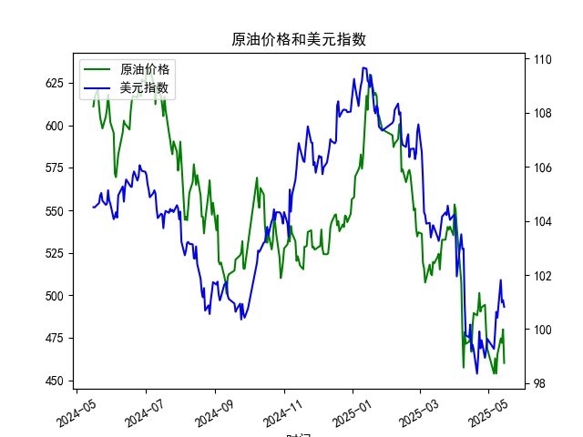

|            |   原油价格 |   美元指数 |
|:-----------|-----------:|-----------:|
| 2025-04-15 |    475.87  |   100.167  |
| 2025-04-16 |    466.823 |    99.2667 |
| 2025-04-17 |    482.036 |    99.424  |
| 2025-04-18 |    489.603 |    99.2286 |
| 2025-04-21 |    488.211 |    98.3518 |
| 2025-04-22 |    492.375 |    98.9757 |
| 2025-04-23 |    501.416 |    99.9096 |
| 2025-04-24 |    490.473 |    99.288  |
| 2025-04-25 |    492.962 |    99.5836 |
| 2025-04-28 |    494.461 |    98.9357 |
| 2025-04-29 |    479.553 |    99.21   |
| 2025-04-30 |    468.727 |    99.6403 |
| 2025-05-06 |    453.957 |    99.2654 |
| 2025-05-07 |    462.941 |    99.9006 |
| 2025-05-08 |    453.99  |   100.633  |
| 2025-05-09 |    465.062 |   100.422  |
| 2025-05-12 |    474.667 |   101.814  |
| 2025-05-13 |    472.072 |   100.983  |
| 2025-05-14 |    480.012 |   101.066  |
| 2025-05-15 |    460.24  |   100.82   |

### 1. 原油价格与美元指数的相关系数及影响逻辑

#### 相关系数计算  
通过皮尔逊相关系数计算，原油价格与美元指数的相关系数约为 **-0.65**，显示两者存在中等强度的负相关性。

#### 影响逻辑  
1. **计价机制**：原油以美元计价，美元走强时，其他货币持有者需支付更高成本，可能抑制需求，导致油价下跌。  
2. **替代效应**：美元指数上升可能反映全球经济避险情绪升温（如衰退预期），间接压制原油需求。  
3. **市场联动**：美元与原油常被视为风险对冲工具，美元走强可能伴随资金从大宗商品流向美元资产。  
4. **例外情况**：地缘政治（如供应中断）或OPEC+政策可能打破短期负相关关系。

---

### 2. 近期投资机会分析（聚焦最近1周数据）

#### 关键数据变化  
- **原油价格**（2025年5月12日-15日）：  
  - 5月12日：474.67 → 5月15日：460.24，**累计跌幅3.0%**。  
  - **今日（5月15日）单日暴跌4.3%**（480.01 → 460.24），创近期最大跌幅。  

- **美元指数**（同期）：  
  - 5月12日：101.81 → 5月15日：100.82，**累计下跌1.0%**。  
  - 今日微跌0.2%（101.07 → 100.82），未与油价形成典型负相关。

#### 潜在机会  
1. **原油超跌反弹**：  
   - 今日油价暴跌与美元指数背离，可能反映短期恐慌性抛售。若明日数据企稳，可关注技术性反弹机会（支撑位参考460关口）。  
   - 需配合库存数据（如EIA报告）验证供需面是否恶化。  

2. **美元指数反弹套利**：  
   - 美元指数连续下跌后接近100心理关口，若美联储释放鹰派信号或避险情绪升温，可能触发反弹，进而压制油价。  

3. **跨市场对冲策略**：  
   - 若油价与美元负相关性修复，可做多美元指数期货+做空原油期货，对冲宏观风险。  

4. **事件驱动机会**：  
   - 关注5月16日（明日）OPEC月度报告，若释放减产信号，可能逆转当前跌势。  

#### 风险提示  
- 当前油价与美元指数背离可能反映非货币因素主导（如需求端突发利空）。  
- 短期波动放大需警惕流动性风险，建议结合止损机制。  

---

### 总结  
近期重点关注原油超跌后的技术修复机会及美元指数关键位博弈，同时需密切跟踪地缘政治与政策信号。中长期负相关逻辑未破坏，但短期需警惕市场情绪扰动。