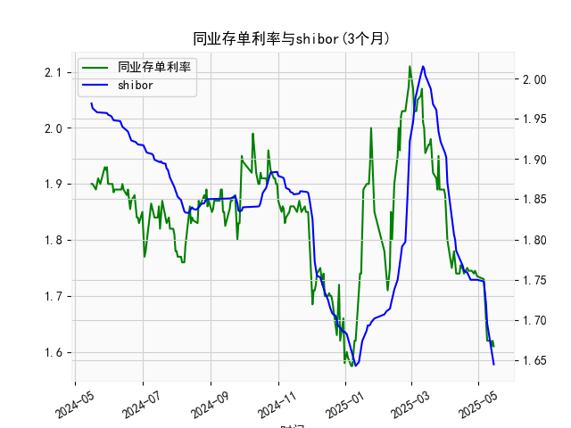

|            |   同业存单利率(3个月) |   shibor(3个月) |
|:-----------|----------------------:|----------------:|
| 2025-04-16 |                 1.75  |           1.772 |
| 2025-04-17 |                 1.75  |           1.767 |
| 2025-04-18 |                 1.74  |           1.761 |
| 2025-04-21 |                 1.75  |           1.759 |
| 2025-04-22 |                 1.745 |           1.755 |
| 2025-04-23 |                 1.745 |           1.753 |
| 2025-04-24 |                 1.745 |           1.75  |
| 2025-04-25 |                 1.745 |           1.75  |
| 2025-04-27 |                 1.74  |           1.75  |
| 2025-04-28 |                 1.745 |           1.75  |
| 2025-04-29 |                 1.74  |           1.75  |
| 2025-04-30 |                 1.735 |           1.75  |
| 2025-05-06 |                 1.73  |           1.748 |
| 2025-05-07 |                 1.69  |           1.737 |
| 2025-05-08 |                 1.66  |           1.72  |
| 2025-05-09 |                 1.62  |           1.696 |
| 2025-05-12 |                 1.62  |           1.672 |
| 2025-05-13 |                 1.61  |           1.662 |
| 2025-05-14 |                 1.62  |           1.653 |
| 2025-05-15 |                 1.61  |           1.645 |

### 1. 同业存单利率与SHIBOR的相关性及影响逻辑

**相关性：**  
同业存单利率（AAA评级）与SHIBOR（3个月）均反映银行间市场的短期资金成本，二者通常呈现**高度正相关**。  
- **SHIBOR**是银行间无担保拆借的基准利率，由市场供需决定，直接体现流动性松紧。  
- **同业存单利率**是银行发行存单的融资成本，受市场对银行信用风险、资金需求及货币政策预期的影响。  

**影响逻辑：**  
1. **流动性传导**：当央行通过公开市场操作释放流动性时，SHIBOR下行，银行融资成本降低，同业存单利率跟随下降（反之亦然）。  
2. **信用风险溢价**：同业存单利率包含发行银行的信用风险溢价（AAA评级风险极低），而SHIBOR是无风险利率，因此在市场避险情绪升温时，两者利差可能扩大。  
3. **政策预期**：若市场预期降准/降息，SHIBOR先行反应，同业存单利率随后调整，形成联动。  

---

### 2. 近期投资机会分析（聚焦最近一周数据）

#### **数据关键变化：**  
- **同业存单利率（AAA-3个月）**：  
  - **今日 vs 昨日**：从`1.62%`降至`1.61%`（降幅`1bp`），延续近一周下行趋势（周内累计降幅约`5-10bp`）。  
  - **趋势**：短期资金面宽松，可能与央行逆回购加量或市场对宽松政策预期升温有关。  

- **SHIBOR（3个月）**：  
  - **今日 vs 昨日**：从`1.653%`微降至`1.645%`（降幅`0.8bp`），同步反映流动性改善。  
  - **趋势**：与同业存单利率同步走低，但降幅更缓，显示市场对中长期资金成本仍存谨慎。  

#### **投资机会判断：**  
1. **债券市场短期博弈**：  
   - 同业存单利率下行利好短端债券（如1年期国债、高等级信用债），可关注收益率曲线陡峭化带来的资本利得机会。  
   - **策略**：增配流动性好的短久期品种，规避长端利率波动风险。  

2. **货币基金与现金管理**：  
   - 利率下行可能导致货币基金收益走低，但短期内仍是避险资金的过渡选择。  

3. **权益市场结构性机会**：  
   - **银行板块**：同业负债成本下降或缓解净息差压力，关注零售业务占优的银行。  
   - **高股息资产**：利率下行提升分红资产的相对吸引力（如公用事业、部分消费龙头）。  

4. **套利窗口**：  
   - 若同业存单与SHIBOR利差持续收窄，可通过回购融资+买入存单的套利策略获取价差收益（需关注资金面稳定性）。  

#### **风险提示：**  
- 资金面宽松持续性存疑（如逆回购到期量、税期扰动）。  
- 若经济数据超预期回暖，可能引发货币政策预期修正，导致利率反弹。  

---

**结论：** 短期流动性宽松支撑利率下行，建议以短久期债券为核心配置，同时关注权益市场中受益于资金成本下降的板块。需密切跟踪央行操作及宏观经济数据验证趋势。