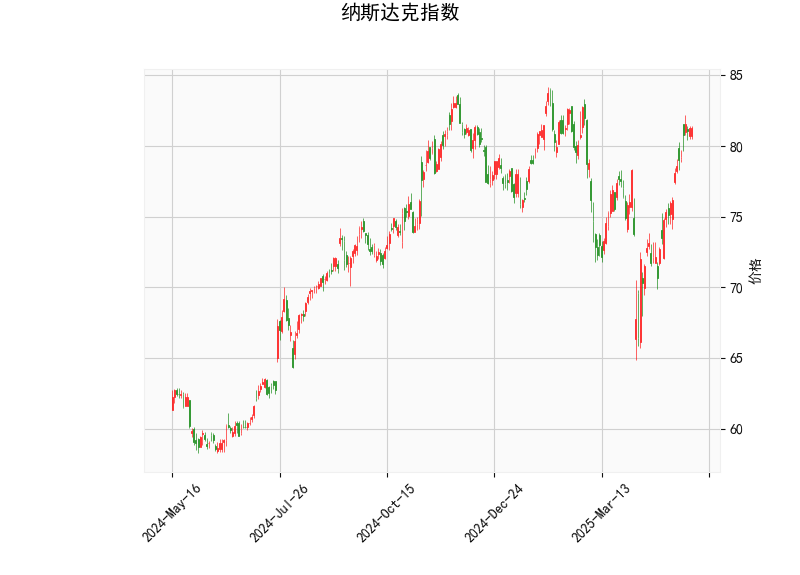

# 纳斯达克指数技术分析与投资策略

---

## **一、技术分析结果解读**

### 1. **价格与布林轨道**
- **当前价**（81.28）位于布林轨道中轨（75.80）和上轨（83.11）之间，**接近上轨**，表明短期处于**上升趋势**，但需警惕上轨附近的压力。
- 若价格突破上轨（83.11），可能加速上涨；若回落至中轨（75.80），则可能进入震荡或回调阶段。

### 2. **RSI指标**
- RSI值为**67.24**，接近超买阈值（70），反映市场买盘力量较强，但尚未进入极端超买区域。需关注RSI是否进一步上升至70以上，可能触发短期回调风险。

### 3. **MACD指标**
- MACD线（1.92）高于信号线（1.26），且柱状图（0.66）持续扩大，显示**多头动能增强**，短期趋势偏强。
- 若MACD柱状图持续放大，则上涨趋势可能延续；若柱状图缩窄，需警惕回调风险。

### 4. **K线形态**
- K线形态包含**CDLSHORTLINE**（短蜡烛线），通常表示市场在当前位置出现犹豫或短期平衡。结合价格接近布林上轨，可能暗示**短期动能不足**，需警惕震荡或小幅回调。

---

## **二、投资机会与策略建议**

### 1. **趋势跟踪策略**
- **多头机会**：若价格站稳中轨（75.80）并向上突破布林上轨（83.11），可顺势做多，目标看向前高或更高阻力位，止损设于中轨下方。
- **空头机会**：若价格回落跌破中轨（75.80），且RSI回落至50以下，可考虑短线做空，目标看向下轨（68.49），止损设于中轨上方。

### 2. **区间交易策略**
- **布林轨道区间操作**：
  - **上轨附近（83.11）**：若价格多次测试上轨未果，可轻仓试空，目标中轨（75.80）。
  - **中轨附近（75.80）**：若价格回调至中轨附近且MACD柱状图未显著缩窄，可逢低做多，目标上轨。

### 3. **风险控制**
- **超买风险**：RSI接近70时，若价格未创新高，可部分止盈或收紧止损。
- **MACD背离信号**：若价格创新高但MACD柱状图缩窄，可能暗示动能衰竭，需警惕反转。

### 4. **套利机会**
- **跨周期对冲**：结合短期（如小时图）与日线趋势差异，若短期超买但日线趋势未改，可短期做空对冲长期持仓风险。
- **波动率交易**：布林轨道开口扩大（波动率上升）时，可布局期权策略（如跨式组合），捕捉潜在大幅波动。

---

## **三、总结**
当前纳斯达克指数技术面偏多（MACD金叉、价格站稳中轨），但需关注布林上轨压力和RSI超买风险。短期策略以**趋势跟随**为主，结合区间操作高抛低吸，严格设置止损。若价格突破上轨，可加大仓位；若回调至中轨附近，则逢低布局多单。