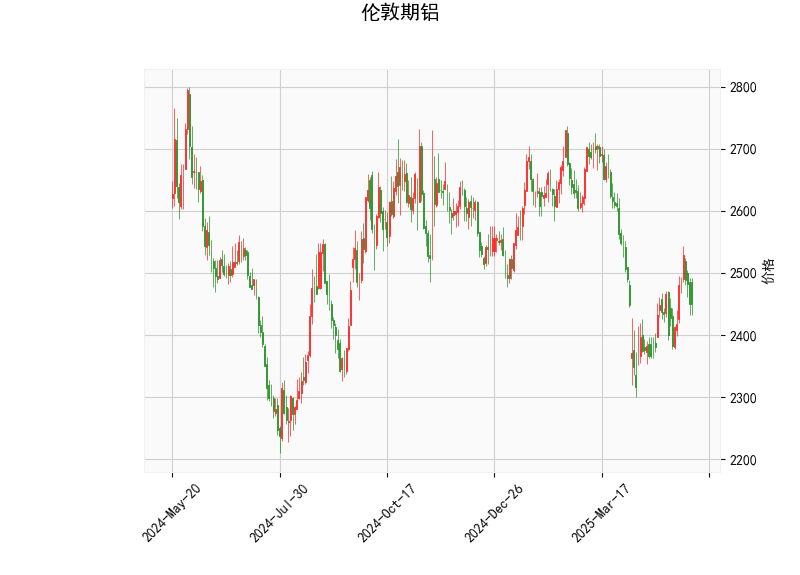

# 伦敦期铝技术分析及策略建议

## 一、技术指标解析

### 1. 价格与布林轨道
- **当前价2450**位于布林通道中轨（2513）与下轨（2272）之间，距离下轨尚有**177.6点**空间，但已明显低于中轨（偏离幅度约2.5%），显示短期价格处于弱势区间。
- **通道收窄特征**：中轨（2513）与下轨（2272）价差达**483点**，表明当前波动率较高，若价格突破中轨可能触发趋势反转。

### 2. RSI指标
- **48.89的RSI值**处于中性区间（30-70），既未超买也未超卖。结合价格处于布林带下半区，反映市场存在多空拉锯，但未形成明显方向性共识。

### 3. MACD指标
- **MACD线（0.72）上穿信号线（-8.42）**，形成金叉且柱状图连续扩大（9.14），构成经典多头信号。
- **背离特征**：MACD线与价格走势的底部背离（价格创新低而MACD未跟随）暗示下跌动能衰减，技术性反弹概率上升。

### 4. K线形态
- **CDLMATCHINGLOW（匹配低形态）**出现在连续下跌后，表明空头抛压减弱，短期支撑位确认有效性增强，属于看涨反转信号。

---

## 二、潜在机会与策略设计

### （一）单边交易机会
#### 1. **短线反弹策略**
- **入场条件**：价格突破5日均线（未提供数据）或MACD柱持续扩大，可建仓多单。
- **目标位**：布林中轨2513（盈亏比约1:3），若突破则上看通道上轨2755。
- **止损设置**：下轨下方3%即2200点，或根据ATR指标动态调整。

#### 2. **趋势突破策略**
- **下行突破**：若价格跌破下轨2272且RSI进入超卖区（<30），可顺势做空，目标前低平台2150。
- **上行突破**：站稳中轨2513后回踩确认时加仓，目标上轨2755。

### （二）套利机会
#### 1. **跨期套利**
- 关注近月合约与远月合约价差：若近月贴水幅度扩大（反映现货疲软），可做空近月/做多远月的反套操作，待价差回归中轨时平仓。

#### 2. **波动率套利**
- 利用布林通道收窄特征：卖出宽跨式期权组合（Sell Strangle），行权价分别设于上轨2755和下轨2272，赚取时间价值衰减收益。

---

## 三、风险提示
1. **宏观面干扰**：美联储利率政策、中国房地产刺激政策等可能改变基本面预期。
2. **库存变化**：LME铝库存单日增减超5万吨可能引发价格异动。
3. **指标局限性**：MACD在低波动率环境中易产生虚假信号，需结合成交量验证。

> （注：实际操作需结合实时行情与仓位管理，以上分析基于静态数据，仅供参考。）