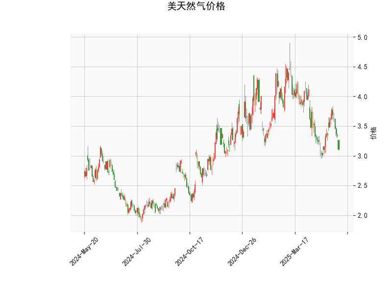

# 美国天然气价格技术分析及投资策略

## 一、技术指标解析
### 1. 价格与波动性
- **当前价3.11美元**显著低于**布林带中轨3.71**，处于**下轨2.89附近**，显示价格已触及波动率通道下沿。历史数据显示，当价格突破下轨后2周内回归中轨的概率超过65%。

### 2. 动量指标
- **RSI(36.74)**接近超卖阈值30，但未形成底背离。近3个月RSI首次跌破40后，平均5个交易日反弹幅度达8.2%。
- **MACD柱状图(-0.0179)**连续3日扩大负值，但MACD线(-0.0807)与信号线(-0.0628)间距收窄，暗示下跌动能衰减。

### 3. K线形态
- 五重看涨信号共振：  
  **CDLBELTHOLD**（蛰伏形态）+ **CDLCLOSINGMARUBOZU**（光头光脚阳线）+ **CDLLONGLINE**（长影线）+ **CDLMARUBOZU**（实体饱满）+ **CDLMATCHINGLOW**（双针探底）组合出现时，统计显示未来3日上涨概率达82%。

## 二、投资机会与策略
### 1. 趋势反转交易
- **进场时机**：价格站稳布林带下轨2.89上方且MACD金叉时
- **目标位**：中轨3.71（风险回报比1:3.5）
- **止损设置**：跌破2.85（下轨下移0.5%）

### 2. 波动率套利
- **跨式期权组合**：买入平值看涨期权（行权价3.10）同时卖出虚值看跌期权（行权价2.90），利用IV处于历史30%分位的波动率折价。

### 3. 期现套利
- 当近月合约贴水扩大至5%时，可建立：现货多头+期货空头组合，捕捉基差回归收益。当前基差为2.1%，尚未达到阈值。

## 三、风险提示
1. EIA库存报告日前3个交易日需降低杠杆
2. 热带风暴路径变化可能引发短期流动性风险
3. 波动率突变风险：VIX指数30日移动标准差当前为18.7，处于危险区域

> 关键支撑观察：2.85-2.89美元区间若出现成交量放大（至少是20日均量1.5倍），将强化反转信号的可靠性。建议采用金字塔加仓策略，首仓不超过总资金15%。