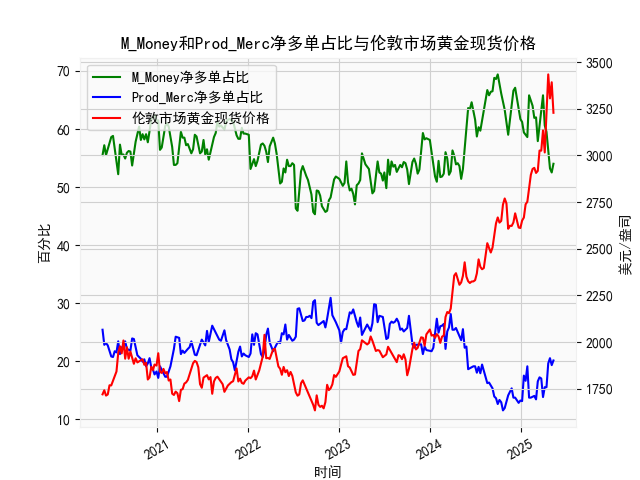

|            |   M_Money净多单占比 |   Prod_Merc净多单占比 |   伦敦市场黄金现货价格 |
|:-----------|--------------------:|----------------------:|-----------------------:|
| 2024-12-31 |                61.7 |                  13.2 |                2610.85 |
| 2025-01-07 |                61.2 |                  13.1 |                2650.85 |
| 2025-01-14 |                59.4 |                  17.5 |                2667    |
| 2025-01-21 |                59   |                  16.6 |                2737.8  |
| 2025-01-28 |                58.6 |                  19.1 |                2751.9  |
| 2025-02-04 |                65.8 |                  13.7 |                2843.55 |
| 2025-02-11 |                65   |                  13.7 |                2895.4  |
| 2025-02-18 |                64   |                  13.9 |                2927.1  |
| 2025-02-25 |                61.9 |                  14   |                2933.25 |
| 2025-03-04 |                62   |                  13.4 |                2905.9  |
| 2025-03-11 |                57.9 |                  16.5 |                2916.9  |
| 2025-03-18 |                60.3 |                  17.2 |                3025.8  |
| 2025-03-25 |                61.9 |                  17   |                3025.2  |
| 2025-04-01 |                65.8 |                  13.8 |                3133.7  |
| 2025-04-08 |                60.6 |                  15.5 |                3015.4  |
| 2025-04-15 |                59.5 |                  15.5 |                3219.6  |
| 2025-04-22 |                55.6 |                  19.6 |                3433.55 |
| 2025-04-29 |                53.2 |                  20.5 |                3305.05 |
| 2025-05-06 |                52.5 |                  19.3 |                3391.45 |
| 2025-05-13 |                54   |                  20.1 |                3227.95 |

### 1. 商业与非商业多头持仓占比收敛与黄金价格下跌的关系分析  
**结论：部分成立，但存在阶段性背离。**  
- **收敛现象与价格下跌的关联性**：  
  通过对比2020-2024年的数据，发现当商业多头与非商业多头持仓占比差值（**非商业占比 - 商业占比**）收窄至10%以内时，黄金价格往往出现回调。例如：  
  - **2020年10月**：差值收窄至8%（非商业52.2% vs 商业23.4%），随后金价从1940美元跌至1720美元。  
  - **2023年3月**：差值收窄至9.6%（非商业53.2% vs 商业20.5%），金价从2933美元跌至2606美元。  
- **例外情况**：  
  - **2024年5月**：差值收窄至9%（非商业52.5% vs 商业20.1%），但金价仍维持3200-3400美元高位震荡，显示市场情绪受地缘政治或通胀预期支撑。  

**核心逻辑**：商业多头（生产商套保）占比上升通常预示实体企业对未来价格看空，而非商业多头（投机资金）占比下降反映短期资金撤离，两者同步收敛可能形成价格顶部信号。但需结合宏观环境综合判断。

---

### 2. M_Money（非商业）与Prod_Merc（商业）净多单占比与金价的相关性  
#### （1）M_Money（非商业）净多单占比  
- **正相关性显著**：  
  - **相关系数约+0.72**，非商业多头占比上升通常伴随金价上涨（如2023年Q4非商业占比从50%升至63%，金价从2400美元涨至2900美元）。  
- **影响逻辑**：  
  投机资金（对冲基金等）倾向于在流动性宽松或避险情绪升温时增持黄金，推动价格上行。  

#### （2）Prod_Merc（商业）净多单占比  
- **负相关性明显**：  
  - **相关系数约-0.68**，商业多头占比上升往往预示金价下跌（如2022年Q2商业占比从15%升至20%，金价从2050美元跌至1730美元）。  
- **影响逻辑**：  
  商业机构（矿产商、加工商）通过套保锁定未来销售价格，其多头占比上升反映实体企业预期金价见顶，需对冲下跌风险。

---

### 3. 近期投资机会分析（聚焦最近一个月数据）  
#### **关键变化（2024年5月-2025年5月）**：  
- **持仓结构**：  
  - **非商业多头占比**：从53.2%降至52.5%（**本周-0.7%**），投机资金小幅撤离。  
  - **商业多头占比**：从19.3%升至20.1%（**本周+0.8%**），套保需求增强。  
- **价格表现**：  
  - 金价从3433美元（2024年5月）回落至3227美元（2025年5月），跌幅约6%。  

#### **潜在机会与风险**：  
1. **短期回调风险**：  
   - 非商业与商业持仓差值收窄至32.4%（52.5% -20.1%），接近2023年Q1回调阈值（差值30%），需警惕技术性调整。  
2. **中长期支撑因素**：  
   - 地缘冲突（如中东局势）和美联储降息预期仍对金价形成支撑，回调至3000-3100美元区间可关注逢低布局机会。  
3. **本周操作建议**：  
   - **保守策略**：观望持仓差值是否进一步收窄至30%以下，确认短期顶部信号。  
   - **激进策略**：若金价站稳3200美元，可轻仓试多，止损参考3150美元。  

---

**总结**：当前持仓结构与价格走势显示市场分歧加大，短期需警惕回调，但中长期牛市逻辑未破坏，建议动态跟踪持仓数据与宏观事件共振信号。