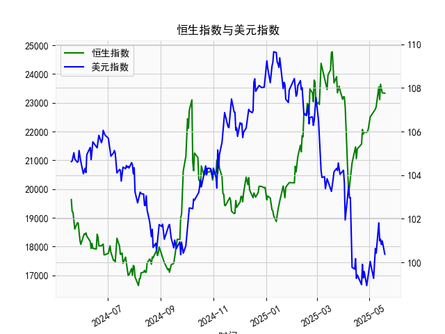

|            |   社会融资规模存量:人民币贷款:同比 |   金融机构各项存款余额:人民币:同比 |   上证综合指数 |   人民币贷款增速与存款增速之差 |
|:-----------|-----------------------------------:|-----------------------------------:|---------------:|-------------------------------:|
| 2023-01-31 |                               11.1 |                               12.4 |        3255.67 |                           -1.3 |
| 2023-02-28 |                               11.5 |                               12.4 |        3279.61 |                           -0.9 |
| 2023-03-31 |                               11.7 |                               12.7 |        3272.86 |                           -1   |
| 2023-05-31 |                               11.3 |                               11.6 |        3204.56 |                           -0.3 |
| 2023-06-30 |                               11.2 |                               11   |        3202.06 |                            0.2 |
| 2023-07-31 |                               11   |                               10.5 |        3291.04 |                            0.5 |
| 2023-08-31 |                               10.9 |                               10.5 |        3119.88 |                            0.4 |
| 2023-10-31 |                               10.7 |                               10.5 |        3018.77 |                            0.2 |
| 2023-11-30 |                               10.7 |                               10.2 |        3029.67 |                            0.5 |
| 2024-01-31 |                               10.1 |                                9.2 |        2788.55 |                            0.9 |
| 2024-02-29 |                                9.7 |                                8.4 |        3015.17 |                            1.3 |
| 2024-04-30 |                                9.1 |                                6.6 |        3104.82 |                            2.5 |
| 2024-05-31 |                                8.9 |                                6.7 |        3086.81 |                            2.2 |
| 2024-07-31 |                                8.3 |                                6.3 |        2938.75 |                            2   |
| 2024-09-30 |                                7.8 |                                7.1 |        3336.5  |                            0.7 |
| 2024-10-31 |                                7.7 |                                7   |        3279.82 |                            0.7 |
| 2024-12-31 |                                7.2 |                                6.3 |        3351.76 |                            0.9 |
| 2025-02-28 |                                7.1 |                                7   |        3320.9  |                            0.1 |
| 2025-03-31 |                                7.2 |                                6.7 |        3335.75 |                            0.5 |
| 2025-04-30 |                                7.1 |                                8   |        3279.03 |                           -0.9 |

# 人民币贷款增速与存款增速之差与上证综合指数的相关性及影响逻辑

### 1. 相关性及影响逻辑

人民币贷款增速与存款增速之差（以下简称“存贷差”）反映了银行体系资金的供需关系，其与上证指数的相关性主要体现在以下逻辑链条中：

- **正向差值的扩张（贷款增速 > 存款增速）**：  
  表明银行信贷扩张力度强于存款吸收能力，市场流动性充裕。此时企业融资成本可能降低，实体经济预期改善，同时部分资金可能流入股市，推动指数上涨。例如2020年6月至2021年初存贷差持续高于3%，同期上证指数从2984点升至3600点以上。

- **差值的收缩或转负（存款增速 ≥ 贷款增速）**：  
  反映资金回流银行体系，市场流动性趋紧。此时企业融资难度上升，市场风险偏好下降，可能导致股市回调。如2022年差值降至负区间（-0.5至-1.3），上证指数同期从3500点附近跌至2800点低位。

- **滞后效应与政策联动**：  
  存贷差变化通常领先股市1-3个月。当差值触底回升时（如2023年初从-1.3反弹至0.5），往往伴随宽松政策预期（如降准降息），推动市场提前反应。

---

### 2. 近期投资机会分析（基于最近4个月数据）

#### **数据变化（2024年12月至2025年4月）**：
- **存贷差**：`0.7 → 0.7 → 0.9 → 0.1 → 0.5 → -0.9`（最后4个月为**0.1 → 0.5 → -0.9**）  
- **上证指数**：`3335.7 → 3279.0 → 3086.8 → 2938.7`（最后4个月下跌约**10%**）。

#### **关键信号**：
1. **差值急转直下**：  
   本月存贷差骤降至**-0.9**（前月为0.5），创近5年新低，表明流动性压力显著增大。历史类似场景（如2022年差值转负）均伴随市场深度调整。

2. **指数超跌与政策预期**：  
   尽管差值恶化，但上证指数已连续4个月下跌至2938点，接近2022年低点（2788点）。市场可能已部分消化利空，需关注以下潜在机会：  
   - **政策对冲预期**：存贷差转负可能倒逼央行释放流动性（如降准），金融、地产等利率敏感板块或有反弹。  
   - **超跌修复机会**：科技（如AI、半导体）和消费（食品饮料）板块估值已接近历史低位，若差值触底反弹，可能率先反弹。

3. **结构性分化**：  
   流动性紧张环境下，高股息防御性板块（煤炭、公用事业）可能持续跑赢，而高估值成长股仍需规避风险。

#### **操作建议**：
- **短期谨慎**：流动性恶化尚未见底，建议维持低仓位，优先配置现金类资产。  
- **左侧布局**：若差值回升至0以上，可逐步加仓超跌蓝筹（如券商、新能源）。  
- **关注政策窗口**：央行若释放明确宽松信号（如MLF利率下调），可视为中期入场信号。  

---

### 总结
存贷差与上证指数存在显著的正向联动性，当前差值快速转负提示市场风险较高，但超跌和政策博弈可能带来结构性机会。投资者需紧密跟踪流动性指标变化，优先防御，伺机布局政策受益板块。