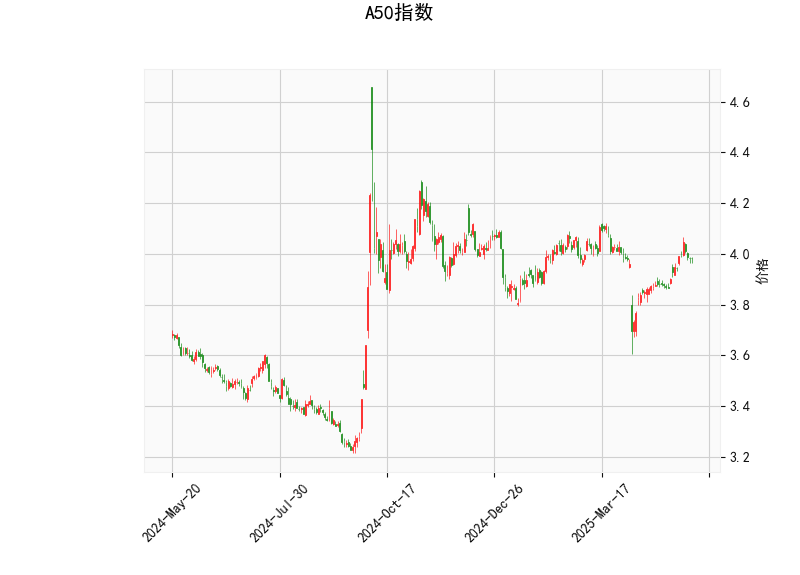

### A50指数技术分析结果解读

#### 1. 技术指标分析
- **当前价与布林轨道**：  
  当前价（3.983）略高于布林中轨（3.956），显示价格处于短期均衡状态，但接近上轨（4.143）时可能面临阻力。若价格站稳中轨，可能向布林上轨测试；若跌破中轨，可能向下轨（3.769）回调。

- **RSI（57.74）**：  
  处于50-60区间，表明市场短期动能中性偏多，但未进入超买区域（>70），暂时无显著回调压力。需关注RSI是否突破60或跌破50以确认趋势强度。

- **MACD指标**：  
  MACD线（0.023）上穿信号线（0.012），柱状图（0.0108）为正且扩大，显示短期多头动能增强，可能开启反弹。但MACD绝对值较小，需结合其他指标验证趋势持续性。

- **K线形态**：  
  多个形态显示市场犹豫（如CDLDOJI、CDLHIGHWAVE、CDLSPINNINGTOP），反映多空博弈激烈；CDLMATCHINGLOW（匹配低点）暗示下跌动能减弱，可能接近短期底部。综合来看，市场处于震荡阶段，需等待明确方向信号。

---

#### 2. 潜在机会与策略
##### **短期交易机会**  
- **区间波段策略**：  
  - **做多**：若价格站稳中轨（3.956）且MACD维持金叉，可轻仓试多，目标布林上轨（4.143），止损设于中轨下方。  
  - **做空**：若价格跌破中轨且MACD死叉，可短线下看下轨（3.769），止损设于中轨上方。  

- **突破策略**：  
  若价格放量突破布林上轨（4.143），可能开启上行趋势，可跟进多单；若跌破下轨（3.769），则可能加速下跌，需警惕风险。

##### **套利机会**  
- **波动率套利**：  
  布林带收窄（当前带宽约0.374）且K线形态显示震荡，可布局波动率策略（如卖出跨式期权），押注价格短期内维持区间波动。

- **多因子共振策略**：  
  等待RSI（>60）与MACD同步上行且价格突破布林上轨时加仓，或RSI（<50）与MACD死叉叠加价格跌破中轨时减仓。

##### **风险提示**  
- **假突破风险**：当前K线形态多空信号混杂，需警惕布林轨道附近的假突破，建议结合成交量确认。  
- **事件驱动风险**：关注宏观经济数据（如中国PMI、美联储政策）对A50指数的冲击，避免单边押注。

---

**总结**：当前A50指数处于震荡整理阶段，短期可依托布林轨道高抛低吸，中期需等待价格突破区间或MACD/RSI的持续信号。建议控制仓位，灵活应对市场变化。