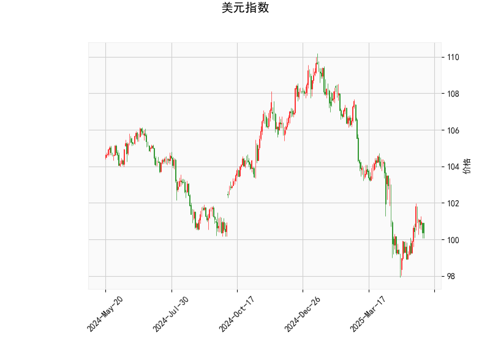

# 美元指数技术分析及对A股/港股的投资策略

## 一、美元指数技术分析解读

### 1. 核心指标解析
- **当前价（100.37）**：位于布林带下轨（97.50）与中轨（102.18）之间，短期偏弱但接近超卖区域。
- **RSI（46.65）**：中性区间，显示市场未出现单边趋势动能。
- **MACD指标**：MACD线（-0.243）上穿信号线（-0.469），柱状图转正（0.226），形成“金叉”，暗示短期反弹可能。
- **布林带形态**：价格持续贴近下轨运行，存在均值回归需求。
- **K线形态**：
  - **CDLBELTHOLD**：下跌趋势中的停顿信号，需结合成交量确认。
  - **CDLMATCHINGLOW**：看涨反转形态，可能预示短期底部。

### 2. 趋势判断
- **短期**：技术面存在超跌反弹动能，目标看向中轨102附近。
- **中期**：若未能有效突破中轨，仍可能延续下行趋势，需关注美联储政策转向预期。

---

## 二、A股/港股投资机会与策略

### 1. 美元联动效应下的机会
- **汇率敏感板块**：
  - **受益于美元反弹**：出口导向型行业（电子代工、纺织服装）可能因人民币短期贬值获得汇兑收益。
  - **警惕外资流出压力**：若美元反弹持续，北向资金可能减持高估值白马股（如消费、新能源）。
- **跨市场套利**：
  - **AH溢价套利**：当前恒生AH溢价指数处于高位（约145），可关注折价率超20%的H股（如券商、银行股），同时做空对应A股。
  - **港股通标的**：布局受美元压制但基本面稳健的港股（如互联网平台、生物医药）。

### 2. 技术面共振策略
- **超跌反弹窗口**：
  - **A股**：关注科创50（半导体设备、AI算力）及中证500成分股中RSI低于30的错杀标的。
  - **港股**：恒生科技指数成分股中MACD底背离个股（如部分电商龙头）。
- **对冲策略**：
  - 使用沪深300股指期货与美元指数期货构建反向对冲组合，降低系统性风险。

### 3. 事件驱动机会
- **政策催化**：关注国内稳增长政策加码（如地产限购放松、消费补贴），重点布局受益于“设备更新”的机械、家电板块。
- **财报季套利**：挖掘A股/H股同步上市企业中业绩超预期但H股反应滞后的标的（如部分消费电子公司）。

---

## 三、风险提示
1. **美联储政策反复**：若6月FOMC释放更强“鹰派”信号，可能强化美元反弹力度。
2. **地缘政治风险**：台海局势、中美科技摩擦或加剧市场波动。
3. **流动性陷阱**：需警惕港股市场流动性不足导致的“折价陷阱”。

> **操作建议**：短期以3-5个交易日的波段操作为主，重点配置低估值、高股息资产（如港股电信三巨头）；中期关注二季度GDP数据落地后的政策受益主线。建议控制仓位在60%以下，保留现金等待右侧信号。