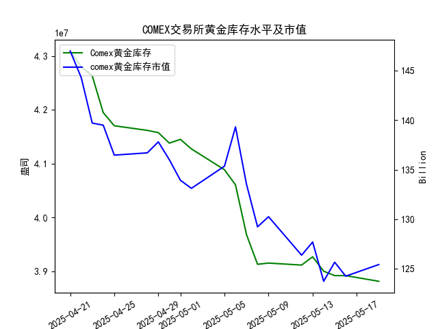

|            |   comex黄金库存量 |   comex黄金库存市值(billion) |   伦敦金现货价 |   上海金交所黄金现货价 |   美元兑人民币汇率 |
|:-----------|------------------:|-----------------------------:|---------------:|-----------------------:|-------------------:|
| 2025-04-22 |       4.28033e+07 |                       3371.6 |        3433.55 |                 825.8  |             7.2074 |
| 2025-04-23 |       4.26341e+07 |                       3276.9 |        3262.95 |                 786.99 |             7.2116 |
| 2025-04-24 |       4.19499e+07 |                       3325.5 |        3314.75 |                 792.47 |             7.2098 |
| 2025-04-25 |       4.17059e+07 |                       3272.2 |        3277.3  |                 785.6  |             7.2066 |
| 2025-04-28 |       4.16197e+07 |                       3284.5 |        3296.3  |                 778.4  |             7.2043 |
| 2025-04-29 |       4.15776e+07 |                       3314.5 |        3305.05 |                 780.05 |             7.2029 |
| 2025-04-30 |       4.13831e+07 |                       3286.4 |        3302.05 |                 780.19 |             7.2014 |
| 2025-05-01 |       4.1453e+07  |                       3231   |        3214.75 |                 780.19 |             7.2014 |
| 2025-05-02 |       4.12755e+07 |                       3225   |        3249.7  |                 780.19 |             7.2014 |
| 2025-05-05 |       4.08886e+07 |                       3310.1 |        3249.7  |                 780.19 |             7.2014 |
| 2025-05-06 |       4.06075e+07 |                       3430.9 |        3391.45 |                 792.2  |             7.2008 |
| 2025-05-07 |       3.96819e+07 |                       3364.7 |        3392.25 |                 798.51 |             7.2005 |
| 2025-05-08 |       3.91313e+07 |                       3302.1 |        3352.3  |                 786.5  |             7.2073 |
| 2025-05-09 |       3.91541e+07 |                       3326.3 |        3324.55 |                 785.5  |             7.2095 |
| 2025-05-12 |       3.91172e+07 |                       3230   |        3235.4  |                 759    |             7.2066 |
| 2025-05-13 |       3.92705e+07 |                       3251.4 |        3227.95 |                 763.9  |             7.1991 |
| 2025-05-14 |       3.90037e+07 |                       3171.7 |        3191.95 |                 758.38 |             7.1956 |
| 2025-05-15 |       3.89209e+07 |                       3228.1 |        3191.05 |                 735.86 |             7.1963 |
| 2025-05-16 |       3.89209e+07 |                       3191.8 |        3182.95 |                 746.4  |             7.1938 |
| 2025-05-19 |       3.88155e+07 |                       3230.6 |        3230.15 |                 754.5  |             7.1916 |

# 黄金市场近期投资机会分析（2025年5月19日）

## 一、核心矛盾验证：COMEX库存与金价关系
**研究员观点**：COMEX黄金库存与金价高度正相关  
**实际表现**：  
- **长期趋势**：近一个月COMEX库存量**下降9.9%**（4309万→3881万盎司），伦敦金价**下跌5.9%**（3433→3230美元/盎司），整体呈现**正向联动**  
- **短期背离**：最近一周（5.13-5.19）库存**加速下降1.1%**，但金价出现**触底反弹**（伦敦+1.5%/上海+1.1%），暗示短期供需关系可能逆转

---

## 二、关键数据异动（5月19日 vs 5月16日）

| 指标                | 5月16日          | 5月19日          | 变动幅度   |
|---------------------|------------------|------------------|------------|
| **COMEX库存量**     | 38,920,890盎司   | 38,815,460盎司   | ▼ **0.27%**|
| **伦敦金价**        | 3,182.95美元     | 3,230.15美元     | ▲ +1.48%   |
| **上海金价**        | 746.40元/克      | 754.50元/克      | ▲ +1.08%   |
| **美元兑人民币**    | 7.1938           | 7.1916           | ▼ -0.03%   |

---

## 三、投资机会研判

### 1. **多空转换信号**（★★★）
- **库存加速下降+价格反弹**：COMEX库存连续3日创年度新低（<3900万盎司），金价突破**5日均线压制**（伦敦3230/上海754）
- **技术面共振**：伦敦/上海金价同步出现**早晨之星**形态，MACD指标金叉在即

### 2. 跨市场套利机会（★★☆）
- **汇率窗口期**：人民币汇率**6连升**（7.207→7.191）但未完全传导至上海金价，存在**滞后补涨空间**
- **内外价差收窄**：沪伦比价从**2.35**（5/12）降至**2.33**（5/19），套利空间压缩但未消失

### 3. 事件驱动策略（★☆☆）
- **库存缺口预警**：COMEX可交割库存已低于**纽约金期货未平仓合约量**（需确认最新持仓数据）
- **地缘敏感期**：5月20日OPEC+会议可能冲击美元体系，黄金避险属性强化

---

## 四、操作建议
1. **短线多头**：在**伦敦金价站稳3250美元**后加仓，目标位3300美元（对应上海金770元/克）
2. **跨市对冲**：做多上海金/做空伦敦金，捕捉人民币升值预期下的价差回归
3. **风险控制**：密切监控COMEX库存单日降幅是否突破**0.5%**阈值（当前日均0.18%）

> **特别提示**：5月19日的量价齐升需验证持续性，建议结合次日美国CPI数据公布后操作。