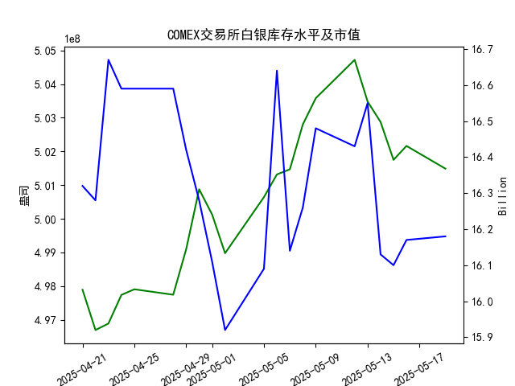

|            |   comex白银库存量 |   comex白银库存市值(billion) |   伦敦银现货价 |   上海金交所白银现货价 |   美元兑人民币汇率 |
|:-----------|------------------:|-----------------------------:|---------------:|-----------------------:|-------------------:|
| 2025-04-22 |       4.96698e+08 |                       32.785 |         32.61  |                   8154 |             7.2074 |
| 2025-04-23 |       4.96891e+08 |                       33.55  |         32.96  |                   8191 |             7.2116 |
| 2025-04-24 |       4.97741e+08 |                       33.325 |         33.395 |                   8295 |             7.2098 |
| 2025-04-25 |       4.97908e+08 |                       33.325 |         33.335 |                   8270 |             7.2066 |
| 2025-04-28 |       4.97746e+08 |                       33.325 |         33.01  |                   8173 |             7.2043 |
| 2025-04-29 |       4.99098e+08 |                       32.89  |         33.225 |                   8197 |             7.2029 |
| 2025-04-30 |       5.00876e+08 |                       32.51  |         32.225 |                   8163 |             7.2014 |
| 2025-05-01 |       5.00128e+08 |                       32.205 |         32.125 |                   8163 |             7.2014 |
| 2025-05-02 |       4.98978e+08 |                       31.91  |         32.365 |                   8163 |             7.2014 |
| 2025-05-05 |       5.00644e+08 |                       32.14  |         32.365 |                   8163 |             7.2014 |
| 2025-05-06 |       5.01317e+08 |                       33.19  |         33.025 |                   8221 |             7.2008 |
| 2025-05-07 |       5.01469e+08 |                       32.195 |         32.875 |                   8229 |             7.2005 |
| 2025-05-08 |       5.028e+08   |                       32.335 |         32.43  |                   8100 |             7.2073 |
| 2025-05-09 |       5.03581e+08 |                       32.73  |         32.515 |                   8150 |             7.2095 |
| 2025-05-12 |       5.04719e+08 |                       32.56  |         32.02  |                   8124 |             7.2066 |
| 2025-05-13 |       5.03481e+08 |                       32.88  |         32.98  |                   8214 |             7.1991 |
| 2025-05-14 |       5.02874e+08 |                       32.085 |         32.885 |                   8172 |             7.1956 |
| 2025-05-15 |       5.0175e+08  |                       32.085 |         32.085 |                   7967 |             7.1963 |
| 2025-05-16 |       5.02164e+08 |                       32.195 |         32.135 |                   8062 |             7.1938 |
| 2025-05-19 |       5.0149e+08  |                       32.265 |         32.52  |                   8113 |             7.1916 |

### 近期白银市场投资机会分析

#### 1. **COMEX白银库存与价格动态**
- **库存变化**：最近一周（5月12日至5月19日），COMEX白银库存从5.0472亿盎司降至5.0149亿盎司，降幅约0.64%。尤其是5月16日至19日，库存减少0.67%，显示短期供应压力缓解。
- **库存市值**：同期市值从16.43 billion波动至16.18 billion，与库存下降趋势一致，但降幅小于库存量，反映近期白银价格对市值的支撑作用。

#### 2. **伦敦白银现货价格**
- **今日（5月19日）**：伦敦银价为32.52美元/盎司，较昨日（32.135）上涨**1.2%**，创近一周新高。
- **短期波动**：过去一周银价经历剧烈震荡（32.02→32.98→32.085→32.52），5月13日单日涨幅达3%，随后回调并企稳回升，显示市场情绪偏向多头。

#### 3. **上海白银现货价格与汇率联动**
- **今日价格**：上海银价报8113元/千克，较昨日（8062）上涨**0.63%**，同步跟随国际价格反弹。
- **汇率影响**：美元兑人民币汇率从7.2014（5月1日）降至7.1916（5月19日），人民币升值压低国内白银进口成本，但近期上海银价仍与国际走势趋同，未显著受汇率压制。

#### 4. **跨市场套利机会**
- **价差分析**（以5月19日数据）：
  - 伦敦银价（32.52美元/盎司）按汇率折算为**233.8元/盎司**（32.52×7.1916）。
  - 上海银价（8113元/千克）折合**229.97元/盎司**（8113÷35.274）。
  - **价差空间**：伦敦较上海溢价约**1.6%**，存在买入上海、卖出伦敦的套利窗口（需扣减交易成本）。

#### 5. **短期驱动因素**
- **库存与价格背离**：COMEX库存下降但市值稳定，暗示市场对白银未来价格预期改善。
- **技术面支撑**：伦敦银价突破32.5美元阻力位，上海银价重回8100上方，短期技术形态偏多。

---

### 投资建议
1. **多头策略**：短期可关注白银期货或ETF的多头机会，止损参考伦敦银价32美元、上海银价8000元支撑。
2. **跨市场套利**：若价差持续超过1%，可尝试低风险套利（需实时监控汇率和两地流动性）。
3. **风险提示**：美联储政策预期、工业需求数据可能引发波动，需结合宏观事件灵活调整仓位。