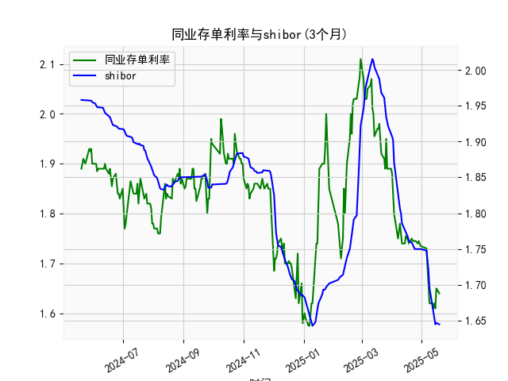

|            |   同业存单利率(3个月) |   shibor(3个月) |
|:-----------|----------------------:|----------------:|
| 2025-04-18 |                 1.74  |           1.761 |
| 2025-04-21 |                 1.75  |           1.759 |
| 2025-04-22 |                 1.745 |           1.755 |
| 2025-04-23 |                 1.745 |           1.753 |
| 2025-04-24 |                 1.745 |           1.75  |
| 2025-04-25 |                 1.745 |           1.75  |
| 2025-04-27 |                 1.74  |           1.75  |
| 2025-04-28 |                 1.745 |           1.75  |
| 2025-04-29 |                 1.74  |           1.75  |
| 2025-04-30 |                 1.735 |           1.75  |
| 2025-05-06 |                 1.73  |           1.748 |
| 2025-05-07 |                 1.69  |           1.737 |
| 2025-05-08 |                 1.66  |           1.72  |
| 2025-05-09 |                 1.62  |           1.696 |
| 2025-05-12 |                 1.62  |           1.672 |
| 2025-05-13 |                 1.61  |           1.662 |
| 2025-05-14 |                 1.62  |           1.653 |
| 2025-05-15 |                 1.61  |           1.645 |
| 2025-05-16 |                 1.65  |           1.647 |
| 2025-05-19 |                 1.64  |           1.645 |

### 1. 同业存单利率与SHIBOR的相关性及影响逻辑

#### 相关性
同业存单利率（AAA）与SHIBOR（3个月）均反映银行间市场的短期资金价格，二者高度相关：
- **同向波动性**：两者均受市场流动性、货币政策（如MLF利率、存款准备金率）、宏观经济预期（如通胀、GDP增速）影响。例如，当央行释放流动性时，两者均可能下行。
- **信用风险差异**：同业存单利率包含发行银行的信用溢价（AAA评级信用风险极低），而SHIBOR是无风险利率（仅反映银行间拆借成本）。因此，市场对银行信用风险的担忧会扩大两者的利差。
- **市场供需差异**：同业存单利率更直接受银行发行需求（如季末考核、信贷扩张）影响，而SHIBOR反映实时拆借供需。

#### 影响逻辑
- **流动性传导**：央行通过公开市场操作（OMO）或MLF调整基础货币供给，直接影响SHIBOR，进而通过银行融资成本间接传导至同业存单利率。
- **政策信号作用**：SHIBOR的异常波动可能预示政策转向（如加息/降息），而同业存单利率的持续偏离（如AAA利率低于SHIBOR）可能反映银行对中长期资金面的悲观预期。
- **套利行为**：若两者利差扩大，机构可能通过“借短投长”策略套利（如以SHIBOR融资、投资同业存单），推动利差回归。

---

### 2. 近期投资机会分析（基于最近一周数据）

#### 数据观察
- **同业存单利率（AAA）**：  
  - 近一周：从`1.74%`（前一周）降至`1.64%`（最新值），**单日降幅显著**（今日`1.64%` vs 昨日`1.65%`）。  
  - 趋势：连续5日下行，反映市场对短期流动性的乐观预期。
- **SHIBOR（3个月）**：  
  - 近一周：从`1.75%`（前一周）降至`1.645%`（最新值），今日小幅反弹（昨日`1.653%` → 今日`1.645%`），但仍处于低位。  
  - 趋势：与同业存单同步下行，但降幅更平缓。

#### 投资机会判断
1. **短期债券配置窗口**：  
   - 逻辑：同业存单利率快速下行且与SHIBOR利差收窄（`1.64% vs 1.645%`），显示市场对优质短期资产的追捧。可增持3个月内到期的利率债或高评级信用债，锁定当前收益率。
   - 风险：若央行意外收紧流动性（如逆回购缩量），利率可能反弹。

2. **权益市场流动性驱动板块**：  
   - 逻辑：资金成本下降（SHIBOR低位）利好杠杆率高的行业（如券商、地产）。近期数据指向宽松预期，可关注金融、消费等对利率敏感板块的短期反弹。
   - 风险：经济数据若不及预期，市场情绪可能逆转。

3. **利率衍生品对冲策略**：  
   - 逻辑：同业存单与SHIBOR利差接近零（罕见现象），若预期利差回归（如SHIBOR回升更快），可通过IRS（利率互换）或期货做多利差。
   - 风险：政策干预可能导致利差持续收窄。

4. **现金管理工具优化**：  
   - 逻辑：货币基金收益率（挂钩同业存单）可能随利率下行，可转向短债基金或银行T+0理财，避免收益进一步下滑。

#### 今日重点关注
- **同业存单单日利率降幅（-1bp）**：可能反映大行集中发行需求减弱或央行隐性宽松操作（如定向MLF）。需结合当日公开市场操作数据验证。
- **SHIBOR小幅反弹**：可能与跨月资金需求短暂上升有关，但趋势未改，维持宽松判断。

---

### 总结
近期流动性宽松信号明确，建议**超配短久期固收资产**，并关注权益市场中利率敏感板块的短期机会，同时警惕政策边际变化对利率的扰动。