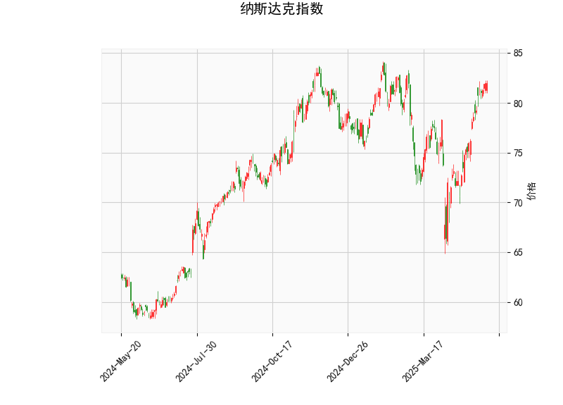

### 一、纳斯达克指数技术分析结果解读

#### 1. **RSI（相对强弱指数）**  
当前RSI值为**68.9**，接近**超买阈值（70）**，但尚未突破。说明市场买方力量占优，但需警惕短期回调风险。若RSI后续突破70并伴随价格新高，可能延续强势；若RSI拐头向下，则可能进入调整阶段。

#### 2. **MACD（指数平滑异同平均线）**  
- **MACD线（2.07）**高于**信号线（1.55）**，形成**多头金叉**，且**柱状图（0.52）**持续扩大，表明短期上涨动能较强。  
- 需关注MACD与信号线的后续关系：若二者保持向上发散，趋势可能延续；若柱状图收缩或出现死叉，则需警惕动能衰竭。

#### 3. **布林轨道**  
- 当前价格**81.96**接近**上轨（83.45）**，表明市场处于短期高位，可能面临压力。  
- 若价格突破上轨且布林带开口扩大，可能开启新一轮上涨；若遇阻回落，可能向中轨（75.89）甚至下轨（68.33）回调。  
- 中轨（75.89）与当前价差较大，显示中期趋势仍偏多。

#### 4. **K线形态**  
出现**CDLLONGLINE（长腿十字线）**，通常为**反转信号**，表明多空博弈激烈。需结合其他指标确认：若后续收阴或跌破关键支撑，可能开启回调；若继续收阳突破上轨，则可能延续涨势。

---

### 二、近期投资机会与策略建议

#### 1. **多头策略（顺势而为）**  
- **突破追涨**：若价格站稳布林带上轨（83.45）且MACD柱状图持续扩大，可轻仓做多，目标前高或更高阻力位，止损设于83下方。  
- **回调做多**：若价格回踩中轨（75.89）或RSI回落至50附近企稳，可视为低吸机会，止损设于中轨下方。

#### 2. **空头策略（逆向博弈）**  
- **超卖反转**：若RSI突破70后快速回落，且价格跌破布林带上轨，可尝试短空，目标中轨（75.89），止损设于83.5上方。  
- **K线形态确认**：若CDLLONGLINE后连续收阴，MACD柱状图收缩，可视为短期见顶信号，配合布林带上轨阻力轻仓试空。

#### 3. **套利与风控建议**  
- **区间交易**：若价格在布林带上下轨（83.45-68.33）间震荡，可高抛低吸，结合RSI和MACD信号动态调整仓位。  
- **止损设置**：所有策略需严格止损，避免单边行情风险。例如，多头止损可设在布林中轨下方（75），空头止损设在布林上轨上方（84）。  
- **趋势跟踪**：若MACD和布林带同步确认趋势（如开口扩大+柱状图持续放量），可逐步加仓。

---

### 三、总结  
当前纳斯达克指数技术面**短期偏多但接近超买**，需警惕回调风险。投资者可结合布林带压力/支撑、MACD动能变化及K线形态灵活布局，重点关注价格对83.45上轨的突破或回落确认信号。建议以轻仓试单为主，避免过度追高。