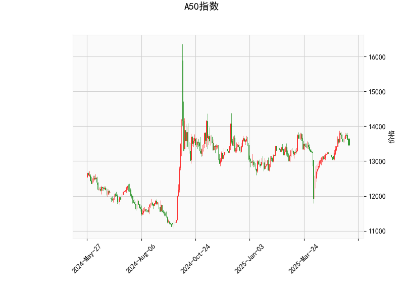

# A50指数技术分析及策略建议

## 一、技术分析解读

### 1. 核心指标分析
- **当前价与布林通道**  
  当前价13,471点位于布林通道中轨（13,306点）上方，但距离上轨（13,984点）仍有约3.8%空间，下轨（12,629点）则有6.2%下跌空间。价格处于中性区间，但短期更接近中轨支撑。

- **RSI指标**  
  51.3的RSI值显示市场处于中性区域，既未超买（>70）也未超卖（<30）。结合近期走势，可能暗示多空力量暂时均衡。

- **MACD指标**  
  MACD线（110.59）下穿信号线（122.99），柱状图-12.4呈现"死叉"形态，显示短期动能偏弱。但MACD绝对值仍处于高位（>100），需警惕中期趋势反转风险。

- **K线形态**  
  `CDLLONGLINE`（长影线形态）与`CDLMATCHINGLOW`（匹配低点形态）同时出现，均为看涨反转信号，暗示空头动能衰竭，可能形成短期底部。

---

## 二、投资机会与策略建议

### 1. 趋势跟踪策略
- **突破交易机会**  
  若价格站稳布林中轨（13,306点）并伴随MACD柱状图缩窄，可布局多单，目标看向上轨13,984点，止损设于中轨下方1%（约13,170点）。

- **反转策略验证**  
  K线组合的看涨信号需配合以下确认条件：  
  ① 连续两日收于13,400点上方  
  ② 成交量放大至近期均量120%以上  
  ③ MACD柱状图由负转正

### 2. 套利机会分析
- **均值回归套利**  
  当前价与布林中轨偏离度仅1.2%，低于近3个月平均偏离度（2.5%）。若价格回落至中轨下方，可结合RSI<45时逢低建仓，目标回报比设定1:2。

- **波动率套利**  
  布林带宽（上轨-下轨）达2,354点，高于近20日平均带宽2,100点。可通过期权组合构建跨式策略，捕捉潜在波动扩张机会。

---

## 三、风险提示
1. **MACD死叉风险**：若MACD柱状图持续扩大负值，可能引发技术性抛压，需警惕下探12,800点支撑位。
2. **假突破风险**：当前价接近中轨敏感区域，若虚假突破可能触发止损盘，建议使用分仓策略。
3. **事件驱动风险**：重点关注中国PMI数据、美联储议息会议等宏观事件对A50的冲击。

> **操作建议**：短期（1-3天）建议观望为主，等待K线组合确认信号。中期（1周）可关注13,200-13,500区间震荡机会，突破区间上下沿3%后顺势操作。风险偏好较高者可小仓位参与波动率交易，建议仓位控制在总资金5%以内。