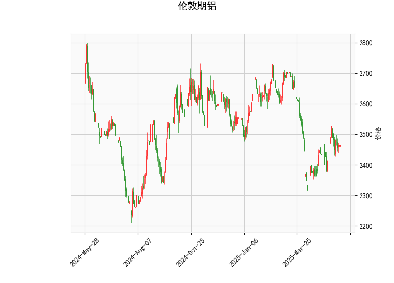

### 伦敦期铝技术分析结果解读

#### 1. 核心指标分析
- **当前价（2466.0）**：价格位于布林通道中轨（2499.81）附近，略低于中轨，表明短期处于中性偏弱区间，但未触及下轨（2268.89），下行空间仍存。
- **RSI（50.88）**：中性区域，无明显超买（>70）或超卖（<30）信号，市场多空力量暂时平衡。
- **MACD（3.16 vs 信号线-0.38）**：MACD线已上穿信号线形成“金叉”，且柱状图（3.54）持续放大，显示短期多头动能增强。
- **布林通道**：当前价与中轨（2499.81）差距较小，若突破中轨可能向上轨（2730.73）方向反弹；若跌破则可能向下轨（2268.89）靠近。
- **K线形态（纺锤线CDLSPINNINGTOP）**：反映市场犹豫不决，需结合后续K线确认方向（如大阳线看涨、大阴线看跌）。

#### 2. 投资或套利机会与策略
**（1）短期多头策略**  
- **入场条件**：  
  - 价格站稳布林中轨（2499.81）且MACD柱状图持续扩大。  
  - 若出现大阳线突破中轨，可视为短期看涨信号。  
- **目标与止损**：  
  - 第一目标：布林上轨（2730.73），对应潜在涨幅约10.7%。  
  - 止损：跌破中轨后回踩失败（如收盘价<2450）。  

**（2）区间震荡策略**  
- **逻辑**：布林通道收窄（上轨-下轨≈462点），且RSI中性，可能进入震荡行情。  
- **操作**：  
  - 接近下轨（2268.89）时轻仓做多，止损设于下轨下方（如2240）。  
  - 接近中轨（2499.81）或上轨（2730.73）时止盈或反手试空。  

**（3）MACD背离套利**  
- **风险提示**：当前MACD金叉有效性需观察，若价格未同步突破中轨，可能形成“假金叉”。  
- **应对**：  
  - 若价格与MACD柱状图背离（如价格新高但柱状图缩量），可反向开仓。  

**（4）事件驱动策略**  
- **关注点**：全球铝库存变动、能源价格波动（电解铝成本）及地缘政治事件（如俄铝供应风险）。  
- **机会捕捉**：若突发利多消息（如减产、需求回升），可结合技术面突破中轨后加仓。  

---

### 总结  
当前技术面呈现震荡偏强特征，MACD金叉与价格接近布林中轨为短期关键观察点。建议以区间操作（高抛低吸）为主，突破中轨后跟进趋势。需警惕纺锤线后的方向确认及宏观面扰动风险，严格设置止损。