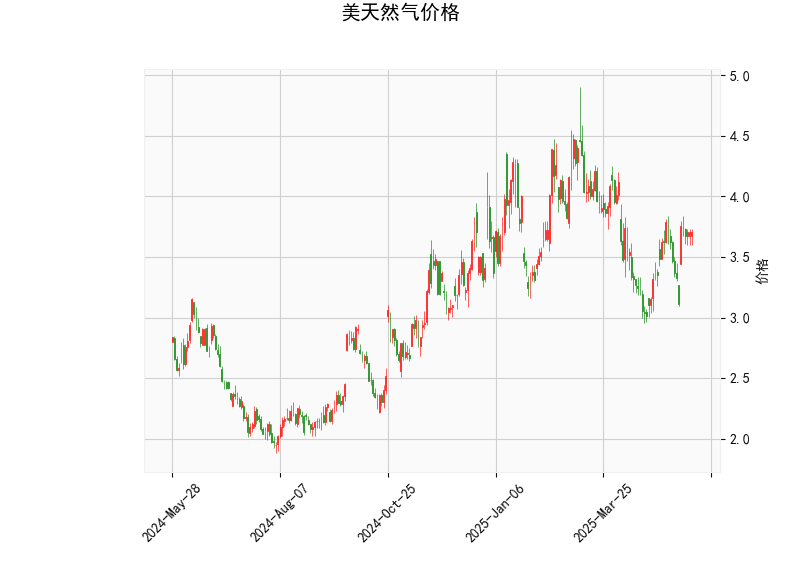

# 美天然气价格技术分析与投资策略

## 一、技术分析解读

### 1. RSI指标
- **当前值55.25**处于中性区间（30-70），接近超买临界值但未触发信号。表明市场暂时没有明确的买卖压力失衡，但需关注是否突破70（超买）或跌破30（超卖）。

### 2. MACD指标
- **金叉初现**：MACD线（0.0394）刚上穿信号线（-0.0012），柱状图转正（0.0406），暗示短期动能转向偏多。但绝对值较小，需关注持续性和量能配合。
- **零轴位置**：MACD与信号线仍位于零轴下方，说明当前反弹仍属于弱势修复阶段。

### 3. 布林通道
- **价格定位**：现价3.706紧贴中轨（3.6878），上下轨间距达1.5美元（4.4360/2.9395），显示当前波动率处于高位。
- **通道形态**：中轨走平且未出现明显张口，暗示价格处于震荡整理阶段，需关注突破方向选择。

### 4. K线形态
- **无显著形态**：K线形态列表为空，说明未出现典型反转或持续形态（如吞没、十字星等），市场处于无序震荡状态。

---

## 二、投资机会与策略建议

### 1. 短期交易机会
- **多头策略**（风险偏好型）：
  - **入场条件**：价格站稳中轨3.6878且MACD柱持续扩大，可轻仓试多。
  - **目标位**：上轨4.4360（空间约19.6%），对应天然气库存季节性波动预期。
  - **止损位**：中轨下方3.65（约1.5%风险空间）。
- **空头策略**（保守型）：
  - **触发条件**：若价格跌破中轨且RSI下穿50，可考虑短空操作。
  - **目标位**：下轨2.9395（空间约20.7%），对应夏季需求疲软逻辑。
  - **止损位**：中轨上方3.70（约0.8%风险空间）。

### 2. 套利机会
- **跨期套利**：
  - 关注近月合约（受天气炒作驱动）与远月合约（受库存压制）价差变化，若近月强势突破可做多近月/做空远月。
- **波动率套利**：
  - 当前布林带宽达1.5美元，若价格收敛至中轨附近可卖出宽跨式期权组合，赚取波动率回落收益。

### 3. 中长线布局
- **季节性多头**：
  - 提前布局冬季取暖季行情，结合技术面突破上轨4.4360确认趋势，目标看向年度前高5.0美元区域。
- **事件驱动策略**：
  - 跟踪飓风季（8-10月）对墨西哥湾产量的影响，配合MACD二次金叉参与短期脉冲行情。

---

## 三、风险提示
1. **假突破风险**：当前价格紧贴中轨，需防范虚假突破后反向波动。
2. **基本面变量**：EIA库存数据、LNG出口量变化可能快速改变技术形态。
3. **地缘政治**：俄罗斯天然气供应波动可能引发关联性行情。
4. **仓位管理**：建议单笔交易风险控制在总资金2%以内，组合最大回撤不超过10%。

> **操作建议**：当前宜保持观望，等待价格有效突破中轨或下轨后跟随趋势。激进投资者可按照3:1盈亏比设置多空策略，重点观察MACD柱状图能否持续放大确认动能。