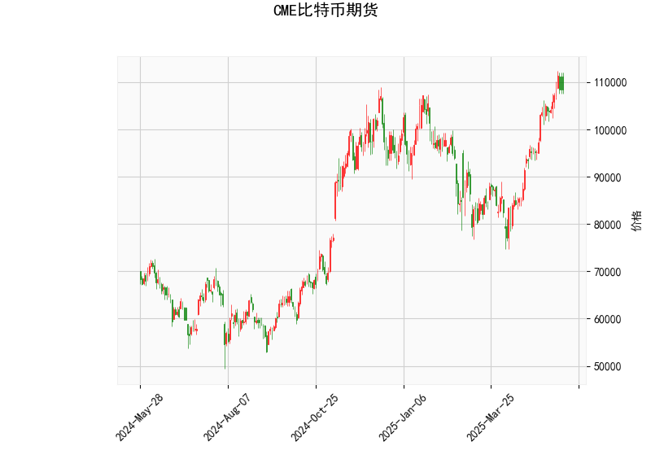

### CME比特币期货技术分析结果解读

#### 1. 技术指标分析
- **当前价（108,370美元）与布林轨道**  
  当前价格已突破布林带上轨（110,808.9美元），接近阻力位。通常价格触及布林带上轨时可能面临回调压力，但若持续突破则可能延续强势。布林带中轨（91,489.6美元）与下轨（72,170.4美元）间距较大，显示当前市场波动性较高。

- **RSI（70.09）**  
  RSI已进入超买区间（>70），表明短期存在回调风险。但若市场处于强趋势中，RSI可能长期维持高位，需结合其他指标判断趋势持续性。

- **MACD（4969.17 vs. 4847.17）**  
  MACD线位于信号线上方且柱状图（122）为正，显示短期看涨动能占优，但需警惕高位MACD背离（如价格新高而MACD未同步）的潜在反转信号。

- **K线形态**  
  - **CDLLONGLINE**：长实体阳线反映买方主导，若出现在趋势高位，需警惕多头力量衰竭。  
  - **CDLMATCHINGLOW**：看涨反转形态，通常出现在下跌趋势末期，但当前价格处于高位，需验证其有效性。

#### 2. 投资与套利机会分析

##### **短期机会**  
- **回调做多策略**  
  - **逻辑**：价格接近布林带上轨且RSI超买，若回落至中轨（91,489美元）附近企稳，可视为多头入场机会。  
  - **风险**：若跌破中轨，可能进一步向下轨（72,170美元）测试支撑，需设置止损。

- **突破追涨策略**  
  - **逻辑**：若价格站稳布林带上轨（110,808美元）且MACD持续上行，可能开启新一轮上涨趋势。  
  - **风险**：需警惕假突破，建议配合成交量确认。

##### **套利机会**  
- **跨期套利**  
  - **正向套利**：若近月合约溢价显著高于远月（Contango结构），可做空近月、做多远月。  
  - **反向套利**：若远月贴水扩大（Backwardation），则反向操作。需关注资金费率与持仓成本。

- **波动率交易**  
  - **逻辑**：布林带扩张显示波动率上升，可买入跨式期权（同时买入看涨和看跌期权），押注价格突破。  
  - **风险**：若波动率回落或价格窄幅震荡，可能面临时间价值损耗。

##### **风险提示**  
- **RSI与价格背离**：若价格新高但RSI未能同步，可能预示趋势反转。  
- **MACD死叉信号**：若MACD线下穿信号线，需警惕短期回调。  
- **宏观环境影响**：美联储政策、监管动态等可能对比特币价格产生突发冲击。

### 总结  
当前技术面呈现多空交织：短期看涨动能（MACD金叉、布林带突破）与超买风险（RSI高位）并存。建议结合仓位管理和严格止损，重点关注价格对布林带上轨的确认情况，并监测衍生品市场（如期权隐含波动率）的联动信号。