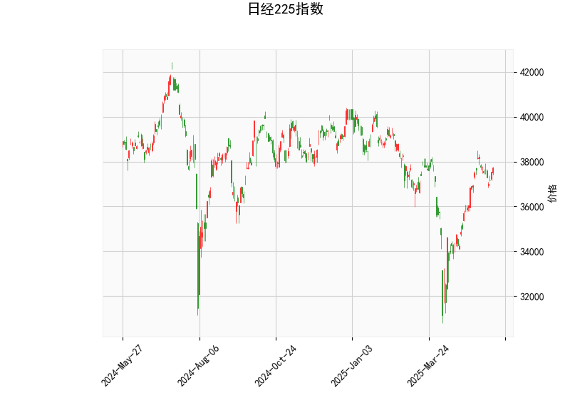

### 日经225指数技术分析结果解读

#### 1. 技术指标分析
- **当前价（37724.11）**：  
  当前价格处于布林带中轨（36253.65）和上轨（39602.26）之间，距离上轨尚有约1878点的空间，短期可能仍有上行潜力，但需关注上轨附近的阻力。

- **RSI（60.36）**：  
  相对强弱指标（RSI）处于60附近，表明市场短期处于中性偏多状态，尚未进入超买区域（70以上）。若后续RSI突破70，可能触发短期回调风险；若回落至50以下，需警惕趋势转弱。

- **MACD指标**：  
  - MACD线（472.51）低于信号线（484.19），柱状图（MACDhist）为负值（-11.69），形成“死叉”信号，暗示短期动能趋弱，可能出现回调或震荡整理。
  - 但MACD和信号线均为正值，表明中长期趋势仍偏多，回调可能为阶段性机会。

- **布林带**：  
  - 当前价格接近布林带中轨（36253.65），若站稳中轨，可能延续上行趋势；若跌破中轨，则需关注下轨（32905.03）支撑。
  - 布林带开口无明显扩张，显示波动率较低，短期可能维持区间震荡。

- **K线形态**：  
  无明确反转或持续形态，市场缺乏方向性信号，需结合其他指标判断趋势。

---

#### 2. 潜在投资机会与策略

##### **短期机会（1-2周）**：
1. **回调买入策略**：  
   - **触发条件**：若价格回落至布林带中轨（36253附近）且RSI未跌破50，可视为短期支撑位。
   - **目标**：反弹至上轨（39602）附近，止损设于中轨下方（如36000）。
   - **逻辑**：当前趋势偏多，MACD死叉可能释放短期回调压力，中轨支撑或吸引买盘。

2. **突破追涨策略**：  
   - **触发条件**：若价格放量突破布林带上轨（39602），且MACD柱状图转正（金叉确认）。
   - **目标**：突破后可能加速上行，看向前高或40000点心理关口。
   - **风险**：需警惕假突破，结合成交量验证。

##### **套利机会**：
- **波动率套利**：  
  布林带收窄显示波动率较低，若预期市场波动加大，可布局跨式期权组合（Long Straddle），捕捉突破行情。

##### **风险提示**：
- **下行风险**：MACD死叉与RSI回落可能触发短期回调，若跌破中轨，可能进一步测试下轨（32905）。
- **仓位管理**：建议分批建仓，避免单一方向重仓。

---

### 总结
当前日经225指数处于中性偏多状态，短期需关注布林带中轨支撑及MACD动能变化。**回调至中轨附近可尝试低吸**，突破上轨则顺势追多，但需警惕假信号。中长期趋势仍需观察MACD是否修复死叉及RSI是否维持50以上。