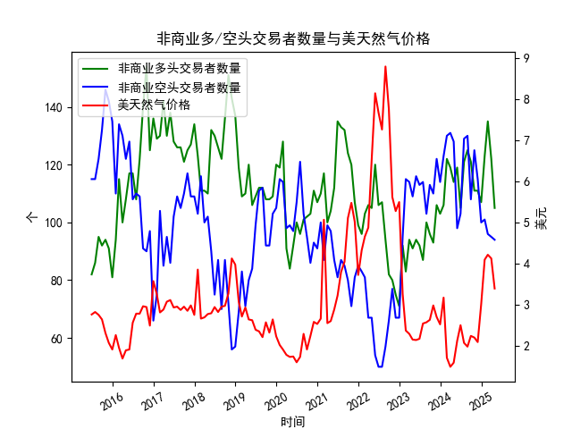

|            |   非商业多头交易者数量 |   非商业空头交易者数量 |   美天然气价格 |
|:-----------|-----------------------:|-----------------------:|---------------:|
| 2023-09-30 |                     96 |                    113 |           2.64 |
| 2023-10-31 |                     93 |                    110 |           2.99 |
| 2023-11-30 |                    106 |                    122 |           2.71 |
| 2023-12-31 |                    103 |                    114 |           2.53 |
| 2024-01-31 |                    106 |                    123 |           3.18 |
| 2024-02-29 |                    122 |                    130 |           1.72 |
| 2024-03-31 |                    119 |                    131 |           1.5  |
| 2024-04-30 |                    114 |                    128 |           1.6  |
| 2024-05-31 |                    119 |                     98 |           2.13 |
| 2024-06-30 |                    105 |                    103 |           2.51 |
| 2024-07-31 |                    121 |                    129 |           2.08 |
| 2024-08-31 |                    125 |                    130 |           1.99 |
| 2024-09-30 |                    121 |                    108 |           2.25 |
| 2024-10-31 |                    111 |                    125 |           2.21 |
| 2024-11-30 |                    111 |                    115 |           2.1  |
| 2024-12-31 |                    107 |                    100 |           3.02 |
| 2025-01-31 |                    123 |                    101 |           4.1  |
| 2025-02-28 |                    135 |                     96 |           4.22 |
| 2025-03-31 |                    122 |                     95 |           4.13 |
| 2025-04-30 |                    105 |                     94 |           3.4  |

### 近期天然气市场投资机会分析

#### 1. **价格与持仓的短期背离（2025年2月-4月）**
- **价格走势**：  
  天然气价格在2025年2月达到4.22美元/百万英热单位后，3月小幅回落至4.13美元（环比-2.1%），4月则大幅下跌至3.40美元（环比-17.7%）。**本月（4月）价格跌幅显著扩大**，可能反映市场对短期供需或库存压力的担忧。
  
- **持仓变化**：  
  - **多头持仓**：2月135.0 → 3月122.0（环比-9.6%）→ 4月105.0（环比-13.0%），**连续两月加速撤离**，表明市场信心明显走弱。  
  - **空头持仓**：2月96.0 → 3月95.0（环比-1.0%）→ 4月94.0（环比-1.05%），**空头平仓力度微弱**，未出现大规模看空信号。  

**关键矛盾**：价格暴跌但空头未显著加仓，可能暗示**短期超卖风险**。若后续库存或需求数据改善，价格存在反弹修复空间。

---

#### 2. **多空持仓比率的触底信号**
- **多空比率**：  
  4月多头/空头比率为105.0/94.0 ≈ 1.12，为近3个月最低值（2月1.41，3月1.28）。**历史低位多空比**（如2015年6月0.71）通常与价格底部相关，当前比率接近2024年12月（1.07），需警惕市场情绪过度悲观后的反转可能。

---

#### 3. **季节性需求预期的潜在支撑**
- **价格周期特征**：  
  天然气价格在冬季（取暖需求）和夏季（发电需求）通常表现较强。**4月价格暴跌**或已部分反映春季需求淡季，但2025年4月价格（3.40美元）仍高于2024年同期（3.02美元），**同比上涨12.6%**，显示长期供需紧平衡逻辑未完全破坏。  

- **库存与天气因素**：  
  若夏季高温或飓风季影响供应，可能推动价格反弹。需关注美国能源信息署（EIA）周度库存报告及极端天气预警。

---

#### 4. **近期操作建议**
- **短期反弹机会**：  
  价格超跌叠加空头未大规模加仓，可关注**3.40美元附近技术支撑**。若5月空头加速平仓（如降至90以下）或库存降幅超预期，可能触发反弹。  
- **中期风险点**：  
  多头持仓持续萎缩表明市场缺乏长期看涨共识，若4月价格低点被击穿，需警惕进一步下探至3.0美元以下（2024年12月水平）。

---

### 结论
**近期核心矛盾**：价格暴跌与持仓信号背离，需结合库存和天气数据判断超卖修复机会。建议**轻仓布局短期反弹**，止损参考3.30美元；中长期需等待多头持仓回暖或空头集中平仓的明确信号。