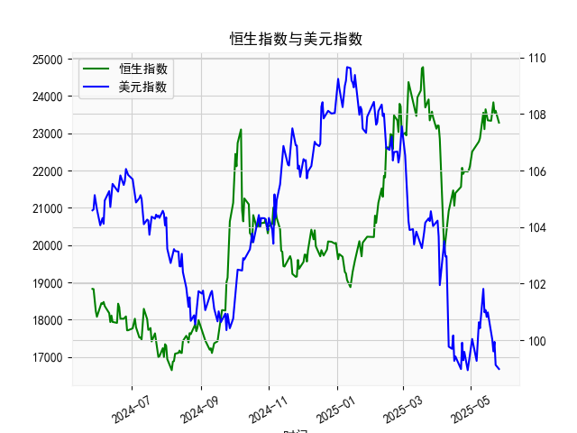

|            |   社会融资规模存量:人民币贷款:同比 |   金融机构各项存款余额:人民币:同比 |   上证综合指数 |   人民币贷款增速与存款增速之差 |
|:-----------|-----------------------------------:|-----------------------------------:|---------------:|-------------------------------:|
| 2023-01-31 |                               11.1 |                               12.4 |        3255.67 |                           -1.3 |
| 2023-02-28 |                               11.5 |                               12.4 |        3279.61 |                           -0.9 |
| 2023-03-31 |                               11.7 |                               12.7 |        3272.86 |                           -1   |
| 2023-05-31 |                               11.3 |                               11.6 |        3204.56 |                           -0.3 |
| 2023-06-30 |                               11.2 |                               11   |        3202.06 |                            0.2 |
| 2023-07-31 |                               11   |                               10.5 |        3291.04 |                            0.5 |
| 2023-08-31 |                               10.9 |                               10.5 |        3119.88 |                            0.4 |
| 2023-10-31 |                               10.7 |                               10.5 |        3018.77 |                            0.2 |
| 2023-11-30 |                               10.7 |                               10.2 |        3029.67 |                            0.5 |
| 2024-01-31 |                               10.1 |                                9.2 |        2788.55 |                            0.9 |
| 2024-02-29 |                                9.7 |                                8.4 |        3015.17 |                            1.3 |
| 2024-04-30 |                                9.1 |                                6.6 |        3104.82 |                            2.5 |
| 2024-05-31 |                                8.9 |                                6.7 |        3086.81 |                            2.2 |
| 2024-07-31 |                                8.3 |                                6.3 |        2938.75 |                            2   |
| 2024-09-30 |                                7.8 |                                7.1 |        3336.5  |                            0.7 |
| 2024-10-31 |                                7.7 |                                7   |        3279.82 |                            0.7 |
| 2024-12-31 |                                7.2 |                                6.3 |        3351.76 |                            0.9 |
| 2025-02-28 |                                7.1 |                                7   |        3320.9  |                            0.1 |
| 2025-03-31 |                                7.2 |                                6.7 |        3335.75 |                            0.5 |
| 2025-04-30 |                                7.1 |                                8   |        3279.03 |                           -0.9 |

### 1. 人民币贷款增速与存款增速之差与上证综合指数的相关性及影响逻辑

#### 相关性分析
从数据趋势看，**人民币贷款增速与存款增速之差（简称“信贷差值”）与上证综指呈现阶段性正相关**：
- **信贷差值扩大时（正值走阔）**：如2020年6月至2021年6月（差值从2.7升至3.9），上证指数从2984点升至3568点；2023年5月至2024年1月（差值从0.4升至0.9），指数从2788点反弹至3351点。此阶段信贷扩张带来的流动性改善通常推动股市上涨。
- **信贷差值缩窄或转负时**：如2021年11月至2022年10月（差值从-0.8降至-1.3），指数从3151点跌至2893点；2024年4月差值转负（-0.9），指数同步下跌至3279点。信贷收缩导致市场流动性收紧，股市承压。

#### 影响逻辑
- **流动性传导**：信贷差值扩大表明银行体系向实体经济注入资金的意愿增强（贷款增速快于存款），企业融资成本降低，市场流动性充裕，资金可能流入股市推高估值。
- **经济预期驱动**：信贷扩张常伴随政策宽松或经济复苏预期，提振投资者风险偏好；反之，信贷收缩可能反映实体需求疲软或政策收紧，引发避险情绪。

---

### 2. 近期投资机会分析（聚焦最近4个月数据）

#### 数据变化特征
- **2025年1月至4月信贷差值波动**：  
  - 1月：0.7 → 2月：0.7（持平）→ 3月：0.9（小幅上升）→ **4月：-0.9（骤降转负）**  
  - **本月（4月）差值较上月骤降1.8**，创近一年最低水平，反映存款增速显著超过贷款增速，流动性短期趋紧。
- **上证指数同步波动**：  
  - 1月：3335点 → 2月：3320点（微跌）→ 3月：3335点（企稳）→ **4月：3279点（跌幅1.7%）**  

#### 潜在投资机会
1. **流动性修复预期下的反弹机会**：  
   - 4月信贷差值骤降可能触发政策宽松（如降准降息），若后续差值触底回升，金融、地产等利率敏感板块或率先受益。
2. **防御性配置需求**：  
   - 差值转负且指数下跌显示短期风险偏好收缩，消费、公用事业等高股息资产可能成为避险选择。
3. **结构性行业轮动**：  
   - 若政策发力“稳信贷”（如定向支持科技、绿色经济），新能源、半导体等政策扶持行业或存在超额收益机会。

#### 风险提示
- 信贷差值持续为负可能压制市场整体估值，需密切关注5月数据是否改善及政策应对信号。