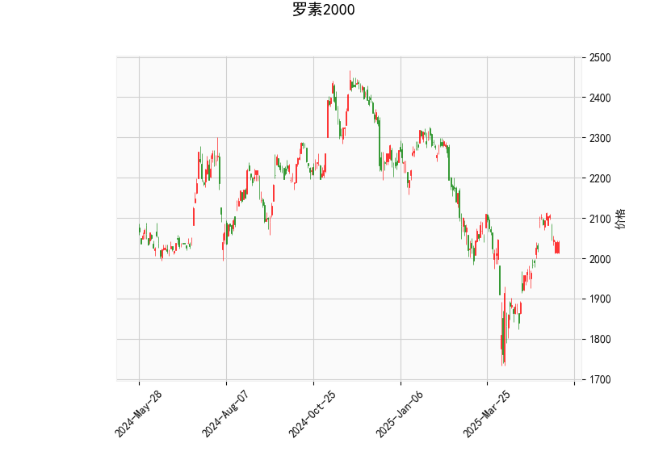

# 罗素2000指数技术分析与投资策略

## 一、技术指标解析

### 1. **RSI（52.53）**
   - RSI处于中性区间（50附近），显示多空力量相对均衡，短期未出现明显超买（>70）或超卖（<30）信号。
   - **隐含信息**：市场缺乏方向性动能，需结合其他指标判断趋势。

### 2. **MACD（21.83 vs 信号线25.37）**
   - MACD线位于信号线下方，柱状图（MACD Histogram）为负值（-3.54），表明短期动能偏空，可能处于回调或震荡阶段。
   - **关键信号**：MACD与信号线形成“死叉”（空头排列），但两者绝对值均高于零轴，中长期趋势尚未完全转弱。

### 3. **布林带（当前价2039.85 vs 中轨1997.97）**
   - 当前价格位于中轨（20日均线）上方，接近上轨（2175.24）与中轨的中间位置，短期支撑位在中轨（1997.97），压力位在上轨（2175.24）。
   - **波动率观察**：布林带带宽（上轨-下轨=354.5）显示市场波动率中等，未出现极端扩张或收缩。

### 4. **K线形态**
   - 未识别到典型反转或持续形态（如头肩顶、三角形等），短期价格走势可能以区间震荡为主。

---

## 二、投资机会与策略建议

### 1. **短期策略：区间震荡交易**
   - **支撑与压力**：中轨（1997.97）为关键支撑，若价格回调至该位置且RSI未跌破50，可考虑轻仓试多；若反弹至2100-2150区间（接近上轨），结合MACD死叉信号可逢高减仓。
   - **止损设置**：若价格有效跌破中轨，可能向下轨（1820.69）移动，需止损观望。

### 2. **中期策略：趋势突破跟踪**
   - **上行突破**：若价格突破上轨（2175.24）且MACD柱状图转正，可能开启新一轮上涨趋势，可加仓或追多。
   - **下行风险**：若MACD持续走弱且价格跌破中轨，需警惕小盘股（罗素2000成分股）流动性风险，可对冲或减仓。

### 3. **套利机会**
   - **波动率套利**：若布林带带宽持续收窄（波动率下降），可布局跨式期权组合，博弈未来波动率回升。
   - **板块轮动**：罗素2000代表小盘股，若宏观经济预期改善（如美联储降息），可优先配置该指数ETF（如IWM）并做空大盘股指数（如标普500）对冲系统性风险。

---

## 三、风险提示
1. **流动性风险**：小盘股流动性较低，极端行情下可能出现价格跳跃。
2. **宏观扰动**：需关注美国通胀数据、美联储政策及企业盈利预期变化。
3. **技术指标滞后性**：MACD及RSI需结合量能验证，若价格与指标背离（如新高但RSI走低），需警惕反转。