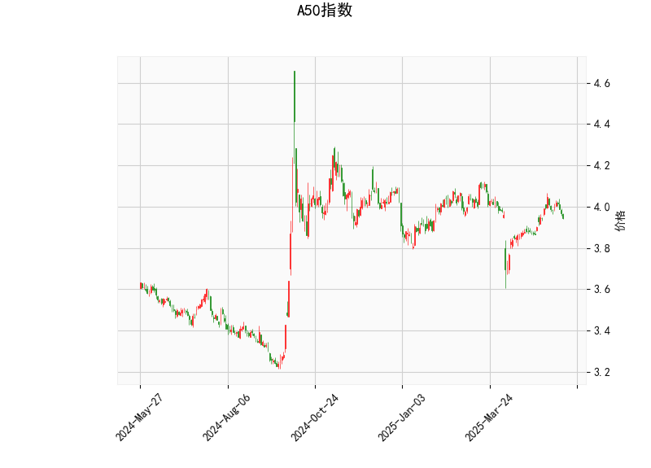

# A50指数技术分析及投资策略

## 一、技术指标解析

### 1. **当前价与布林带**  
当前价（3.946）略低于布林带中轨（3.955），靠近下轨（3.769），表明短期可能处于震荡偏弱状态。布林带上下轨间距较窄（4.140 vs 3.769），显示波动率较低，但若价格突破中轨或上下轨，可能触发趋势性行情。

### 2. **RSI指标**  
RSI值为47.8，接近中性区域（50），未进入超买（>70）或超卖（<30）区间，反映市场多空力量暂时均衡，需结合其他指标判断方向。

### 3. **MACD指标**  
- **MACD线（0.0182）低于信号线（0.0198）**，柱状图（-0.00157）为负值，形成“死叉”信号，暗示短期动能偏空。
- 但两者绝对值接近，趋势强度较弱，需警惕假信号可能。

### 4. **K线形态**  
CDLLONGLINE（长腿十字星）形态出现，表明市场分歧较大，可能预示反转。若后续价格站稳中轨或放量突破，则可能确认方向。

---

## 二、潜在机会与策略

### 1. **震荡区间策略**  
- **区间范围**：布林带下轨（3.769）至中轨（3.955）。  
- **操作逻辑**：当前价靠近下轨，若RSI未明显跌破40且价格反弹，可轻仓试多，目标中轨（3.955）；若价格跌破下轨且MACD空头增强，则观望或短空。

### 2. **趋势突破策略**  
- **向上突破中轨（3.955）**：若伴随成交量放大及MACD柱状图转正，可视为短期多头信号，目标上轨（4.140）。  
- **向下跌破下轨（3.769）**：若RSI同步下探至35以下，可能加速下跌，目标前低（需结合历史支撑位）。

### 3. **反转信号验证**  
- **CDLLONGLINE有效性**：若次日收阳且站稳中轨，则看涨；若收阴且MACD死叉延续，则看空。  
- **结合MACD背离**：若价格新低但MACD未同步走弱，可能形成底背离，提示反弹机会。

---

## 三、风险提示  
1. **低波动率陷阱**：当前布林带收窄，若长期横盘后突破，可能伴随剧烈波动，需严格止损（如中轨下方1%-2%）。  
2. **外围市场扰动**：A50指数受美股及人民币汇率影响较大，需关注美联储政策及经济数据。  
3. **量能配合**：若突破关键位时缺乏成交量支持，可能为假突破，建议分批建仓。  

**结论**：短期以区间操作为主，重点关注中轨争夺及MACD动能变化，突破后顺势跟进。