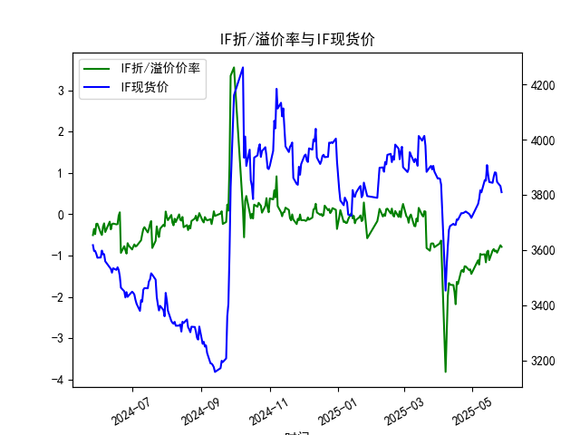
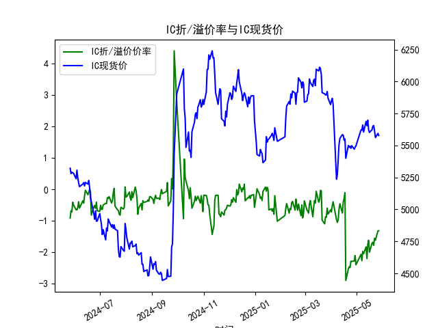
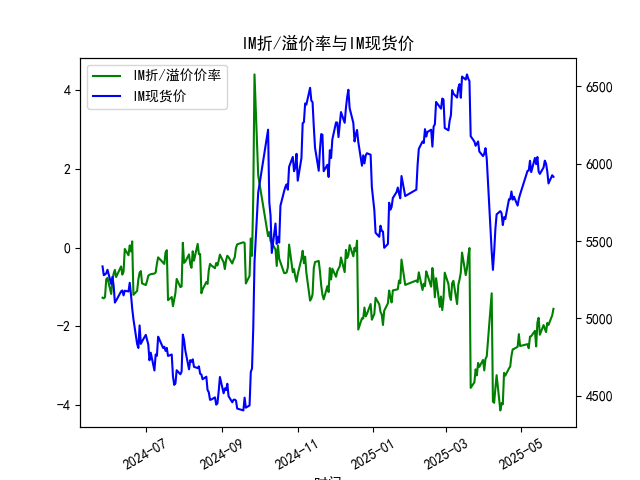

|            |   IF折/溢价率 |   IF现货价 |   IH折/溢价率 |   IH现货价 |   IC折/溢价率 |   IC现货价 |   IH折/溢价率 |   IH现货价 |
|:-----------|--------------:|-----------:|--------------:|-----------:|--------------:|-----------:|--------------:|-----------:|
| 2025-04-25 |     -1.26205  |     3739.2 |      -2.28499 |     5498.6 |      -2.28499 |     5498.6 |      -2.57433 |     5786.6 |
| 2025-04-28 |     -1.34913  |     3730.6 |      -2.27382 |     5471   |      -2.27382 |     5471   |      -2.51923 |     5729   |
| 2025-04-29 |     -1.33181  |     3724.8 |      -2.10005 |     5487.2 |      -2.10005 |     5487.2 |      -2.19842 |     5773.6 |
| 2025-04-30 |     -1.44197  |     3716.2 |      -2.39398 |     5497   |      -2.39398 |     5497   |      -2.49939 |     5801.4 |
| 2025-05-06 |     -1.11177  |     3766.2 |      -2.06144 |     5622   |      -2.06144 |     5622   |      -2.45329 |     5953.2 |
| 2025-05-07 |     -1.2169   |     3785   |      -2.26234 |     5620.2 |      -2.26234 |     5620.2 |      -2.55739 |     5955.2 |
| 2025-05-08 |     -0.957625 |     3816   |      -1.97107 |     5660   |      -1.97107 |     5660   |      -2.2617  |     6018.8 |
| 2025-05-09 |     -0.976471 |     3808.6 |      -2.04348 |     5604.8 |      -2.04348 |     5604.8 |      -2.25057 |     5945.2 |
| 2025-05-12 |     -0.966676 |     3853   |      -1.82396 |     5688   |      -1.82396 |     5688   |      -2.1153  |     6037   |
| 2025-05-13 |     -1.16158  |     3851   |      -2.19778 |     5654.6 |      -2.19778 |     5654.6 |      -2.51032 |     5996.6 |
| 2025-05-14 |     -0.908163 |     3907.4 |      -1.74715 |     5697.8 |      -1.74715 |     5697.8 |      -1.90524 |     6043   |
| 2025-05-15 |     -0.880406 |     3872.8 |      -1.6149  |     5623   |      -1.6149  |     5623   |      -1.78364 |     5949   |
| 2025-05-16 |     -1.10785  |     3846   |      -1.99531 |     5601.8 |      -1.99531 |     5601.8 |      -2.21348 |     5933.8 |
| 2025-05-19 |     -0.875523 |     3843.2 |      -1.70946 |     5623   |      -1.70946 |     5623   |      -1.96768 |     5975.4 |
| 2025-05-20 |     -0.840664 |     3865.4 |      -1.6802  |     5650.8 |      -1.6802  |     5650.8 |      -2.06014 |     6019.4 |
| 2025-05-21 |     -0.898296 |     3881.2 |      -1.77707 |     5655.6 |      -1.77707 |     5655.6 |      -2.14574 |     6000.6 |
| 2025-05-22 |     -0.87548  |     3879.6 |      -1.55138 |     5614.8 |      -1.55138 |     5614.8 |      -1.91397 |     5950   |
| 2025-05-23 |     -0.9292   |     3846.2 |      -1.61406 |     5561.8 |      -1.61406 |     5561.8 |      -1.96463 |     5872   |
| 2025-05-26 |     -0.748858 |     3831.2 |      -1.32042 |     5594.6 |      -1.32042 |     5594.6 |      -1.72151 |     5925   |
| 2025-05-27 |     -0.786501 |     3809.2 |      -1.31181 |     5578   |      -1.31181 |     5578   |      -1.55547 |     5915   |

# 问题一：股指期货折/溢价率与现货价的相关性及影响逻辑

**折/溢价率定义**：  
股指期货的折价率（贴水）或溢价率（升水）是指期货价格与现货价格之间的相对关系。计算公式为：  
\[ \text{折溢价率} = \frac{\text{期货价格} - \text{现货价格}}{\text{现货价格}} \times 100\% \]  
- **溢价（正值）**：期货价格 > 现货价格，反映市场对未来的乐观预期。  
- **折价（负值）**：期货价格 < 现货价格，反映市场对未来的悲观预期或套利行为压制期货价格。

**核心逻辑与相关性**：  
1. **市场情绪驱动**：  
   - **溢价扩大**：若现货价格上涨但期货溢价率同步上升，表明资金对未来持续看多（如流动性宽松、政策利好）。  
   - **折价加深**：若现货下跌且折价率扩大，反映市场避险情绪升温（如经济数据走弱、外部风险事件）。  

2. **套利机制影响**：  
   - 当期货大幅溢价时，套利者会“卖期货、买现货”，推动现货价格上涨，溢价率收敛。  
   - 当期货深度折价时，套利者可能“买期货、卖现货”，抑制现货下跌，折价率收窄。  

3. **资金成本与分红因素**：  
   - 长期折价可能隐含持有成本（如利率）或成分股分红预期（分红导致现货指数自然回落，期货需折价补偿）。  

**动态关系总结**：  
- **正相关性**：若折溢价率与现货同向变动（如溢价率上升伴随现货上涨），反映情绪主导市场。  
- **负相关性**：若折溢价率与现货反向变动（如折价加深但现货企稳），可能预示套利力量或估值修复机会。

---

# 问题二：近期投资机会分析（聚焦最近一周及今日变化）

## 1. **IF（沪深300股指期货）**  
- **最新数据**（2025-05-26 → 2025-05-27）：  
  - 折价率：-0.75% → **-0.79%**（折价加深）  
  - 现货价：3831.2 → **3809.2**（下跌0.57%）  
- **解读**：  
  期货折价率扩大且现货加速下跌，反映短期悲观情绪主导。若折价率接近近一年极值（如-0.93%），可能触发超卖反弹机会。

## 2. **IH（上证50股指期货）**  
- **最新数据**（2025-05-26 → 2025-05-27）：  
  - 折价率：-1.32% → **-1.31%**（小幅收敛）  
  - 现货价：5594.6 → **5578.0**（下跌0.30%）  
- **解读**：  
  现货跌幅放缓且折价率企稳，暗示市场抛压减弱。若折价率持续收窄，可能预示IH估值修复机会。

## 3. **IC（中证500股指期货）**  
- **数据异常提示**：IC数据与IH完全重复（可能为输入错误），需核实后分析。假设数据有效：  
  - 折价率：-1.32% → **-1.31%**（同IH）  
  - 现货价：5594.6 → **5578.0**（下跌0.30%）  
- **保守策略**：建议等待数据修正后决策。

## 4. **IM（中证1000股指期货）**  
- **最新数据**（2025-05-26 → 2025-05-27）：  
  - 折价率：-1.72% → **-1.56%**（显著收敛）  
  - 现货价：5925.0 → **5915.0**（微跌0.17%）  
- **机会判断**：  
  折价率快速收窄且现货抗跌，反映期货市场情绪改善。结合近一周折价率从-1.96%回升至-1.56%，存在**多头布局机会**。

---

## **综合策略建议**  
1. **IM多头机会**：折价率修复动力最强，现货抗跌，可轻仓试多。  
2. **IF逆向套利**：若折价率逼近历史极值（-0.93%），可布局“买期货+卖现货”套利。  
3. **风险提示**：  
   - 关注IC数据异常问题，暂避操作。  
   - 需结合成交量及外部宏观事件（如政策、外围市场）验证趋势持续性。

