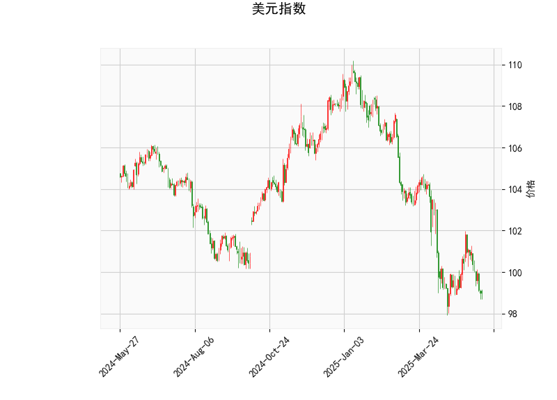

### 美元指数技术分析解读

#### 1. **美元指数关键指标分析**
- **当前价（98.9787）与布林轨道**：  
  当前价显著低于布林中轨（101.54），接近布林下轨（97.44），表明美元指数处于短期超卖状态，可能面临技术性反弹需求。若价格站稳下轨上方，可能向中轨（101.54）方向修复；若跌破下轨，则需警惕加速下跌风险。

- **RSI（38.74）**：  
  处于30-50区间，接近超卖但未进入极端区域，反映市场情绪偏空但未完全恐慌，短期内可能震荡筑底。

- **MACD（-0.496）与信号线（-0.438）**：  
  MACD线位于信号线下方且持续为负值，显示短期下跌动能占优，但两者差值（-0.058）较小，暗示空头力量可能接近衰竭，需关注后续能否形成金叉。

- **K线形态（CDLMATCHINGLOW）**：  
  该形态通常出现在下跌趋势末端，暗示空头力量减弱，可能迎来短期反转信号，需结合其他指标验证。

**综合判断**：美元指数短期可能触底反弹，但中期趋势仍需观察能否站稳中轨（101.54）。若反弹失败，则可能进一步下探布林下轨（97.44）。

---

### 2. A股/港股潜在机会与策略

#### **宏观联动性分析**  
美元指数走弱通常利好风险资产（如新兴市场股票），但若其反弹可能压制港股（联系汇率制）及外资流入A股的节奏。当前美元技术面偏弱但存在反弹可能，需警惕短期波动风险。

#### **A股策略**  
- **主题机会**：  
  - **出口链（家电、机械）**：若美元反弹，人民币汇率承压，出口型企业盈利预期改善。  
  - **超跌成长板块（新能源、半导体）**：若市场情绪修复，估值弹性较高。  
- **防御配置**：关注高股息（电力、公用事业）及消费（食品饮料）板块，对冲美元反弹带来的外资流出压力。

#### **港股策略**  
- **AH溢价套利**：筛选AH溢价率高于30%的H股（如券商、保险），布局估值修复机会。  
- **互联网与生物医药**：估值处于历史低位，若美元反弹未持续，外资可能回流超跌龙头。  
- **对冲工具**：通过恒生指数期货或反向ETF（如ＦＩ二南方恒指，07500.HK）对冲美元反弹风险。

#### **风险提示**  
- **美元反弹超预期**：可能引发外资撤离港股及A股北向资金流出，需关注汇率及美联储政策信号。  
- **技术面失效**：若美元指数跌破布林下轨（97.44），或触发止损盘加剧下跌，需动态调整仓位。

---

**总结**：短期可关注美元指数反弹对AH股的压制效应，优先布局低估值防御板块；若美元延续弱势，则加大成长股及港股弹性标的配置。建议结合汇率波动灵活调整仓位，利用衍生工具对冲尾部风险。